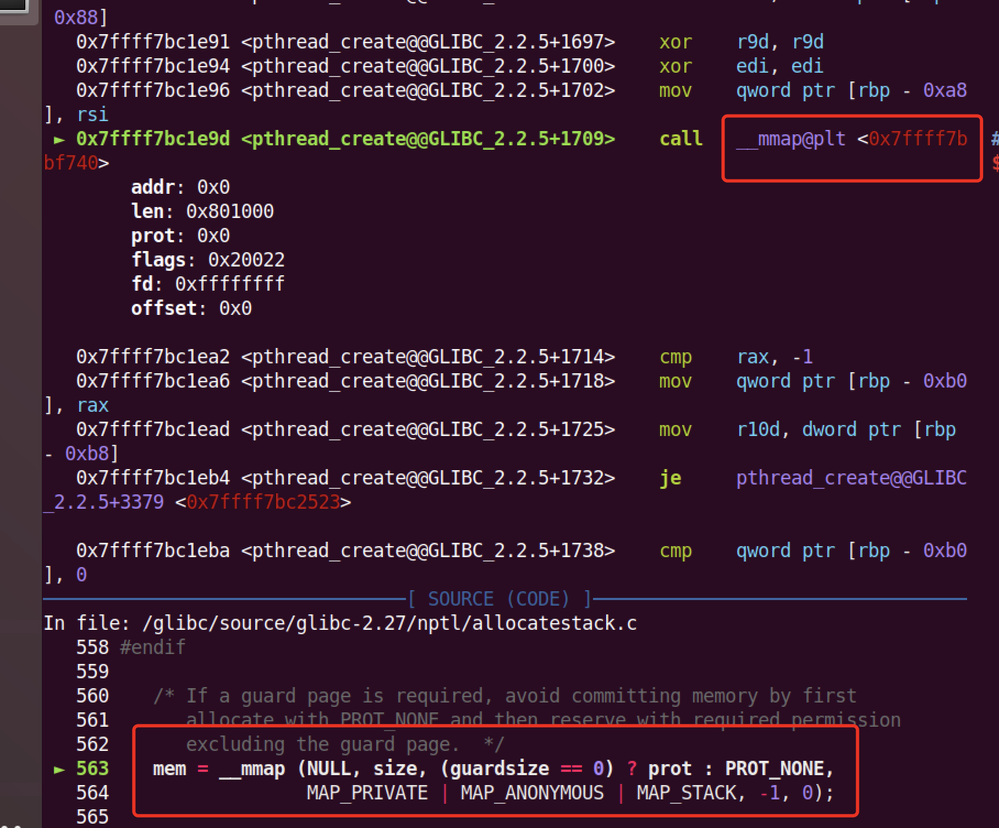

# Glibc_TLS

> Pointer_guard机制的原理以及绕过。参考：

TLS(Thread Local Storage，线程本地存储)，我们可以使用`__thread`关键字来告知编译器一个变量应该放入TLS。

**TLS只能被当前线程访问和修改**，所以其必然不能和普通变量一样存储到某个段里面（bss,data之类）。

Example:

~~~c
#include <pthread.h>
#include <stdio.h>
 
static __thread int a = 12345; // 0x3039
__thread unsigned long long b = 56789; // 0xddd5
__thread int c;
 
void try(void *tmp) {
    printf("try: a = %lx, b = %llx, c = %s\n", a, b, &c);
    return;
}
 
int main(void) {
    a = 0xdeadbeef;
    b = 0xbadcaffe;
    c = 0x61616161;
    printf("main thread: a = %lx, b = %llx, c = %s\n", a, b, &c);
    pthread_t pid;
    pthread_create(&pid, NULL, try, NULL);
    pthread_join(pid, NULL);
    return 0;
}

~~~

> 编译指令：gcc tls.c -pthread -g -o tls
>
> Pthread_create : https://blog.csdn.net/liangxanhai/article/details/7767430
>
> pthread_join()函数，以阻塞的方式等待thread指定的线程结束。当函数返回时，被等待线程的资源被收回。如果线程已经结束，那么该函数会立即返回。并且thread指定的线程必须是joinable的。

结果输出：

~~~c
main thread: a = deadbeef, b = badcaffe, c = aaaa
try: a = 3039, b = ddd5, c = 
~~~

可以看到，尽管都是全局变量，但是线程之间并没有互相影响。

gdb加载，我们用`info files`可以查看文件结构：

~~~
Entry point: 0x5555555546b0
	0x0000555555554270 - 0x000055555555428c is .interp
	0x000055555555428c - 0x00005555555542ac is .note.ABI-tag
	0x00005555555542ac - 0x00005555555542d0 is .note.gnu.build-id
	0x00005555555542d0 - 0x00005555555542ec is .gnu.hash
	0x00005555555542f0 - 0x00005555555543e0 is .dynsym
	0x00005555555543e0 - 0x00005555555544ab is .dynstr
	0x00005555555544ac - 0x00005555555544c0 is .gnu.version
	0x00005555555544c0 - 0x0000555555554510 is .gnu.version_r
	0x0000555555554510 - 0x00005555555545d0 is .rela.dyn
	0x00005555555545d0 - 0x0000555555554630 is .rela.plt
	0x0000555555554630 - 0x0000555555554647 is .init
	0x0000555555554650 - 0x00005555555546a0 is .plt
	0x00005555555546a0 - 0x00005555555546a8 is .plt.got
	0x00005555555546b0 - 0x0000555555554932 is .text
	0x0000555555554934 - 0x000055555555493d is .fini
	0x0000555555554940 - 0x0000555555554991 is .rodata
	0x0000555555554994 - 0x00005555555549d8 is .eh_frame_hdr
	0x00005555555549d8 - 0x0000555555554b00 is .eh_frame
	0x0000555555754d80 - 0x0000555555754d90 is .tdata
	0x0000555555754d90 - 0x0000555555754d94 is .tbss
	0x0000555555754d90 - 0x0000555555754d98 is .init_array
	0x0000555555754d98 - 0x0000555555754da0 is .fini_array
	0x0000555555754da0 - 0x0000555555754fa0 is .dynamic
	0x0000555555754fa0 - 0x0000555555755000 is .got
	0x0000555555755000 - 0x0000555555755010 is .data
	0x0000555555755010 - 0x0000555555755018 is .bss
~~~

可以看到sections里面多了`tdata`和`tbss`与正常的data以及bss section相似，两者分别存储已经初始化的线程变量以及未初始化的线程变量。

~~~c
pwndbg> telescope 0x0000555555754d80
00:0000│   0x555555754d80 ◂— 0x3039 /* '90' */
01:0008│   0x555555754d88 ◂— 0xddd5
02:0010│   0x555555754d90 (__init_array_start) —▸ 0x5555555547b0 (frame_dummy) ◂— push   rbp
03:0018│   0x555555754d98 (__do_global_dtors_aux_fini_array_entry) —▸ 0x555555554770 (__do_global_dtors_aux) ◂— cmp    byte ptr [rip + 0x200899], 0
04:0020│   0x555555754da0 (_DYNAMIC) ◂— 0x1
... ↓
07:0038│   0x555555754db8 (_DYNAMIC+24) ◂— 0x63 /* 'c' */
~~~

可以看到，tdata段里面存储的确实是我们设定的值。

反汇编try函数：

~~~asm
pwndbg> disassemble try
Dump of assembler code for function try:
   0x00005555555547ba <+0>:	push   rbp
   0x00005555555547bb <+1>:	mov    rbp,rsp
   0x00005555555547be <+4>:	sub    rsp,0x10
   0x00005555555547c2 <+8>:	mov    QWORD PTR [rbp-0x8],rdi
   0x00005555555547c6 <+12>:	mov    rdx,QWORD PTR fs:0xfffffffffffffff0
   0x00005555555547cf <+21>:	mov    eax,DWORD PTR fs:0xffffffffffffffe8
   0x00005555555547d7 <+29>:	mov    rcx,QWORD PTR fs:0x0
   0x00005555555547e0 <+38>:	add    rcx,0xfffffffffffffff8
   0x00005555555547e7 <+45>:	mov    esi,eax
   0x00005555555547e9 <+47>:	lea    rdi,[rip+0x158]        # 0x555555554948
   0x00005555555547f0 <+54>:	mov    eax,0x0
   0x00005555555547f5 <+59>:	call   0x555555554680 <printf@plt>
   0x00005555555547fa <+64>:	nop
   0x00005555555547fb <+65>:	leave  
   0x00005555555547fc <+66>:	ret    
End of assembler dump.
~~~

我们单步调试结果如下：

但是fs寄存器显示为0，同时直接访问改地址报错，其原因是[gdb没有权限访问](https://stackoverflow.com/questions/10354063/how-to-use-a-logical-address-in-gdb)fs寄存器，但是`fsbase`指令可以访问：

~~~
pwndbg> fsbase 
0x7ffff77c4700
~~~

我们vmmap查看可以发现，这其实是指向了一段开辟的内存空间。

## X86_64_ABI要求的TLS结构

TLS（Thread Local Storage）的结构与TCB（Thread Control Block）以及dtv（dynamic thread vector）密切相关，每一个线程中每一个使用了TLS功能的module都拥有一个TLS Block。这几者的关系如下图所示1：

`TLS Blocks`分为两类，一类是装载程序的时候已经存在的（位于TCB前），这部分是`static TLS`，右边的Blocks是动态分配的，他们被使用dlopen函数在程序运行的时候动态装载的模块使用。

`TCB`作为线程控制块，保存`dtv`数组的入口（看图箭头），然后`dtv`数组里面的每一项都对应着`TLS Block`的入口，其值为指针，指向`TLS Block`数据快。

> `dtv`数组的第一个成员是一个计数器，每当程序使用dlopen函数或者dlfree函数记载一个具备TLS变量的module的时候，改计数器的值都会加一，从而保证了程序内版本的一致性。（图中gen）

同时elf文件本身对应的`TLS Block`一定在`dtv`数组里面占据索引为1的位置，**且位置与`TCB`相邻**。

图中的tp1指针（TCB上面）是因为，在i386架构上，这个指针为gs寄存器，x86_64架构上其为fs寄存器，因为该指针和ELF文件本身对应的TLS block之间的偏移是固定的，所以程序在编译的时候就可以将ELF中线程变量的地址硬编码到目标文件里面。

# Glibc-TLS具体实现

多线程情况下（CTF_TLS一般就考得多线程）：

> [pthread_create.c](https://code.woboq.org/userspace/glibc/nptl/pthread_create.c.html)的源码，我调试使用的是glibc 2..27

非主线程：

* pthread_create.c的源码还是挺复杂的，但是我们边调试边看

从这里开始，执行流从pthread_create.c跳转到了allocatestack.c

~~~c
int err = ALLOCATE_STACK (iattr, &pd); //pthread.c里面的新栈分配
~~~

这是一条`pthread_create函数`跳转到[allocate_stack](https://code.woboq.org/userspace/glibc/nptl/allocatestack.c.html#allocate_stack)函数的调用链,这个函数的注释如下：

~~~c

/* Get a stack frame from the cache.  We have to match by size since
   some blocks might be too small or far too large.  */
~~~

可以看到肯定是要进行空间分配了。

分配方式：通过调用函数为新线程分配栈

可以看接下来的代码，其实源码里面有两种线程栈的开辟方式，一种是在原来主线程栈的后面开辟，一个是mmap的方式开辟一块新的虚拟内存来作为新栈，一般情况下都是第二种方式，所以我们重点分析这个，看[源码](https://code.woboq.org/userspace/glibc/nptl/allocatestack.c.html#53)总结如下：

1. 栈对齐
2. 找到一个合适的大小可以容纳`guard`和`eventually the thread descriptor`，然后通过[get_cached_stack](https://code.woboq.org/userspace/glibc/nptl/allocatestack.c.html#get_cached_stack)从cache里面拿出一块内存。
3. 判断不会重叠（这不重要）后，调用`mmap`函数，如上图。
4. **Place the thread descriptor at the end of the stack.**
5. 为分配的区域开启保护机制。（这个就应该跟普通的那些区域保护类似）
6. 分配`dtv区域`（堆空间），写入相关信息，比如`static tls `相关，看下面的`dtv`介绍。

~~~c
 pd = (struct pthread *) ((((uintptr_t) mem + size)
                                    - TLS_TCB_SIZE)
                                   & ~__static_tls_align_m1);
~~~

通过这个我们就知道，在分配的空间的底部形成了一个数据结构`struct pthread`：

~~~c
/* 进行这一步操作后内存布局如下：
 * 
 *                                  TLS_TCB_SIZE
 *                                        ^
 *                            +-----------+----------+
 *                            |                      |
 * ---------------------+----------------------------+
 *                      |     |                      |
 *                      | pad |                      |
 *                      |     |                      |
 * ---------------------+----------------------------+
 *                            ^                      ^
 *                            +                      +
 *                           pd                mmap area end
 *
 */
~~~

> 从左向右看，新栈的底部被分配了一个容纳pd结构体的空间，该结构体的类型为struct pthread，我们称其为一个thread descriptor，该结构体的第一个域为tchhead_t类型，其定义如下：

~~~c
typedef struct
{
  void *tcb;        /* Pointer to the TCB.  Not necessarily the
               thread descriptor used by libpthread.  */
  dtv_t *dtv;
  void *self;       /* Pointer to the thread descriptor.  */
  int multiple_threads;
  int gscope_flag;
  uintptr_t sysinfo;
  uintptr_t stack_guard;
  uintptr_t pointer_guard;
  unsigned long int vgetcpu_cache[2];
  /* Bit 0: X86_FEATURE_1_IBT.
     Bit 1: X86_FEATURE_1_SHSTK.
   */
  unsigned int feature_1;
  int __glibc_unused1;
  /* Reservation of some values for the TM ABI.  */
  void *__private_tm[4];
  /* GCC split stack support.  */
  void *__private_ss;
  /* The lowest address of shadow stack,  */
  unsigned long long int ssp_base;
  /* Must be kept even if it is no longer used by glibc since programs,
     like AddressSanitizer, depend on the size of tcbhead_t.  */
  __128bits __glibc_unused2[8][4] __attribute__ ((aligned (32)));
 
  void *__padding[8];
} tcbhead_t;

~~~

到此为止我们就可以知道，pthread会分配一个新栈给线程，然后在新栈的底部放入一个`pthread`数据结构。

### 父线程TCB的继承

上述栈分配完成后，在源码里已经在`tcb`数据结构里面填写了一些内容，

~~~c
/* Copy the stack guard canary.  */
#ifdef THREAD_COPY_STACK_GUARD
  THREAD_COPY_STACK_GUARD (pd);
#endif
  /* Copy the pointer guard value.  */
#ifdef THREAD_COPY_POINTER_GUARD
  THREAD_COPY_POINTER_GUARD (pd);
#endif
~~~

接下来就是将父进程的canary复制到当前进程的TCB结构体里面，事实上，在fs寄存器没有被改变之前，其中存放着父进程TCB的地址，可以使用`THREAD_SELF`宏来获取父线程的TCB指针，所以在这里，子线程会继承父线程整个TCB的域。

> canary是存放在pthread结构体里面的，别搞混了，可以发现在执行的前后线程pthread结构里面的`stack_guard`变成了和父进程一样。

### dvt

定义如下：

~~~c
struct dtv_pointer
{
  void *val;                    /* Pointer to data, or TLS_DTV_UNALLOCATED.  */
  void *to_free;                /* Unaligned pointer, for deallocation.  */
};
 
/* Type for the dtv.  */
typedef union dtv
{
  size_t counter;
  struct dtv_pointer pointer;
} dtv_t;
~~~

分配源码：

~~~c
void *
_dl_allocate_tls (void *mem)
{
  return _dl_allocate_tls_init (mem == NULL
                                ? _dl_allocate_tls_storage ()
                                : allocate_dtv (mem));
}
~~~

dvt是一个c语言的联合类型，那么他可能是一个`counter`或者`dtv_pointer`结构体，如果是`counter`那么其在dtv[-1]以及dtv[0]这个成员使用，标志着dtv数组中的个数，或者是一个`dtv_pointer`结构体，其成员指向一个TLS Block.

在tcb里面，使用`module ID`作为索引，程序装载的每一个`moudle`都会有一个`modle ID`，这个值存在于module对应的`link_map`结构体里面：

`link_map`结构体复杂的很，看大佬里文章标注了关键部分：

~~~c
    /* 与TLS有关的内容  */
 
    /* TLS segment的起始地址，TLS segment由两部分组成，分别是tdata和tbss，存放初始化和未初始化的全局变量
     * 该segment在module被装载的时候映射的内存中，作为每一个线程初始化TLS Blocks时的模版 */
    void *l_tls_initimage;
    /* TLS segment在文件中的大小（仅.tdata的大小）  */
    size_t l_tls_initimage_size;
    /* TLS segment在内存中的大小（.data加上.tbss的大小）*/
    size_t l_tls_blocksize;
    /* TLS Block的对齐标准  */
    size_t l_tls_align;
    /* 符合对齐要求的第一个字节的偏移  */
    size_t l_tls_firstbyte_offset;
#ifndef NO_TLS_OFFSET
# define NO_TLS_OFFSET  0
#endif
#ifndef FORCED_DYNAMIC_TLS_OFFSET
# if NO_TLS_OFFSET == 0
#  define FORCED_DYNAMIC_TLS_OFFSET -1
# elif NO_TLS_OFFSET == -1
#  define FORCED_DYNAMIC_TLS_OFFSET -2
# else
#  error "FORCED_DYNAMIC_TLS_OFFSET is not defined"
# endif
#endif    
        /* 对于程序加载时就装载了的模块，该变量标示本模块对应的TLS Block在static TLS中的偏移.  */
    ptrdiff_t l_tls_offset;
    /* 本模块在dtv数组中的索引  */
    size_t l_tls_modid;
 
    /* 由该动态链接库构造的tls变量的数量  */
    size_t l_tls_dtor_count;

~~~

dtv数组空间的分配,上面的分配源码里面我们就可以推断出来调用链会调用`allocate_dtv`：

~~~c
static void *
allocate_dtv (void *result)
{
  dtv_t *dtv;
  size_t dtv_length;
 
  dtv_length = GL(dl_tls_max_dtv_idx) + DTV_SURPLUS;
  dtv = calloc (dtv_length + 2, sizeof (dtv_t));
  if (dtv != NULL)
    {
      /* dtv长度的初始值 */
      dtv[0].counter = dtv_length;
 
      /* dtv的余下部分被初始化为0，来表示这里什么也没有 */
 
      /* 将dtv加入到线程描述符中 */
      INSTALL_DTV (result, dtv);
    }
  else
    result = NULL;
 
  return result;
}
~~~

可以看到明显的堆分配函数，可以看到`dvt`应该是存储到堆空间了,然后利用`INSTALL_DTV`宏操作来实现将dtv加入到线程描述符中,该宏操作如下：

~~~c
# define INSTALL_DTV(descr, dtvp) \
  ((tcbhead_t *) (descr))->dtv = (dtvp) + 1
~~~

其实就是一个指针 赋值的操作，至此`dtv`空间分配完毕，接下来要进行[_dl_allocate_tls_init](https://code.woboq.org/userspace/glibc/elf/dl-tls.c.html#_dl_allocate_tls_init)操作。

### static TLS以及fs的初始化

`_dl_allocate_tls_init`这个函数其实就是一个循环遍历的过程：

* 首先肯定是循环遍历各种检查

但是关键部分在于

~~~c
/* result指针指向TCB结构体， map为link map的一个节点 */
dest = (char *) result - map->l_tls_offset;
 
/* 设置DTV entry，一些平台在静态链接的程序中使用的简化版的__tls_get_addr需要这个值 */
dtv[map->l_tls_modid].pointer.val = dest;
 
/* 复制初始镜像，并将bss段清零  */
memset (__mempcpy (dest, map->l_tls_initimage,
            map->l_tls_initimage_size), '\0',
                map->l_tls_blocksize - map->l_tls_initimage_size);
~~~

这就使得TLS初始化完成（不考虑dlopen，dlfree），因为dest是指向该静态`TLS`的指针。

### fs寄存器设置

fs寄存器用户态的程序无法设置，我们可以用`strace`跟踪系统调用：

~~~bash
strace -f ./tls
~~~

可以看到`clone`的系统调用（其实全场就它可疑了）

~~~bash
clone(child_stack=0x7fe71281dfb0, flags=CLONE_VM|CLONE_FS|CLONE_FILES|CLONE_SIGHAND|CLONE_THREAD|CLONE_SYSVSEM|CLONE_SETTLS|CLONE_PARENT_SETTID|CLONE_CHILD_CLEARTID, parent_tidptr=0x7fe71281e9d0, tls=0x7fe71281e700, child_tidptr=0x7fe71281e9d0) = 8982
~~~

我们发现在`pthread.c`的源码里面有[createthread.c](https://code.woboq.org/userspace/glibc/sysdeps/unix/sysv/linux/createthread.c.html)的调用，跟进去就发现了`clone`相关：

~~~c
const int clone_flags = (CLONE_VM | CLONE_FS | CLONE_FILES | CLONE_SYSVSEM
                           | CLONE_SIGHAND | CLONE_THREAD
                           | CLONE_SETTLS | CLONE_PARENT_SETTID
                           | CLONE_CHILD_CLEARTID
                           | 0);
  TLS_DEFINE_INIT_TP (tp, pd);
  if (__glibc_unlikely (ARCH_CLONE (&start_thread, STACK_VARIABLES_ARGS,
                                    clone_flags, pd, &pd->tid, tp, &pd->tid)
                        == -1))
    return errno;
~~~

~~~bash
clone -> _do_fork -> copy_process -> copy_thread_tls -> do_arch_prctl_64
~~~

上面都是大佬查到的`clone`利用链，但是我查到的直接就到汇编了，emmm

## 主线程情况

我们通过`gdb设置catchpoint`拦截系统调用可以很快的找到主线程初始化的时候TLS的位置，

这里我们可以看到它的相关调用，那么根据大佬查到的文档信息：

~~~
dl.so ELF headers point its start at _start.
_start (sysdeps/i386/dl-machine.h) calls _dl_start.
_dl_start (elf/rtld.c) initializes bootstrap_map, calls _dl_start_final
_dl_start_final calls _dl_sysdep_start.
_dl_sysdep_start (sysdeps/mach/hurd/dl-sysdep.c) calls __mach_init to initialize enough to run RPCs, then calls _hurd_startup.
_hurd_startup (hurd/hurdstartup.c) gets hurdish information from servers and calls its main parameter.
the main parameter was actually go inside _dl_sysdep_start, which calls dl_main.
dl_main (elf/rtld.c) interprets ld.so parameters, loads the binary and libraries, calls _dl_allocate_tls_init.
~~~

那么，自然我们就要进入`dl_main.c`看看函数的调用情况了：

发现`dl_main`还是十分复杂的，但是看着都是一些个初始化的工作，我们只关心TLS相关，

~~~c
  // part I
  bool was_tls_init_tp_called = tls_init_tp_called;
  if (tcbp == NULL)
        tcbp = init_tls ();
 
  if (__glibc_likely (need_security_init))
        /* Initialize security features.  But only if we have not done it
        earlier.  */
        security_init ();
 
    // part II
    if ((!was_tls_init_tp_called && GL(dl_tls_max_dtv_idx) > 0) || count_modids != _dl_count_modids ())
        ++GL(dl_tls_generation);
 
  _dl_allocate_tls_init (tcbp);
 
  /* And finally install it for the main thread.  */
  if (! tls_init_tp_called)
    {
      const char *lossage = TLS_INIT_TP (tcbp);
      if (__glibc_unlikely (lossage != NULL))
                _dl_fatal_printf ("cannot set up thread-local storage: %s\n", lossage);
    }
~~~

我们跟如`init_tls`函数：

最开始就是一些初始化的工作，关键在于[_dl_allocate_tls_storage](https://code.woboq.org/userspace/glibc/elf/dl-tls.c.html#_dl_allocate_tls_storage)函数，改函数上来就用[malloc](https://code.woboq.org/userspace/glibc/elf/dl-minimal.c.html#malloc)分配了一块大内存（这个`malloc`有自己的专门实现，其本质还是调用了mmap分配大块内存）

* 其次就是清理刚分配的内存
* 关键在于[allocate_dtv](https://code.woboq.org/userspace/glibc/elf/dl-tls.c.html#allocate_dtv)函数的调用

~~~c
allocate_dtv (void *result)
{
  dtv_t *dtv;
  size_t dtv_length;
  /* We allocate a few more elements in the dtv than are needed for the
     initial set of modules.  This should avoid in most cases expansions
     of the dtv.  */
  dtv_length = GL(dl_tls_max_dtv_idx) + DTV_SURPLUS;
  dtv = calloc (dtv_length + 2, sizeof (dtv_t));
  if (dtv != NULL)
    {
      /* This is the initial length of the dtv.  */
      dtv[0].counter = dtv_length;
      /* The rest of the dtv (including the generation counter) is
         Initialize with zero to indicate nothing there.  */
      /* Add the dtv to the thread data structures.  */
      INSTALL_DTV (result, dtv);
    }
  else
    result = NULL;
  return result;
}
~~~

这次就是直接利用`calloc`分配内存，这会直接使用之前`malloc`剩下的内存，进而形成这样一种结构：

~~~~
+---------------------+-------------------+-------------------------------+
|                     |                   |                               |
|   static TLS        |    TCB Structure  |       dtv array               |
|                     |                   |                               |
+---------------------+-+-------------------------------------------------+
                        |                 ^
                        +-----------------+
~~~~

（膜拜大佬的作图能力，TCB Structure在源码里面有显示哦）。

## 安全保护

初始化完成之后肯定是要进行安全保护的，这就是[security_init](https://code.woboq.org/userspace/glibc/elf/rtld.c.html#security_init)函数。

~~~c
static void
security_init (void)
{
  /* Set up the stack checker's canary.  */
  uintptr_t stack_chk_guard = _dl_setup_stack_chk_guard (_dl_random);
#ifdef THREAD_SET_STACK_GUARD
  THREAD_SET_STACK_GUARD (stack_chk_guard);
#else
  __stack_chk_guard = stack_chk_guard;
#endif
  /* Set up the pointer guard as well, if necessary.  */
  uintptr_t pointer_chk_guard
    = _dl_setup_pointer_guard (_dl_random, stack_chk_guard);
#ifdef THREAD_SET_POINTER_GUARD
  THREAD_SET_POINTER_GUARD (pointer_chk_guard);
#endif
  __pointer_chk_guard_local = pointer_chk_guard;
  /* We do not need the _dl_random value anymore.  The less
     information we leave behind, the better, so clear the
     variable.  */
  _dl_random = NULL;
}
~~~

整个代码好像就是一个插入类似`canary`的过程，这里就涉及到一些技巧了，如何绕过`canary`的检查。

### _dl_random的来源

下写断点

> pwndbg> watch _dl_random
>
> 这个功能很有用，甚至可以监视一块内存。

如何查看当前进程的`auxiliary vector`

~~~bash
pwndbg> info auxv 
33   AT_SYSINFO_EHDR      System-supplied DSO's ELF header 0x7ffff7ffb000
16   AT_HWCAP             Machine-dependent CPU capability hints 0xf8bfbff
6    AT_PAGESZ            System page size               4096
17   AT_CLKTCK            Frequency of times()           100
3    AT_PHDR              Program headers for program    0x555555554040
4    AT_PHENT             Size of program header entry   56
5    AT_PHNUM             Number of program headers      15
7    AT_BASE              Base address of interpreter    0x7ffff7dd8000
8    AT_FLAGS             标记                         0x0
9    AT_ENTRY             Entry point of program         0x5555555546b0
11   AT_UID               真正用户id号              1000
12   AT_EUID              Effective user ID              1000
13   AT_GID               Real group ID                  1000
14   AT_EGID              Effective group ID             1000
23   AT_SECURE            Boolean, was exec setuid-like? 0
25   AT_RANDOM            Address of 16 random bytes     0x7fffffffe1c9
26   AT_HWCAP2            Extension of AT_HWCAP          0x0
31   AT_EXECFN            File name of executable        0x7fffffffefdc "/home/sh/Test/Glibc_TLS/tls"
15   AT_PLATFORM          String identifying platform    0x7fffffffe1d9 "x86_64"
0    AT_NULL              End of vector                  0x0
~~~

`_dl_sysdep_start`函数（我只截取了一部分）：

~~~c
 for (av = GLRO(dl_auxv); av->a_type != AT_NULL; set_seen (av++))
    switch (av->a_type)
    {
			case AT_RANDOM:
        _dl_random = (void *) av->a_un.a_val;
~~~

该函数取`AT_RANDOM`的值，赋值给`_dl_random`指针。

这里面这个值其实源自内核(这点和windows相似)：

> 由内核创建，在用户态的时候进入`TCB`结构体，被用来当做对指针的加密措施，以及栈`canary`.

## TLS初始化

这个跟上面的调用的一个函数`_dl_allocate_tls_init`，其参数是之前`init_tls`函数的返回值，同时函数也对fs寄存器进行了设置。

# TLS安全机制

借用大佬的图：

相关保护：

* stack canary
* pointer guard

~~~asm
#  define PTR_MANGLE(var)   asm ("xor %%fs:%c2, %0\n"             \
                     "rol 2*" LP_SIZE "+1, %0"           \
                     : "=r" (var)                 \
                     : "0" (var),                 \
                       "i" (offsetof (tcbhead_t,          \
                              pointer_guard)))
#  define PTR_DEMANGLE(var) asm ("ror2*" LP_SIZE "+1, %0\n"         \
                     "xor %%fs:%c2, %0"               \
                     : "=r" (var)                 \
                     : "0" (var),                 \
                       "i" (offsetof (tcbhead_t,          \
                              pointer_guard)))
// 64位情况下，LP_SIZE为0x10
~~~

看不太懂这个汇编，但是大佬解释说

> 这两个宏利用pointer_guard分别对指针进行了加密和解密操作，加密由一次异或以及一次bitwise rotate组成。加密使用的key来自fs:[offsetof(tcbhead_t, pointer_guard)]

利用pointer_guard进行加密的过程可以表示为rol(ptr ^ pointer_guard, 0x11, 64)，解密的过程为ror(enc, 0x11, 64) ^ pointer_guard。那么假设现在我们知道了enc和ptr两个值，我们就可以通过这个算式来计算出pointer_guard(64位情况)5：

~~~
pointer_guard = ror (enc, 0x11, 64) ^ ptr 
~~~

同时假设我们获得了对pointer_guard的任意写，并且已知会调用一个函数指针enc，以及恶意地址evil_ptr，我们可以通过修改pointer_guard为evil_guard来将解密后的指针导向恶意地址，转换关系如下：

~~~c
evil_guard = ror (enc, 0x11, 64) ^ evil_ptr
~~~

# TLS攻击

> https://dere.press/glibc_tls/
>
> http://hmarco.org/bugs/glibc_ptr_mangle_weakness.html

