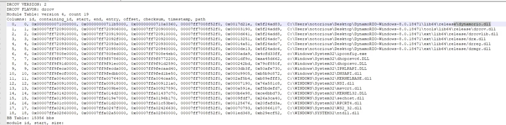
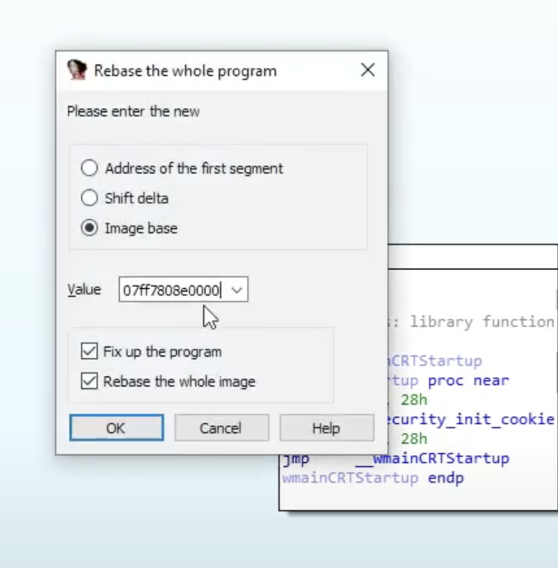

# IDApro-Code Coverage Measurement with Dynamo Rio & Lighthouse

## 工具

### dynamorio

https://dynamorio.org/

不过目前该工具并不支持MacOS

### lighthouse - idapro插件

https://github.com/gaasedelen/lighthouse

如果ida里面有这两个选项，说明插件安装成功：

## 操作流程

首先使用 dynamorio:

结果如下：

在同目录下，我们会生成日志信息：

打开文件，里面很多信息：

版本信息，和加载的模块信息，系统库等等

下面要使用上述的ida插件，但是我们必须重设基地址，跟之前的教程里面的做法那样，通过日志文件中得到的基地址进行重设。

然后使用插件（文中idapro插件所显示的那个按钮）把日志文件加载进去

图中绿色表示程序执行过程中使用的函数，并且函数调转块中有几个块被执行都有说明（Blocks Hit）

双击右侧函数表上方的属性还支持排序功能，不得不说功能很不错，上图右下角那里还有代码覆盖率等信息。