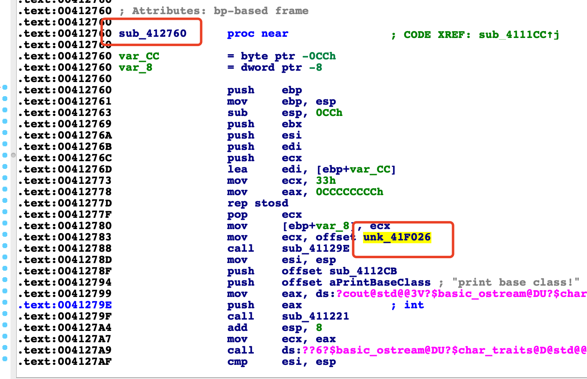
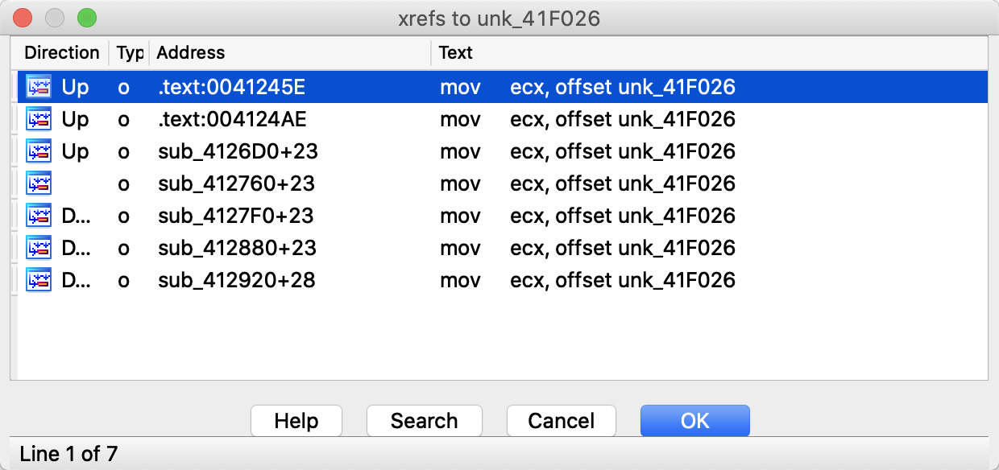
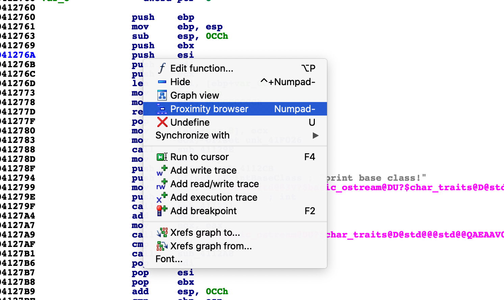
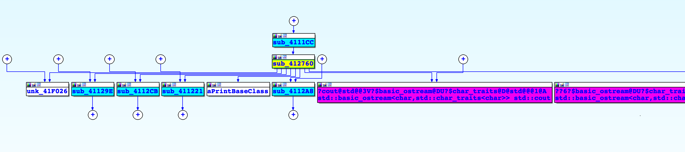
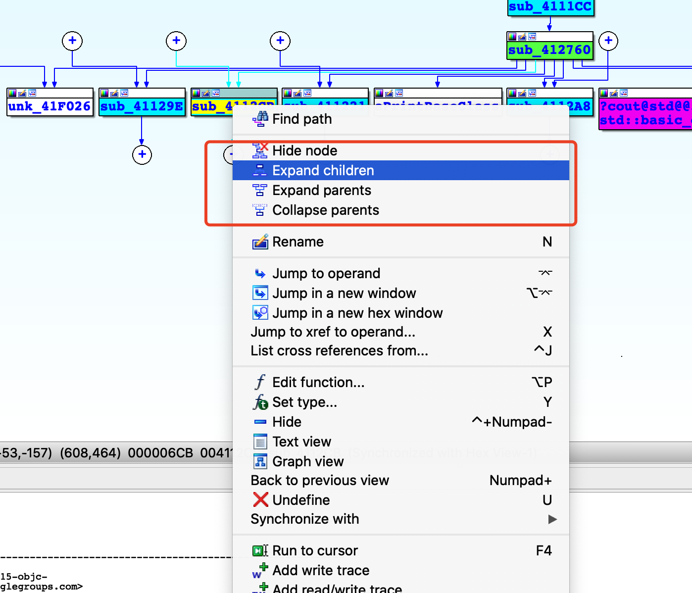
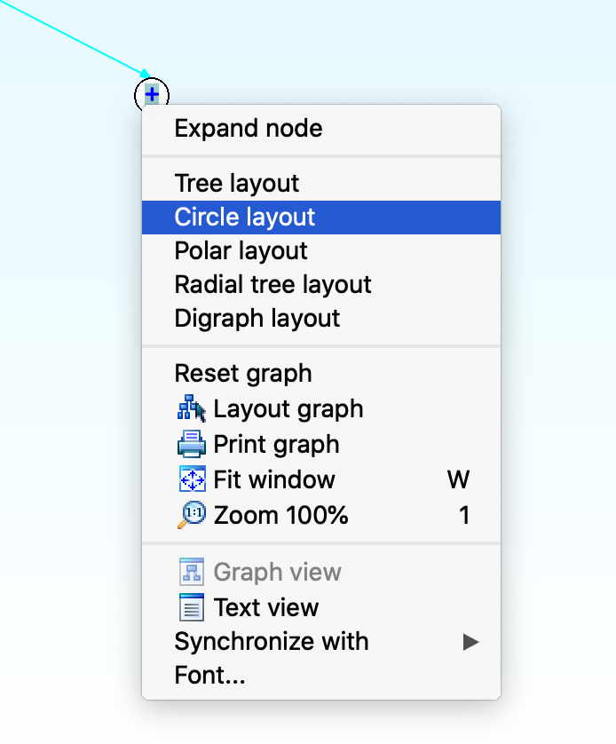
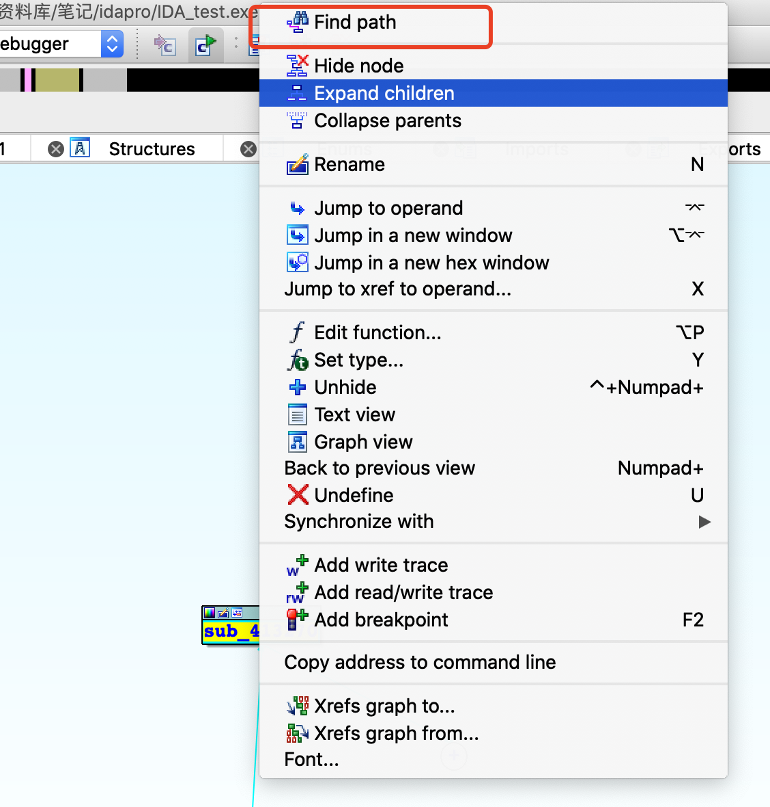
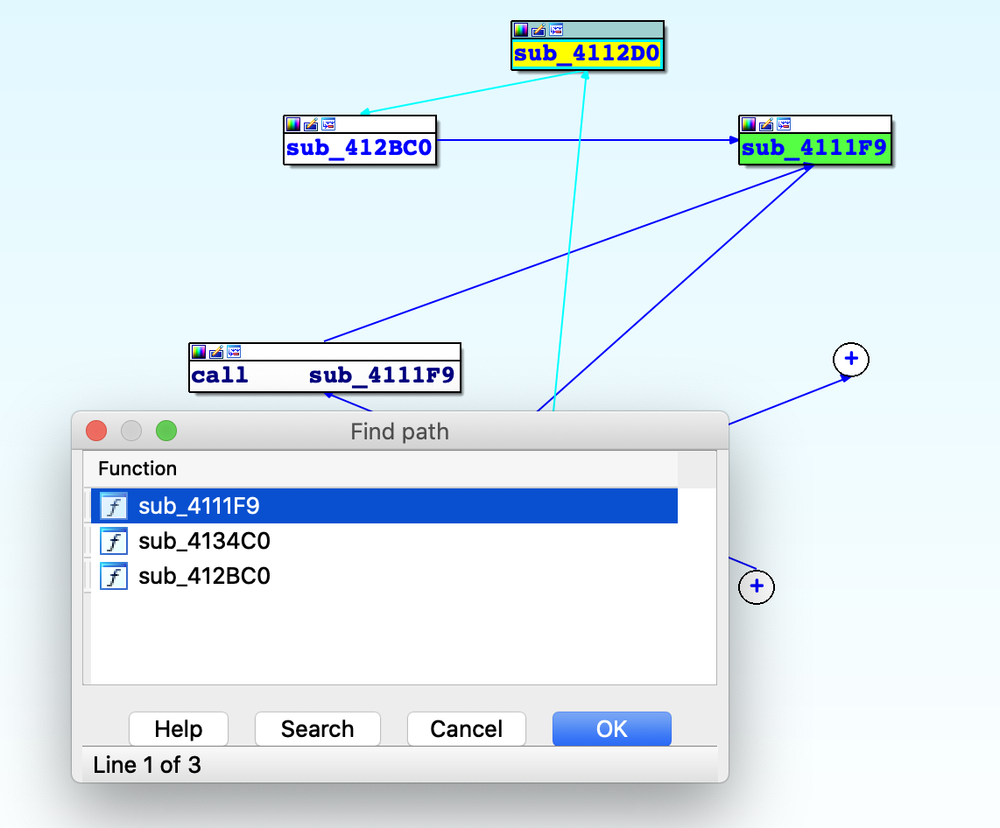
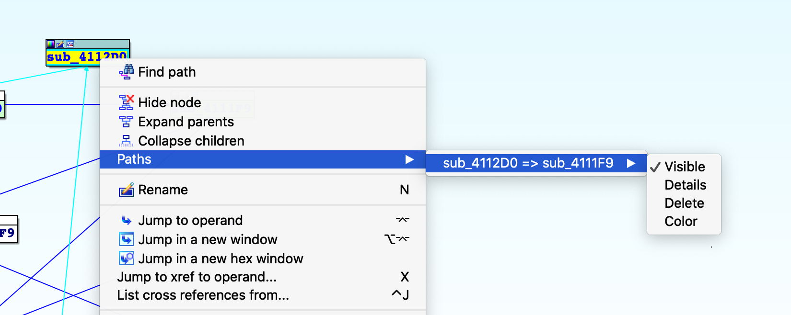

# IDApro-Function Cross Reference & Proximity Browser

### 交叉引用

快捷键x 

将光标停留在变量或者函数名上面然后按下快捷键x，会弹出交叉引用的窗口

我们可以看到变量或者函数在哪里被引用了，双击之后就可以调转到函数或者变量被引用的所在地。

###  Proximity browser

这个功能允许我们反向查看函数和全局变量及其他们之间的调用关系：

同时，通过缩放和扩展节点，我们可以很方便的观看整个程序的执行流程：

同样，右键点击那些+的节点可以以各种视图来方便观看

其实关键还是在于如何定位函数，当我们通过这种方便观看的样式找到我们所需要的函数的时候，我们可以对函数名进行右键点击：

之后会弹出函数的调用列表，其中包含我们的函数执行的流程。

这可以很方便帮我们识别一个函数是否调用另一个函数。同时点击ok后，路径会被记录在paths里面：

同时可以对路径进行颜色标记来方便进行各种操作。