# IDApro-How to do Binary Diffing - Patch Analysis

### 下载地址

依赖于java环境

https://zynamics.com/software.html

### 分析

首先我们把两个样本载入idapro，然后save

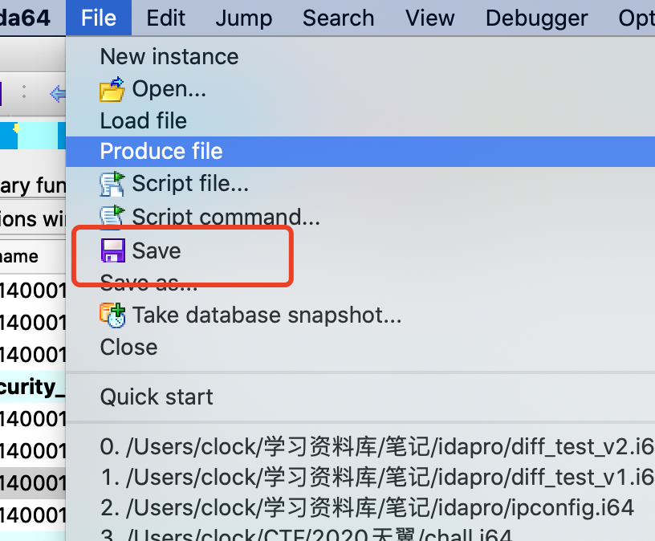

这样我们会得到一个ida数据库，对两个样本都进行该操作。

样本1：

~~~c
#include<Windows.h>
#include<stdio.h>
int main()
{
	for (int i = 0; i <= 10 ; i++)
	{
		if (i == 5)
		{
			printf("Hello There!!\n");
			return 0;
		}
		printf("Hello There!!\n");
	}
	return 0;
}
~~~

样本2：

~~~c
#include<Windows.h>
#include<stdio.h>
int main()
{
	for (int i = 0; i <= 10 ; i++)
	{
		printf("Hello There!!\n");
	}
	return 0;
}
~~~

### bindiff

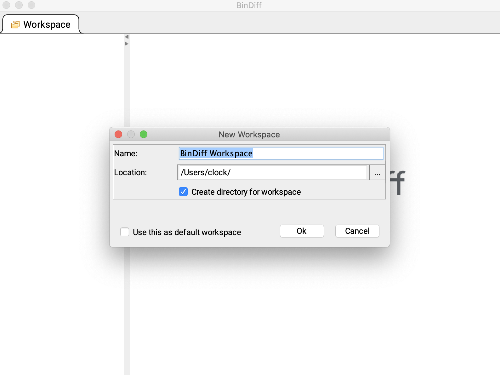

点击file里面创建一个workspace,然后在diffs里面点击new diff

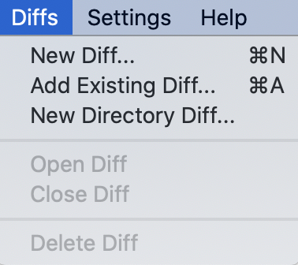

选择刚才得到的两个文件：

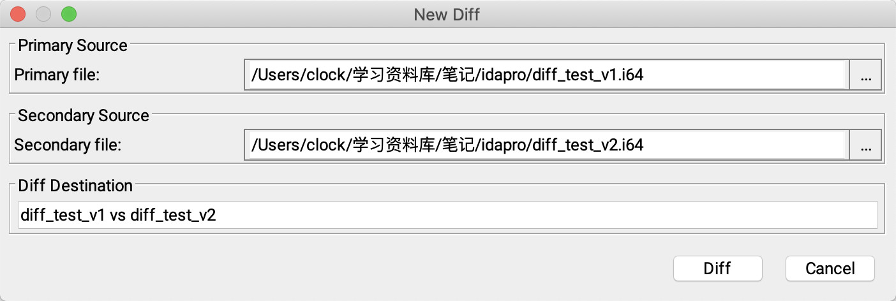

Tips:

如果报错

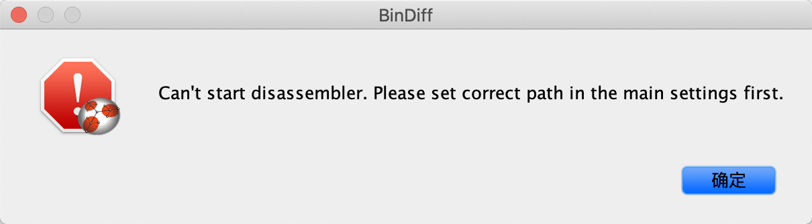

记得在Settings里面的Main settings里面设置ida的安装目录

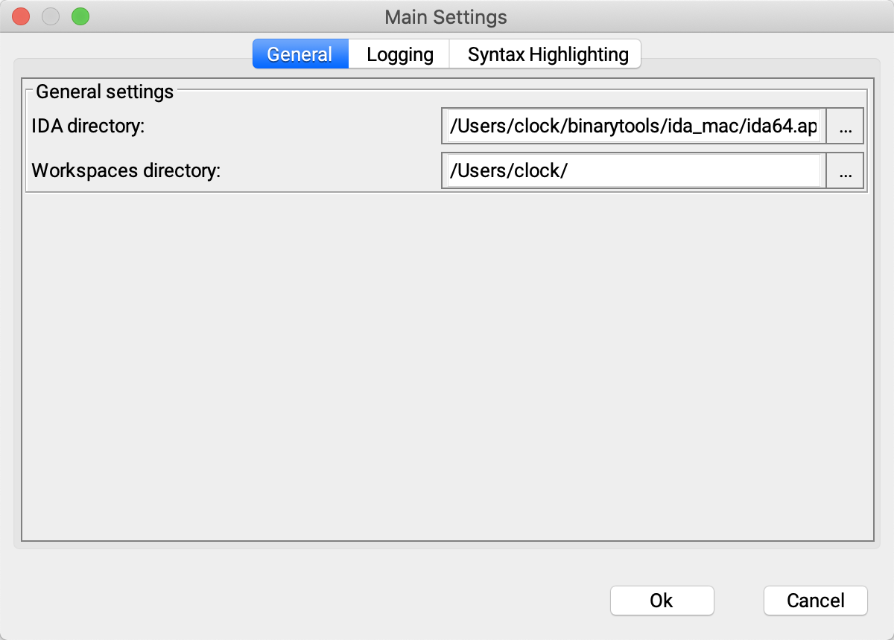

但是分析的时候会很长，所以不建议这个方法

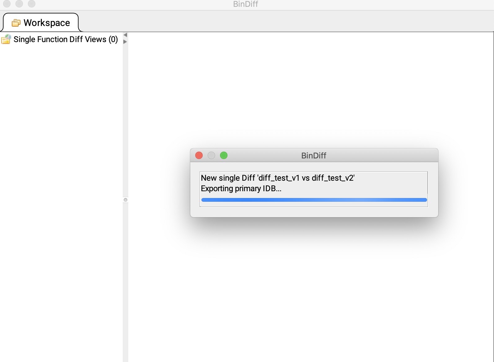

### ida里面使用bindiff

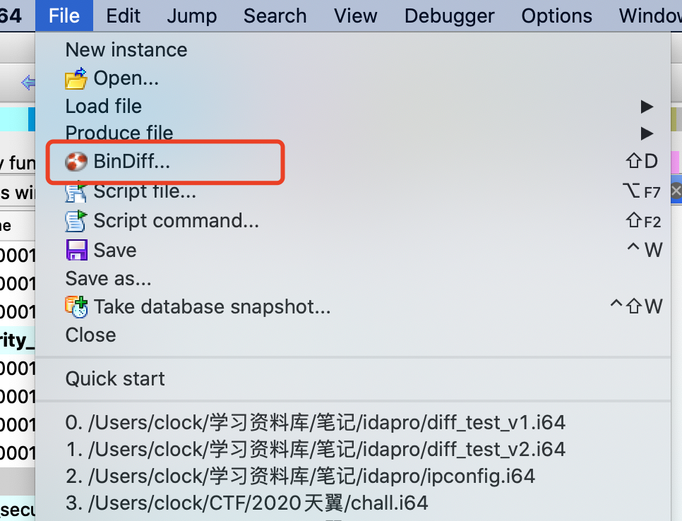

Tips:Ida mac版这个bindiff要安装两遍，为了32位和64位ida都可以使用该插件。

但是无语的是，我发现在比较过程中会报错，然后我就查了查diff的官方文档：

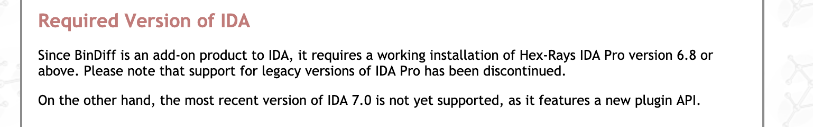

不支持ida pro7.0哦，然后又找了找，发现了这个

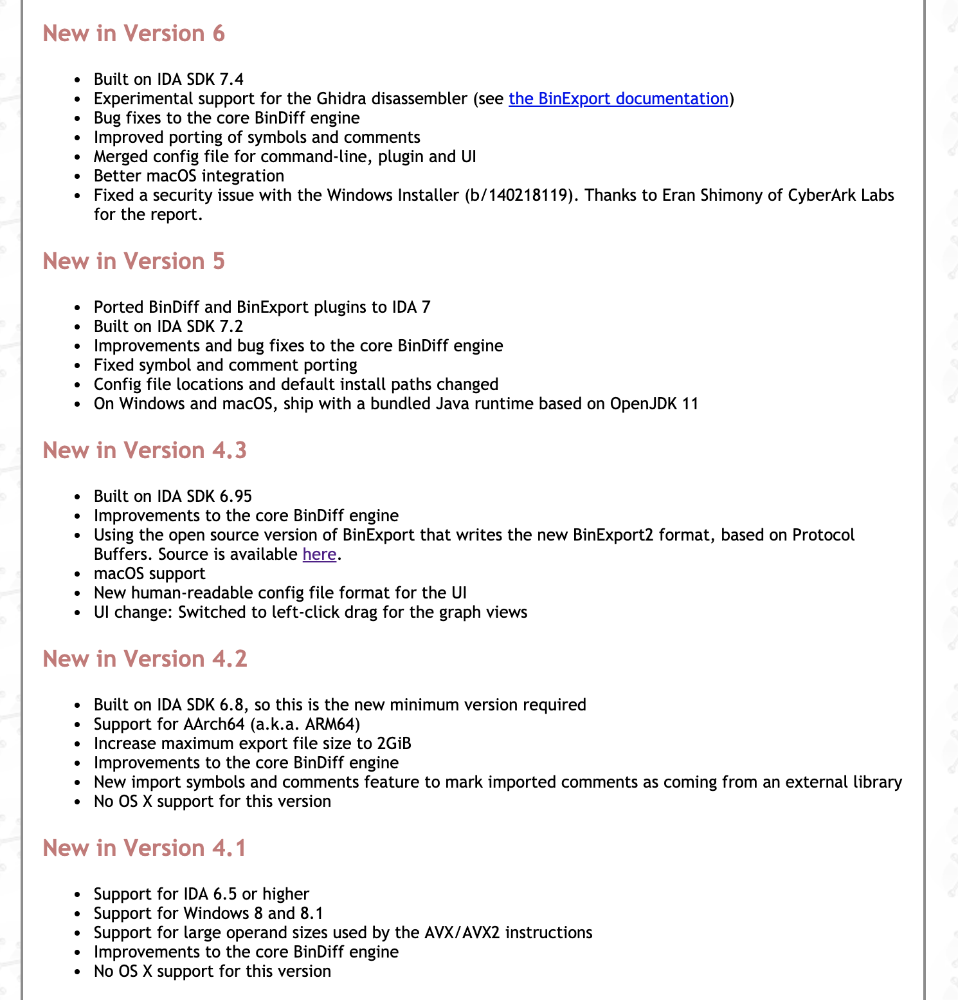

版本5可以的，下载试试。

终于可以了，舒适。

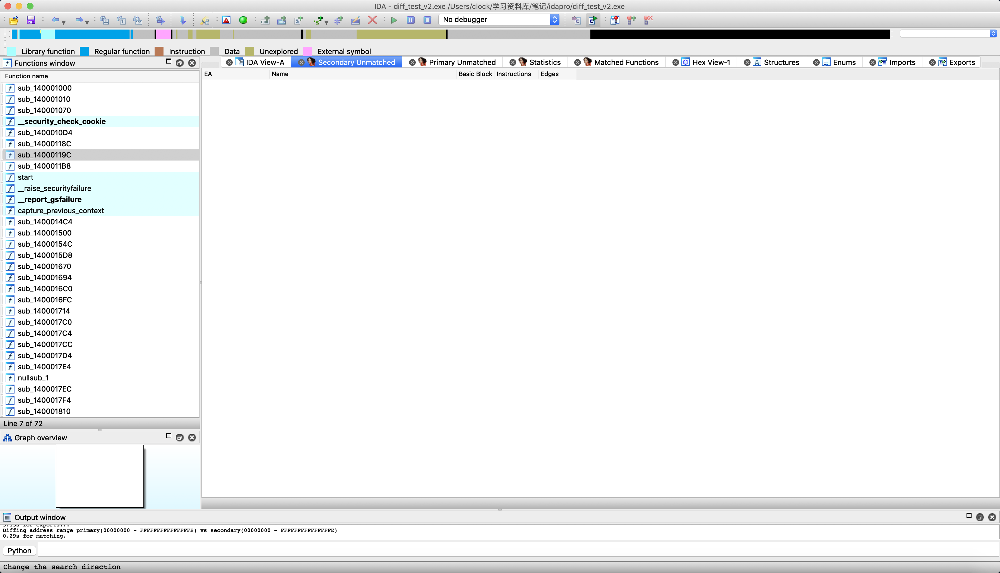

分析完之后是这个样子，可以看到多出来很多辅助窗口。

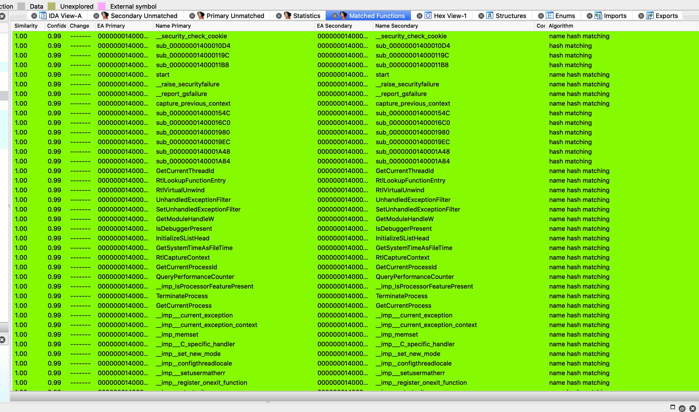

这个窗口里面可以看到列出了详细的比较信息，比较重要的是前两项,Similarity和Confidence，一个是匹配度，一个是对于正确性的信息，下拉到最后一个就看可以看到实际上出现了很大不同。

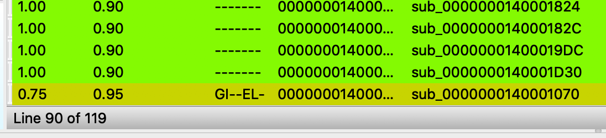

右键点击：

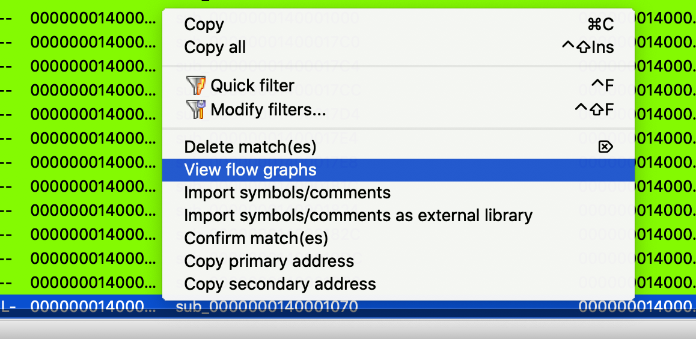

然后bindiff就会弹出来了：

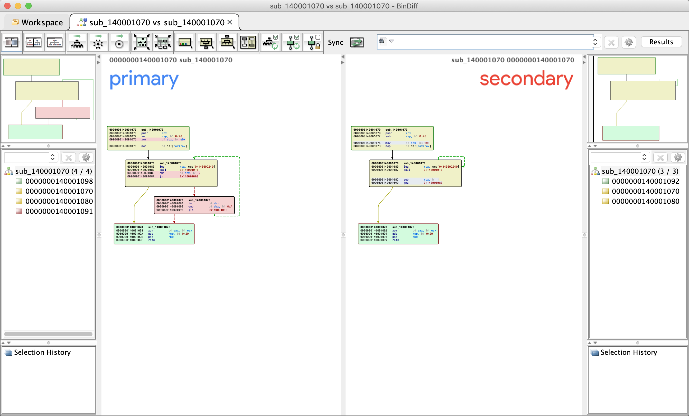

挺准确的，哈哈。