# IDApro-Introduction

### 文件载入

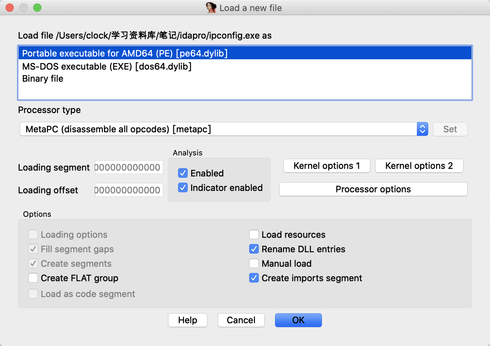

ida会自动识别出一些文件格式，一般默认就可。

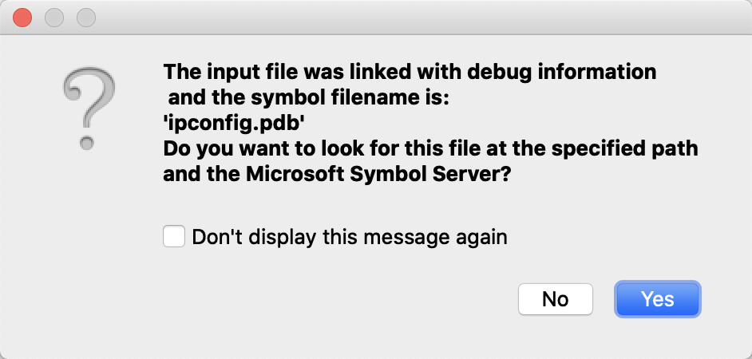

载入过程中IDApro会询问是否要从微软的符号服务器上下载符号文件。如果用的windows系统的话应该就可以直接下载下来了，但是mac的话会出现这个。

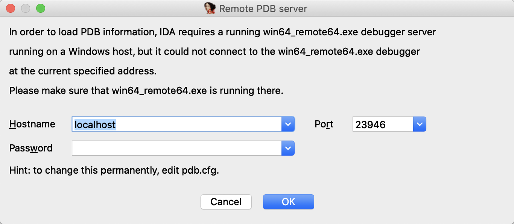

所以我就直接点了Cancel。

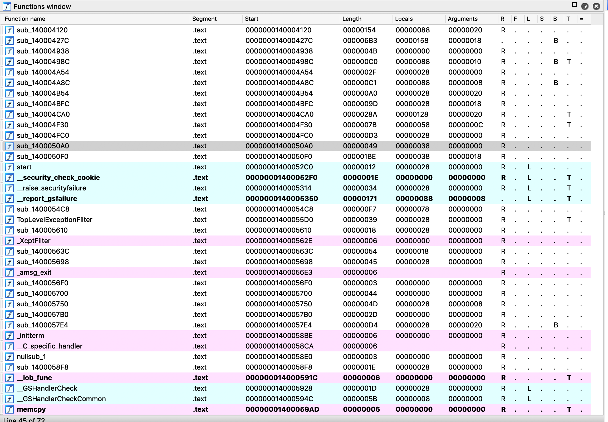

这是IDApro左侧的函数信息窗口，如果你刚才下载了符号表的话你就会看到左侧的sub开头的函数变成实实在在的函数名，没有下载符号表的话就会看到是这个样子，有很多函数都是sub_开头。

### 函数重要属性

* Start:函数的起始地址，这个是根据基地址+偏移求出
* Length:函数所占的字节长度
* 最右侧的一系列字母代表内存权限

### 视图

ida有两种视图，可以按空格快捷键进行来回切换。

文本视图：

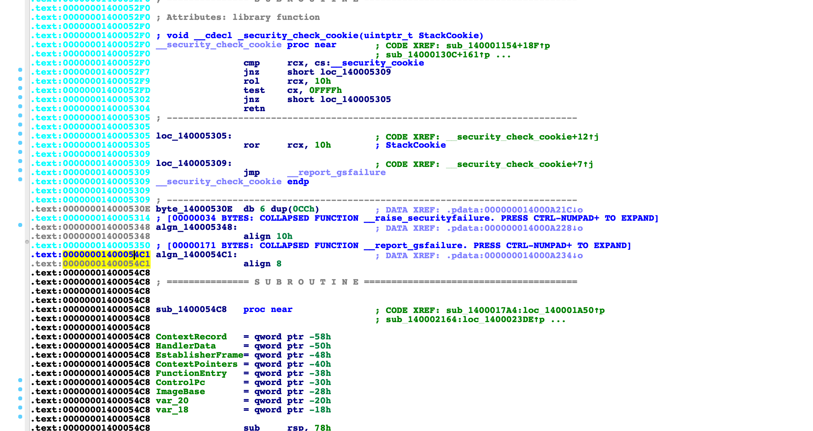

图形视图：

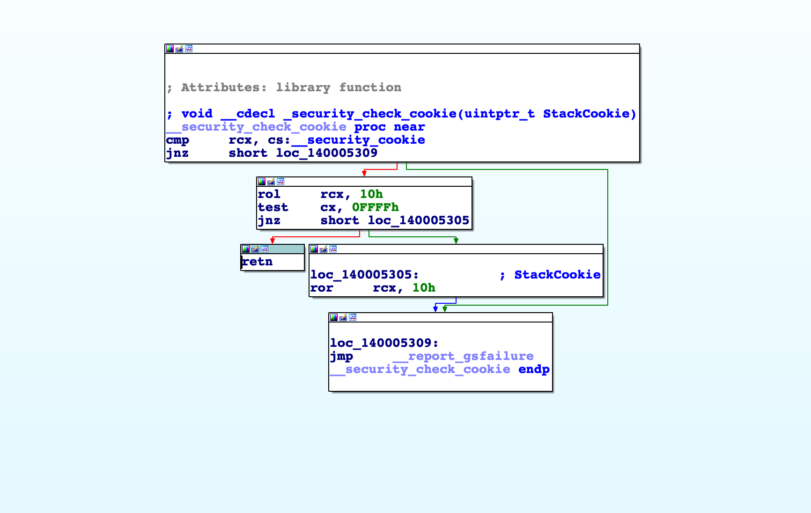

这种视图可以让你很清楚的看见函数执行流程。

### 功能区

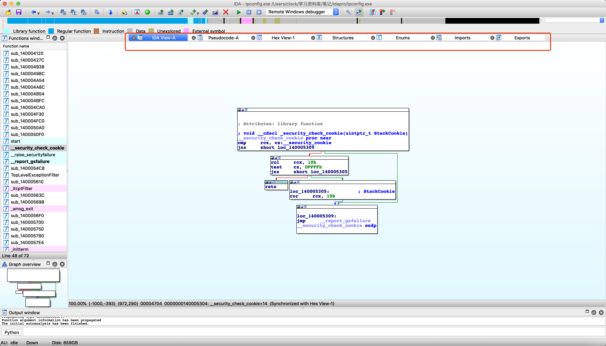

ida拥有强大的功能集成。

* 16进制转储，有的类似于16进制编辑器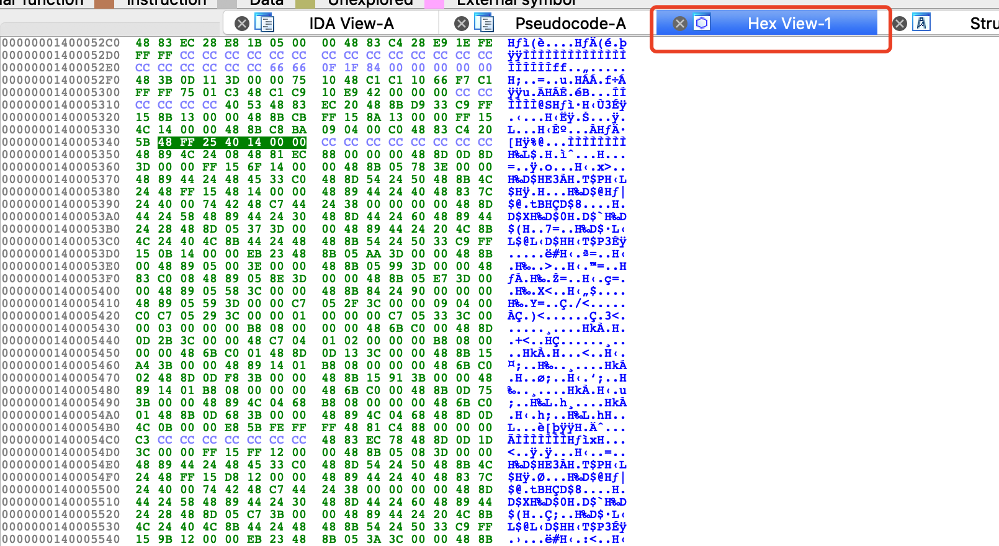

* 结构体识别，这个功能在逆向过程中经常使用。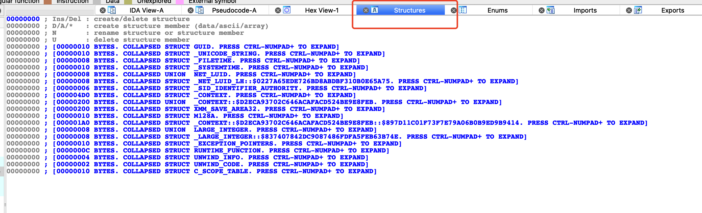这里会显示出来一些识别出的，也可以由用户添加自己逆向出来的结构体。
* 导入函数表：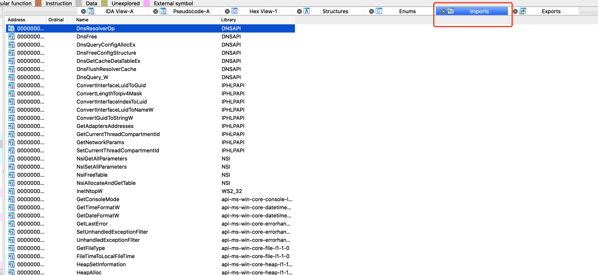这个会显示出二进制文件中导入的库和函数。
* 输出窗口：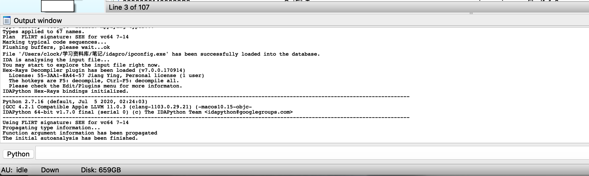这里会显示一些执行信息和日志，同时支持python脚本和idc脚本来进行操作
* Tips:你按control + 1会看到更多的功能区。

### 基地址重设

idapro加载程序会默认加载基地址，可以再edit里面进行更改

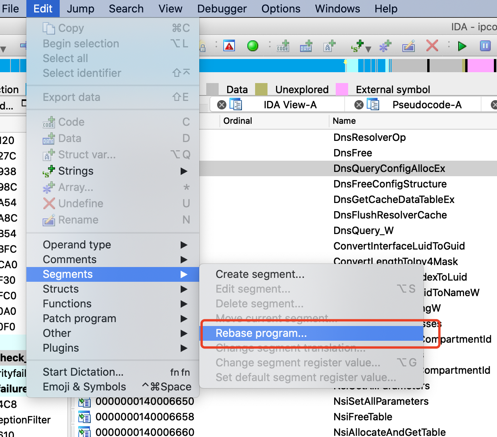

### 目标地址跳转

如果你知道一个地址，可以通过这个直接跳转过去

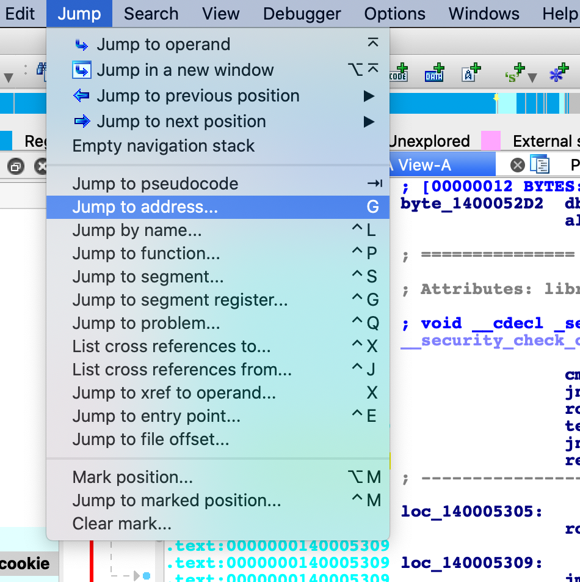

不过快捷键g会是更好的选择。

### 快捷搜索

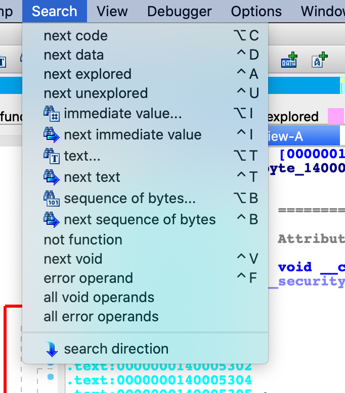

可以搜索文本等一系列的东西，方便更快的进行逆向分析。

### 调试功能

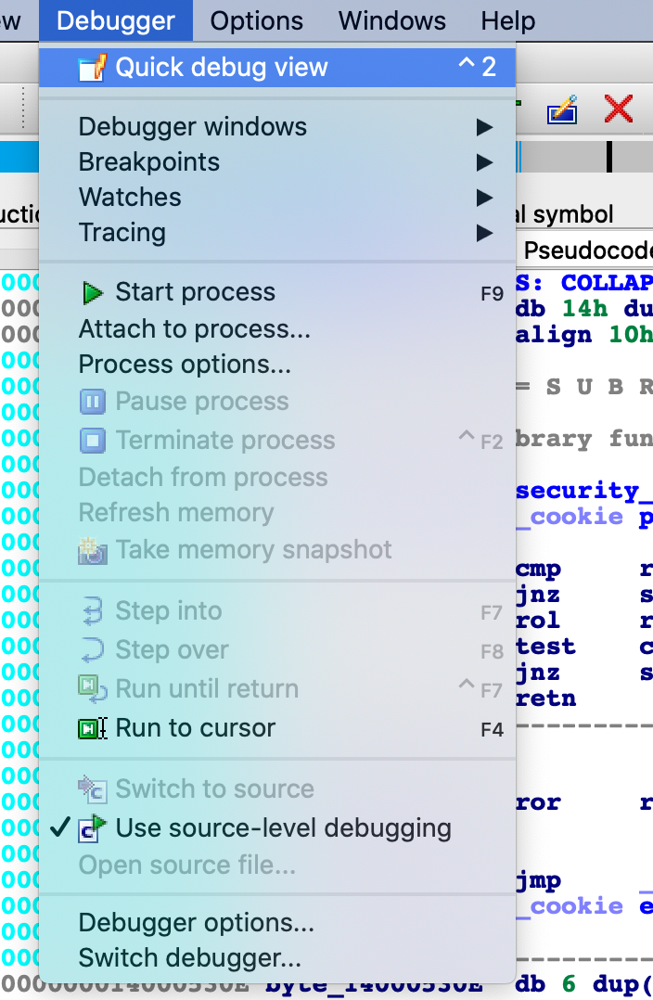

idapro现在也支持强大的动态调试功能，同样在调试windows程序时mac版idapro就会很鸡肋，但是远程调试linux程序的话是一样的。