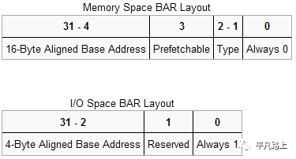

# qemu-pwn-基础知识

> 遇见过好几次qemu的题目，但是其实做出来的几次都是题目没配置好，这次决定还是学习一下，学习新知识总比混吃等死强一点点。

## qemu概述

首先，你必须知道的是，每一个qemu的虚拟机其实都是对应的一个线程，本质上每个虚拟机对应的是你host主机上的一个进程，它的执行线程（cpu线程，i/o线程等）对应qemu进程的一个线程。


其次是内存结构，虚拟机对应的内存结构：

qemu虚拟机对应的真实内存结构如下：

~~~
Guest' processes
+--------------------+
Virtual addr space   |                    |
+--------------------+
|                    |
                     \__   PageTable     \__
                        \                    \
|                    |  Guest kernel
+----+--------------------+----------------+
Guest's phy. memory |    |                    |                |
+----+--------------------+----------------+
|                                          |
                    \__                                        \__
                       \                                          \
|             QEMU process                 |
+----+------------------------------------------+
Virtual addr space |    |                                          |
+----+------------------------------------------+
|                                               |
                    \__                PageTable                   \__
                       \                                               \
|                                               |
+----+-----------------------------------------------++
Physical memory    |    |                                               ||
+----+-----------------------------------------------++
~~~

我感觉大部分新手看到这个图都是懵逼的，文档作者真是好作图。。。不过如果你计算机系统学的好的话，其实可以看出来，是分页机制,简单来说就是本身的host主机分页机制拿出虚拟地址，然后qemu process在虚拟地址中模拟物理地址，然后再次分页机制，就在虚拟机的物理地址上虚拟出来了虚拟地址，其实本质上不过是一次叠加吧。

> qemu进行会为虚拟机mmap分配出相应虚拟机申请大小的内存

strng启动命令：

~~~bash
./qemu-system-x86_64 \
-m 1G \
-device strng \
-hda my-disk.img \
-hdb my-seed.img \
-nographic \
-L pc-bios/ \
-enable-kvm \
-device e1000,netdev=net0 \
-netdev user,id=net0,hostfwd=tcp::5555-:22
~~~

> strng其实就是虚拟机，例子来源于Blizzard CTF 2017

那么地址改如何转换呢？

~~~c
#include<stdio.h>
#include<string.h>
#include<stdint.h>
#include<stdlib.h>
#include<fcntl.h>
#include<assert.h>
#include<inttypes.h>

#define PAGE_SHIFT  12
#define PAGE_SIZE   (1<< PAGE_SHIFT)
#define PFN_PRESENT (1ull<< 63)
#define PFN_PFN     ((1ull<< 55) - 1)  //这里其实就是01111~很多1
//kernel 在2.6.25的时候加入了这样一个功能/proc/self/pagemap 也就是在每个进程的/proc里面都有一个pagemap通过读取里面的内容就可以算出当前虚拟地址对应的物理页，然后加入page_offset就可以知道当前虚拟地址对应的物理地址,下面其实就是这样的一个流程。

int fd;

uint32_t page_offset(uint32_t addr) //这个其实就是拿出物理地址偏移，低12位是偏移，然后
{
return addr & ((1<< PAGE_SHIFT) - 1);
}

uint64_t gva_to_gfn(void*addr)
{
uint64_t pme, gfn;
size_t offset;
    offset = ((uintptr_t)addr >> 9) & ~7;
    lseek(fd, offset, SEEK_SET);
    read(fd, &pme, 8);
if(!(pme & PFN_PRESENT))
return-1;
    gfn = pme & PFN_PFN;
return gfn;
}

uint64_t gva_to_gpa(void*addr)
{
uint64_t gfn = gva_to_gfn(addr);
assert(gfn != -1);
return(gfn << PAGE_SHIFT) | page_offset((uint64_t)addr);
}

int main()
{
uint8_t*ptr;
uint64_t ptr_mem;

    fd = open("/proc/self/pagemap", O_RDONLY);
if(fd < 0) {
        perror("open");
exit(1);
}

    ptr = malloc(256);
    strcpy(ptr, "Where am I?");
    printf("%s\n", ptr);
    ptr_mem = gva_to_gpa(ptr);
    printf("Your physical address is at 0x%"PRIx64"\n", ptr_mem);

    getchar();
return0;
}
~~~

这个其实就是就是虚拟地址到相应物理地址的转换过程。

由于strng虚拟机为32位的，所以编译的命令为：

```
gcc -m32 -O0 mmu.c -o mmu
```

使用命令`scp -P5555 mmu ubuntu@127.0.0.1:/home/ubuntu`将其传至虚拟机中，最后运行得到结果：

```
ubuntu@ubuntu:~$ sudo ./mmuWhere am I?Your physical address is at 0x33cd6008
```

从上面我们知道了虚拟机对应的内存地址在qemu进程中的地址为`0x7fe37fe00000`到`0x7fe3bfe00000`，因此相应的字符串地址为`0x7fe37fe00000+0x33cd6008`，在gdb中进行验证，成功看到相应的字符串：

```
pwndbg> x/s 0x7fe37fe00000+0x33cd6008
```

## pci设备地址空间

> 这个我不是特别熟悉，只能跟着文章理解了

PCI设备都有一个配置空间，其记录了关于此设备的详细信息。大小256字节，头部64字节是PCI标准规定的，当然并非所有的项都必须填充，位置是固定了，没有用到可以填充0。前16个字节的格式是一定的，包含头部的类型、设备的总类、设备的性质以及制造商等，格式如下：

> 横排是32位，竖排是每四个字节一横

6个BAR(Base Address Registers)，BAR记录了设备所需要的地址空间的类型，基址以及其他属性。格式如下：



通过最低位可以区别开来设备可以申请的两类地址空间

### 重点

当BAR最后一位为0表示这是映射的I/O内存，为1是表示这是I/O端口，当是I/O内存的时候1-2位表示内存的类型，bit 2为1表示采用64位地址，为0表示采用32位地址。bit1为1表示区间大小超过1M，为0表示不超过1M。bit3表示是否支持可预取。

而相对于I/O内存，当最后一位为1时表示映射的I/O端口。I/O端口一般不支持预取，所以这里是29位的地址。

通过memory space访问设备I/O的方式称为memory mapped I/O，即MMIO，这种情况下，CPU直接使用普通访存指令即可访问设备I/O。

通过I/O space访问设备I/O的方式称为port I/O，或者port mapped I/O，这种情况下CPU需要使用专门的I/O指令如`IN/OUT`访问I/O端口。

> 到此基本上就可以理解ctf题目里面的一些东西了，看起来好像区分MMIO和PMIO的方法就是cpu访问io端口的方式而已。

### MMIO和PMIO

在MMIO中，内存和I/O设备共享同一个地址空间。MMIO是应用得最为广泛的一种I/O方法，它使用相同的地址总线来处理内存和I/O设备，I/O设备的内存和寄存器被映射到与之相关联的地址。当CPU访问某个内存地址时，它可能是物理内存，也可以是某个I/O设备的内存，用于访问内存的CPU指令也可来访问I/O设备。每个I/O设备监视CPU的地址总线，一旦CPU访问分配给它的地址，它就做出响应，将数据总线连接到需要访问的设备硬件寄存器。为了容纳I/O设备，CPU必须预留给I/O一个地址区域，该地址区域不能给物理内存使用。

> 其中有一段不能给物理内存使用，应该是处理算法不同，当访问I/O地址的时候就会直接走另一套算法。

在PMIO中，内存和I/O设备有各自的地址空间。端口映射I/O通常使用一种特殊的CPU指令，专门执行I/O操作。在Intel的微处理器中，使用的指令是IN和OUT。这些指令可以读/写1,2,4个字节（例如：`outb`, `outw`, `outl`）到IO设备上。I/O设备有一个与内存不同的地址空间，为了实现地址空间的隔离，要么在CPU物理接口上增加一个I/O引脚，要么增加一条专用的I/O总线。由于I/O地址空间与内存地址空间是隔离的，所以有时将PMIO称为被隔离的IO(Isolated I/O)。

> 这一块有点理论化，总结来说就是地址空间使用的区别，不过PMIO从硬件上就会支持地址空间的分离，而MMIO的话就是从内存空间着手分离。

## qemu中查看pci设备

~~~
ubuntu@ubuntu:~$ lspci
00:00.0 Host bridge: Intel Corporation 440FX - 82441FX PMC [Natoma] (rev 02)
00:01.0 ISA bridge: Intel Corporation 82371SB PIIX3 ISA [Natoma/Triton II]
00:01.1 IDE interface: Intel Corporation 82371SB PIIX3 IDE [Natoma/Triton II]
00:01.3 Bridge: Intel Corporation 82371AB/EB/MB PIIX4 ACPI (rev 03)
00:02.0 VGA compatible controller: Device 1234:1111 (rev 02)
00:03.0 Unclassified device [00ff]: Device 1234:11e9 (rev 10)
00:04.0 Ethernet controller: Intel Corporation 82540EM Gigabit Ethernet Controller (rev 03)
~~~

> lspci 命令用来显示当前主机的所有pci总线信息，已经所有已连接的PCI设备信息。

xx:yy:z 的格式为： 总线：设备：功能。

以树状的形式输出pci结构。

~~~bash
ubuntu@ubuntu:~$ lspci -t -v
-[0000:00]-+-00.0  Intel Corporation 440FX - 82441FX PMC [Natoma]
           +-01.0  Intel Corporation 82371SB PIIX3 ISA [Natoma/Triton II]
           +-01.1  Intel Corporation 82371SB PIIX3 IDE [Natoma/Triton II]
           +-01.3  Intel Corporation 82371AB/EB/MB PIIX4 ACPI
           +-02.0  Device 1234:1111
           +-03.0  Device 1234:11e9
           \-04.0  Intel Corporation 82540EM Gigabit Ethernet Controller
~~~

其中`[0000]`表示pci的域， PCI域最多可以承载256条总线。每条总线最多可以有32个设备，每个设备最多可以有8个功能。

总之每个 PCI 设备有一个总线号, 一个设备号, 一个功能号标识。PCI 规范允许单个系统占用多达 256 个总线, 但是因为 256 个总线对许多大系统是不够的, Linux 现在支持 PCI 域。每个 PCI 域可以占用多达 256 个总线. 每个总线占用 32 个设备, 每个设备可以是 一个多功能卡(例如一个声音设备, 带有一个附加的 CD-ROM 驱动)有最多 8 个功能。

PCI 设备通过`VendorIDs`、`DeviceIDs`、以及`Class Codes`字段区分：

~~~
ubuntu@ubuntu:~$ lspci -v -m -n -s 00:03.0
Device: 00:03.0
Class:  00ff
Vendor: 1234
Device: 11e9
SVendor:        1af4
SDevice:        1100
PhySlot:        3
Rev:    10

ubuntu@ubuntu:~$ lspci -v -m -s 00:03.0
Device: 00:03.0
Class:  Unclassified device [00ff]
Vendor: Vendor1234
Device: Device11e9
SVendor:        RedHat, Inc
SDevice:        Device1100
PhySlot:        3
Rev:    10
~~~

> 这些事一些查看信息的命令，不过感觉好像效果一样吧。

### 查看设备的内存空间

~~~
ubuntu@ubuntu:~$ lspci -v -s 00:03.0
00:03.0 Unclassified device [00ff]: Device 1234:11e9 (rev 10)
	Subsystem: Red Hat, Inc Device 1100
	Physical Slot: 3
	Flags: fast devsel
	Memory at febf1000 (32-bit, non-prefetchable) [size=256]
	I/O ports at c050 [size=8]
~~~

命令解析：

​	BARO为MMIO空间，地址为febf1000，大小为256;

​	BAR1为PMIO空间，端口地址为0xc050.

还有一个，但是看着emmmm....


## qemu中访问I/O空间

两种不同的内存分配方式，如果访问，其都可以采用在内核态访问或者在用户空间编程进行访问。

### 访问mmio

编译内核模块，在内核态访问mimo空间，示例代码如下：

~~~c
#include<asm/io.h>
#include<linux/ioport.h>

long addr=ioremap(ioaddr,iomemsize);
readb(addr);
readw(addr);
readl(addr);
readq(addr);//qwords=8 btyes

writeb(val,addr);
writew(val,addr);
writel(val,addr);
writeq(val,addr);
iounmap(addr);
~~~

> 其实本人并没有学过内核编程，只是做题时偶尔了解，不过这个应该看语法就能看懂吧，不过是一些读输入和写数据的操作。

毫无疑问，普通的gcc编译不出来的，不过单纯为了做题的话，记住那几个关键语法就行,orz...

还有一种方式是在用户态访问mmio空间，通过映射`resource0`文件实现内存的访问，示例代码如下：

~~~c
#include<assert.h>
#include<fcntl.h>
#include<inttypes.h>
#include<stdio.h>
#include<stdlib.h>
#include<string.h>
#include<sys/mman.h>
#include<sys/types.h>
#include<unistd.h>
#include<sys/io.h>


unsignedchar* mmio_mem;

voiddie(constchar* msg) //看着有点像消息传递
{
    perror(msg);
exit(-1);
}
void mmio_write(uint32_t addr, uint32_t value) //mmio写入
{
*((uint32_t*)(mmio_mem + addr)) = value;
}

uint32_t mmio_read(uint32_t addr) //mmio读数据
{
return*((uint32_t*)(mmio_mem + addr));
}
int main(int argc, char*argv[])
{

// Open and map I/O memory for the strng device
int mmio_fd = open("/sys/devices/pci0000:00/0000:00:04.0/resource0", O_RDWR | O_SYNC);
if(mmio_fd == -1)
die("mmio_fd open failed");

    mmio_mem = mmap(0, 0x1000, PROT_READ | PROT_WRITE, MAP_SHARED, mmio_fd, 0);
if(mmio_mem == MAP_FAILED)
die("mmap mmio_mem failed");

    printf("mmio_mem @ %p\n", mmio_mem);

      mmio_read(0x128);
        mmio_write(0x128, 1337);
}
~~~

> 如果我们看了之前的访问方式，这个不难理解吧？这个就是打开resource0文件，访问这个文件里面的内容，找到内存空间，然后通过指针操作访问和写入这个文件 的内存空间，我表述的可能不透彻，关键还是看上面的图片。

### 访问pmio

编译内核模块，在内核空间访问pmio空间，示例代码：

~~~c
#include<asm/io.h>
#include<linux/ioport.h>

inb(port);  //读取一字节
inw(port);     //读取两字节
inl(port);    //读取四字节

outb(val,port);    //写一字节
outw(val,port); //写两字节
outl(val,port);    //写四字节
~~~

> 这个没啥好说的，毕竟从内核操作，权限高，命令全，这个就是从端口读写。

用户空间访问则需要先调用iopl函数申请访问端口，示例代码如下：

~~~c
#include<sys/io.h >

iopl(3); 
inb(port); 
inw(port); 
inl(port);

outb(val,port); 
outw(val,port); 
outl(val,port);
~~~

> 就是一个api的差别，果然从硬件支持后，减轻了不少负担。

## QOM编程模型

QEMU提供了一套面向对象编程的模型——QOM（QEMU Object Module），几乎所有的设备如CPU、内存、总线等都是利用这一面向对象的模型来实现的。

由于qemu模拟设备以及CPU等，既有相应的共性又有自己的特性，因此使用面向对象来实现相应的程序是非常高效的，可以像理解C++或其它面向对象语言来理解QOM。

有几个比较关键的结构体，`TypeInfo`、`TypeImpl`、`ObjectClass`以及`Object`。其中ObjectClass、Object、TypeInfo定义在include/qom/object.h中，TypeImpl定义在qom/object.c中。

`TypeInfo`是用户用来定义一个Type的数据结构，用户定义了一个TypeInfo，然后调用`type_register(TypeInfo )`或者`type_register_static(TypeInfo )`函数，就会生成相应的`TypeImpl`实例，将这个`TypeInfo`注册到全局的`TypeImpl`的`hash`表中。

~~~c
struct TypeInfo
{
const char* name;
const char* parent;
size_t instance_size;
void(*instance_init)(Object*obj);
void(*instance_post_init)(Object*obj);
void(*instance_finalize)(Object*obj);
bool abstract;
size_t class_size;
void (*class_init)(ObjectClass*klass, void*data);
void (*class_base_init)(ObjectClass*klass, void*data);
void (*class_finalize)(ObjectClass*klass, void*data);
void* class_data;
InterfaceInfo* interfaces;
};
~~~

`TypeImpl`的属性与`TypeInfo`的属性对应，实际上qemu就是通过用户提供的TypeInfo创建的TypeImpl的对象。

如下面定义的pci_test_dev:

~~~c
static const TypeInfo pci_testdev_info = {
.name          = TYPE_PCI_TEST_DEV,
.parent        = TYPE_PCI_DEVICE,
.instance_size = sizeof(PCITestDevState),
.class_init    = pci_testdev_class_init,
};
TypeImpl* type_register_static(const TypeInfo* info)
{
return type_register(info);
}
TypeImpl *type_register(const TypeInfo* info)
{
assert(info->parent);
return type_register_internal(info);
}
static TypeImpl* type_register_internal(const TypeInfo* info)
{
	TypeImpl* ti;
    ti = type_new(info);
    type_table_add(ti);
return ti;
}
~~~

当所有qemu总线、设备等的`type_register_static`执行完成后，即它们的`TypeImpl`实例创建成功后，qemu就会在`type_initialize`函数中去实例化其对应的`ObjectClasses`。

每个`type`都有一个相应的`ObjectClass`所对应，其中ObjectClass是所有类的基类

~~~c
struct ObjectClass
{
/*< private >*/
Type type;  
GSList* interfaces;
const char* object_cast_cache[OBJECT_CLASS_CAST_CACHE];
const char* class_cast_cache[OBJECT_CLASS_CAST_CACHE];
ObjectUnparent* unparent;
GHashTable* properties;
};
~~~

用户可以定义自己的类，继承相应类即可：

~~~c++
/* include/qom/object.h */
typedef struct TypeImpl* Type;
typedef struct ObjectClass ObjectClass;
structObjectClass
{
/*< private >*/
Type type;       /* points to the current Type's instance */
...
/* include/hw/qdev-core.h */
typedef struct DeviceClass{
/*< private >*/
ObjectClass parent_class;
/*< public >*/
...
/* include/hw/pci/pci.h */
typedef struct PCIDeviceClass{
DeviceClass parent_class;
...
~~~

可以看到类的定义中父类都在第一个字段，使得可以父类与子类直接实现转换。一个类初始化时会先初始化它的父类，父类初始化完成后，会将相应的字段拷贝至子类同时将子类其余字段赋值为0，再进一步赋值。同时也会继承父类相应的虚函数指针，当所有的父类都初始化结束后，`TypeInfo::class_init`就会调用以实现虚函数的初始化，如下例的`pci_testdev_class_init`所示：

~~~c++
static void pci_testdev_class_init(ObjectClass* klass, void* data)
{
DeviceClass* dc = DEVICE_CLASS(klass);
PCIDeviceClass* k = PCI_DEVICE_CLASS(klass);
        k->init = pci_testdev_init;
        k->exit= pci_testdev_uninit;
...
        dc->desc = "PCI Test Device";
...
}
~~~

最后一个Object对象：

~~~c++
struct Object
{
/*< private >*/
ObjectClass* class;
ObjectFree* free;
GHashTable* properties;
uint32_t ref;
Object* parent;
};
~~~

`Object`对象为何物？`Type`以及`ObjectClass`只是一个类型，而不是具体的设备。`TypeInfo`结构体中有两个函数指针：`instance_init`以及`class_init`。`class_init`是负责初始化`ObjectClass`结构体的，`instance_init`则是负责初始化具体`Object`结构体的。

```
the Object constructor and destructor functions (registered by the respective Objectclass constructors) will now only get called if the corresponding PCI device's -device option was specified on the QEMU command line (unless, probably, it is a default PCI device for the machine). Object类的构造函数与析构函数（在Objectclass构造函数中注册的）只有在命令中-device指定加载该设备后才会调用（或者它是该系统的默认加载PCI设备）。
```

`Object`示例如下所示：

~~~c++
/* include/qom/object.h */
typedef struct Object Object;
struct Object
{
/*< private >*/
ObjectClass* class; /* points to the Type's ObjectClass instance */
...
/* include/qemu/typedefs.h */
typedef struct DeviceState DeviceState;
typedef struct PCIDevice PCIDevice;
/* include/hw/qdev-core.h */
struct DeviceState{
/*< private >*/
Object parent_obj;
/*< public >*/
...
/* include/hw/pci/pci.h */
struct PCIDevice{
DeviceState qdev;
...
structYourDeviceState{
PCIDevice pdev;
...
~~~

QOM会为设备Object分配`instace_size`大小的空间，然后调用`instance_init`函数（在Objectclass的class_init函数中定义）：

~~~c
static int pci_testdev_init(PCIDevice* pci_dev)
{
PCITestDevState *d = PCI_TEST_DEV(pci_dev);
...
~~~

> 前面感觉都是记不住的胡扯（哈哈哈哈），下面到重点了。

### 重点

PCI内存空间：

qemu使用`MemoryRegion`来表示内存空间，在`include/exec/memory.h`中定义。使用`MemoryRegionOps`结构体来对内存的操作进行表示，如`PMIO`或`MMIO`。对每个`PMIO`或`MMIO`操作都需要相应的`MemoryRegionOps`结构体，该结构体包含相应的`read/write`回调函数。

> 每个PMIO和MMIO都需要相应的MemoryRegionOps结构体

~~~c++
static const MemoryRegionOps pci_testdev_mmio_ops = {
.read = pci_testdev_read,
.write = pci_testdev_mmio_write,
.endianness = DEVICE_LITTLE_ENDIAN,
.impl = {
.min_access_size = 1,
.max_access_size = 1,
},
}; //MMIO

static const MemoryRegionOps pci_testdev_pio_ops = {
.read = pci_testdev_read,
.write = pci_testdev_pio_write,
.endianness = DEVICE_LITTLE_ENDIAN,
.impl = {
.min_access_size = 1,
.max_access_size = 1,
},
}; // PMIO
~~~

首先使用`memory_region_init_io`函数初始化内存空间（`MemoryRegion`结构体），记录空间大小，注册相应的读写函数等；然后调用`pci_register_bar`来注册BAR等信息。需要指出的是无论是MMIO还是PMIO，其所对应的空间需要显式的指出（即静态声明或者是动态分配），因为`memory_region_init_io`只是记录空间大小而并不分配。

~~~c++
/* hw/misc/pci-testdev.c */
#define IOTEST_IOSIZE 128
#define IOTEST_MEMSIZE 2048

typedef struct PCITestDevState{
/*< private >*/
PCIDevice parent_obj;
/*< public >*/

MemoryRegion mmio;
MemoryRegion portio;
IOTest* tests;
int current;
} PCITestDevState;

static int pci_testdev_init(PCIDevice* pci_dev)
{
PCITestDevState* d = PCI_TEST_DEV(pci_dev);
...
        memory_region_init_io(&d->mmio, OBJECT(d), &pci_testdev_mmio_ops, d,
"pci-testdev-mmio", IOTEST_MEMSIZE * 2); 
        memory_region_init_io(&d->portio, OBJECT(d), &pci_testdev_pio_ops, d,
"pci-testdev-portio", IOTEST_IOSIZE * 2); 
        pci_register_bar(pci_dev, 0, PCI_BASE_ADDRESS_SPACE_MEMORY, &d->mmio);
        pci_register_bar(pci_dev, 1, PCI_BASE_ADDRESS_SPACE_IO, &d->portio);
~~~

> 其实并不是很难理解，就是结构体很多，找起来很费时间，不过重点部分记好差不多就够用啦。

## qemu中设备的实现

### strng

~~~c
#include "qemu/osdep.h"
#include "hw/pci/pci.h"

#define STRNG(obj) OBJECT_CHECK(STRNGState, obj, "strng")
//MMIO
#define STRNG_MMIO_REGS 64
#define STRNG_MMIO_SIZE (STRNG_MMIO_REGS * sizeof(uint32_t))
//PO
#define STRNG_PMIO_ADDR 0
#define STRNG_PMIO_DATA 4
#define STRNG_PMIO_REGS STRNG_MMIO_REGS
#define STRNG_PMIO_SIZE 8

typedef struct {
    PCIDevice pdev;
    MemoryRegion mmio;
    MemoryRegion pmio;
    uint32_t addr;
    uint32_t regs[STRNG_MMIO_REGS];
    void (*srand)(unsigned int seed);
    int (*rand)(void);
    int (*rand_r)(unsigned int *seed);
} STRNGState;

static uint64_t strng_mmio_read(void *opaque, hwaddr addr, unsigned size)
{
    STRNGState *strng = opaque;

    if (size != 4 || addr & 3)
        return ~0ULL;

    return strng->regs[addr >> 2];
}

static void strng_mmio_write(void *opaque, hwaddr addr, uint64_t val, unsigned size)
{
    STRNGState *strng = opaque;
    uint32_t saddr;

    if (size != 4 || addr & 3)
        return;

    saddr = addr >> 2;
    switch (saddr) {
    case 0:
        strng->srand(val);
        break;

    case 1:
        strng->regs[saddr] = strng->rand();
        break;

    case 3:
        strng->regs[saddr] = strng->rand_r(&strng->regs[2]);

    default:
        strng->regs[saddr] = val;
    }
}

static const MemoryRegionOps strng_mmio_ops = {
    .read = strng_mmio_read,
    .write = strng_mmio_write,
    .endianness = DEVICE_NATIVE_ENDIAN,
};

static uint64_t strng_pmio_read(void *opaque, hwaddr addr, unsigned size)
{
    STRNGState *strng = opaque;
    uint64_t val = ~0ULL;

    if (size != 4)
        return val;

    switch (addr) {
    case STRNG_PMIO_ADDR:
        val = strng->addr;
        break;

    case STRNG_PMIO_DATA:
        if (strng->addr & 3)
            return val;

        val = strng->regs[strng->addr >> 2];
    }

    return val;
}

static void strng_pmio_write(void *opaque, hwaddr addr, uint64_t val, unsigned size)
{
    STRNGState *strng = opaque;
    uint32_t saddr;

    if (size != 4)
        return;

    switch (addr) {
    case STRNG_PMIO_ADDR:
        strng->addr = val;
        break;

    case STRNG_PMIO_DATA:
        if (strng->addr & 3)
            return;

        saddr = strng->addr >> 2;
        switch (saddr) {
        case 0:
            strng->srand(val);
            break;

        case 1:
            strng->regs[saddr] = strng->rand();
            break;

        case 3:
            strng->regs[saddr] = strng->rand_r(&strng->regs[2]);
            break;

        default:
            strng->regs[saddr] = val;
        }
    }
}

static const MemoryRegionOps strng_pmio_ops = {
    .read = strng_pmio_read,
    .write = strng_pmio_write,
    .endianness = DEVICE_LITTLE_ENDIAN,
};

static void pci_strng_realize(PCIDevice *pdev, Error **errp)
{
    STRNGState *strng = DO_UPCAST(STRNGState, pdev, pdev);

    memory_region_init_io(&strng->mmio, OBJECT(strng), &strng_mmio_ops, strng, "strng-mmio", STRNG_MMIO_SIZE);
    pci_register_bar(pdev, 0, PCI_BASE_ADDRESS_SPACE_MEMORY, &strng->mmio);
    memory_region_init_io(&strng->pmio, OBJECT(strng), &strng_pmio_ops, strng, "strng-pmio", STRNG_PMIO_SIZE);
    pci_register_bar(pdev, 1, PCI_BASE_ADDRESS_SPACE_IO, &strng->pmio);
}

static void strng_instance_init(Object *obj)
{
    STRNGState *strng = STRNG(obj);

    strng->srand = srand;
    strng->rand = rand;
    strng->rand_r = rand_r;
}

static void strng_class_init(ObjectClass *class, void *data)
{
    PCIDeviceClass *k = PCI_DEVICE_CLASS(class);

    k->realize = pci_strng_realize;
    k->vendor_id = PCI_VENDOR_ID_QEMU;
    k->device_id = 0x11e9;
    k->revision = 0x10;
    k->class_id = PCI_CLASS_OTHERS;
}

static void pci_strng_register_types(void)
{
    static const TypeInfo strng_info = {
        .name          = "strng",
        .parent        = TYPE_PCI_DEVICE,
        .instance_size = sizeof(STRNGState),
        .instance_init = strng_instance_init,
        .class_init    = strng_class_init,
    };

    type_register_static(&strng_info);
}
type_init(pci_strng_register_types)
~~~


