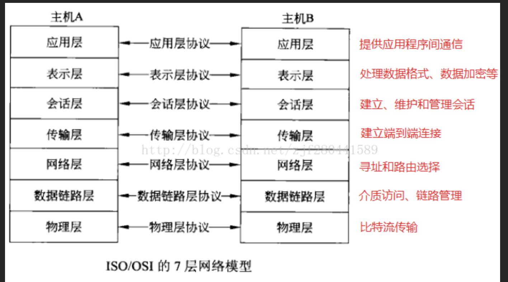
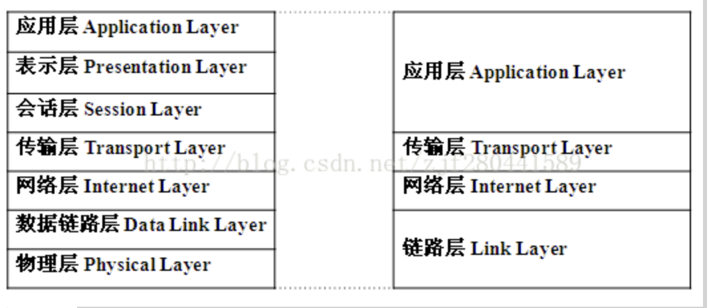
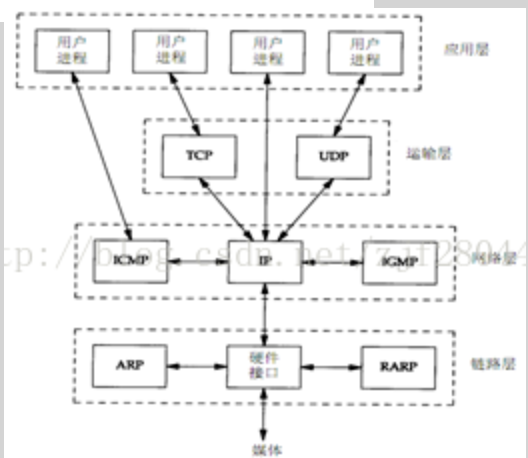
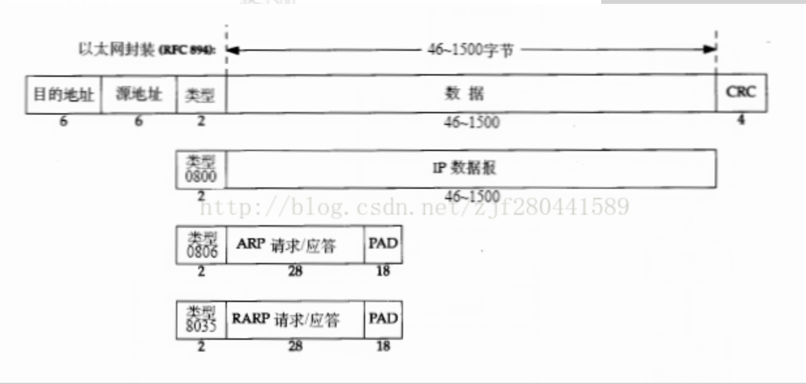

# Socket编程学习  一

>  参考https://blog.csdn.net/zjf280441589/article/details/44258027?ops_request_misc=%257B%2522request%255Fid%2522%253A%2522159947005219724835846881%2522%252C%2522scm%2522%253A%252220140713.130102334.pc%255Fblog.%2522%257D&request_id=159947005219724835846881&biz_id=0&utm_medium=distribute.pc_search_result.none-task-blog-2~blog~first_rank_v2~rank_blog_v1-12-44258027.pc_v2_rank_blog_v1&utm_term=socket&spm=1018.2118.3001.4187

## 概述

OSI(open system interconnection)开放系统互联模型是由ISO国际标准化组织定义的网络分层模型，共七层, 从下往上为:

| 物理层(Physical Layer)      | 物理层定义了所有电子及物理设备的规范，为上层的传输提供了一个物理介质，本层中数据传输的单位为比特（bit/二进制位）。属于本层定义的规范有EIA/TIA RS-232、RJ-45等，实际使用中的设备如网卡属于本层。 |
| --------------------------- | ------------------------------------------------------------ |
| 数据链路层(Data Link Layer) | 对物理层收到的比特流进行数据成帧。提供可靠的数据传输服务，实现无差错数据传输。在数据链路层中数据的单位为帧(frame)。属于本层定义的规范有HDLC、PPP、STP等，实际使用中的设备如switch交换机属于本层。 |
| 网络层（Network Layer）     | 网络层负责将各个子网之间的数据进行路由选择，分组与重组。本层中数据传输的单位为数据包（packet）。属于本层定义的规范有IP、RIP、OSPF、ICMP、IGMP等。实际使用中的设备如路由器属于本层。 |
| 传输层(Transport Layer)     | 提供可靠的数据传输服务(注意OSI的传输层与TCP/IP的传输层的功能不尽相同)，它检测路由器丢弃的包，然后产生一个重传请求，能够将乱序收到的数据包重新排序。 |
| 会话层(Session Layer)       | 管理主机之间会话过程，包括会话建立、终止和会话过程中的管理   |
| 表示层(Presentation Layer)  | 表示层对网络传输的数据进行变换，使得多个主机之间传送的信息能够互相理解，包括数据的压缩、加密、格式转换等。 |
| 应用层(Application Layer)   | 应用层与应用程序界面沟通，以达至展示给用户的目的。 在此常见的协定有: HTTP，HTTPS，FTP，TELNET，SSH，SMTP，POP3等 |

## TCP/IP  模型

其实在真实环境下，7层并不是全部都真实存在。

### TCP/IP主要协议

其实主要的就是 TCP 和 UDP 不过我们值得注意的是其中的分层所处的结构。ip , icmp igmp都是处于网络层。

## 链路层

### 以太网帧格式

