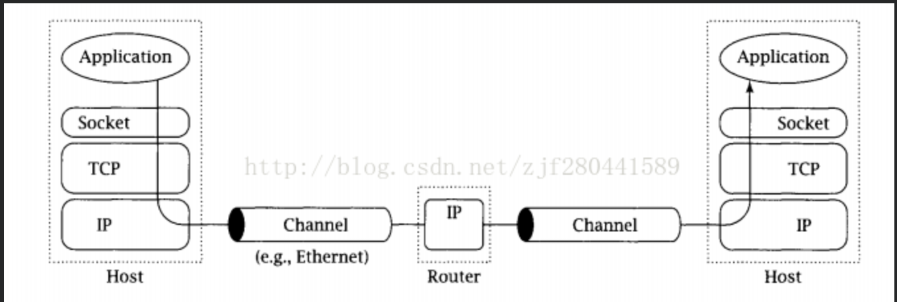
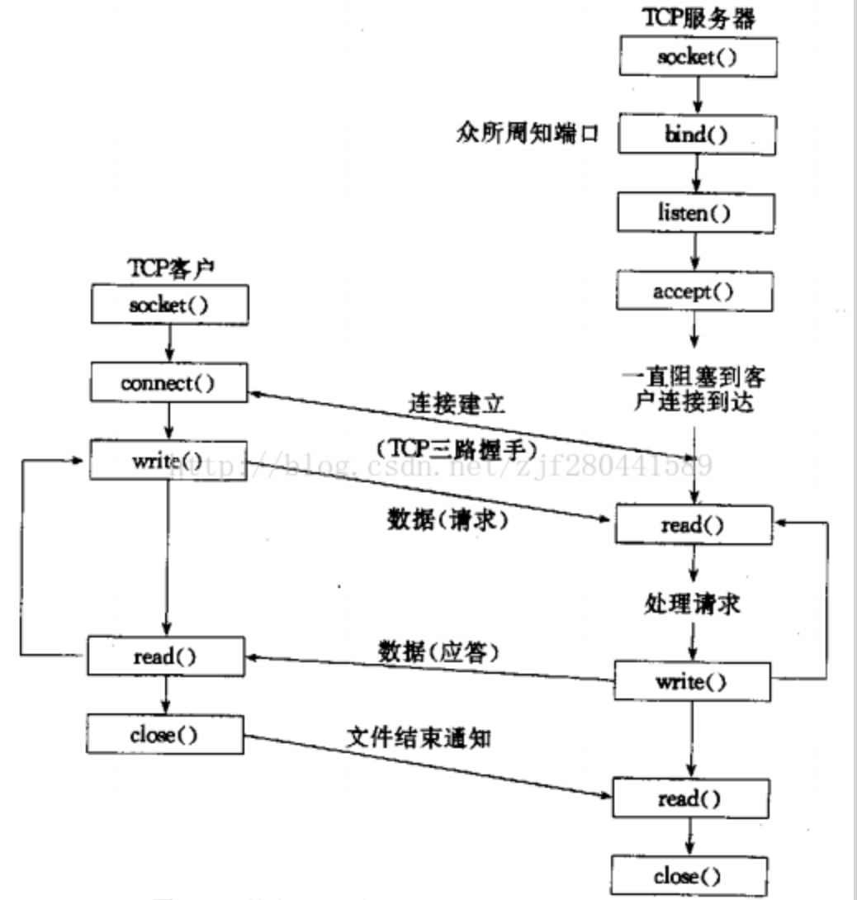
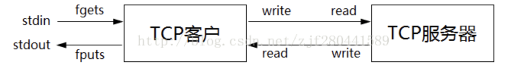

> 编程引导

## 什么是socket?

socket是用户进程和内核网络协议栈的接口：其不仅可以用于本机进程间通信，可以用于网络上不同主机的进程间通信, 甚至还可以用于异构系统之间的通信。

流程：应用 - > socket接口 -> tcp -> ip -> channel(这个以后要好好理解) -> IP(router,这里实际上是路由分发的作用) -> Channel -> ip -> tcp -> socket -> application 

其本质实际上是应用之间相互访问的过程。

## IPv4 套接口地址

IPv4套接口地址结构通常也称为“网际套接字地址结构”，它以“sockaddr_in”命名，定义在头文件<netinet/in.h>中

~~~c
struct sockaddr_in
{
  uint8_t sin_len; //该结构体的长度，在4.3BSD-Reno版本之前的第一个成员是sin_family.
  sa_family_t sin_family; // 地址家族，对于IPv4来说必须是AF_INET
  in_port_t sin_port; //端口
  struct in_addr sin_addr; // IPv4的地址
	char sin_zero[8];   //暂时不用，一般将其设置为0
}
~~~

### Linux结构（重点）：

~~~c
struct sockaddr_in
{
    sa_family_t    sin_family; /* address family: AF_INET */
    in_port_t      sin_port;   /* port in network byte order(网络字节序) */
    struct in_addr sin_addr;   /* internet address */
};
/* Internet address. */
struct in_addr
{
    uint32_t       s_addr;     /* address in network byte order */
};
~~~

相比上一个少了结构体长度。

### 通用地址结构

用来指定与套接字关联的地址（可以支持其他协议）。

~~~c
struct sockaddr
{
	uint8_t  sin_len;  //结构体长度
	sa_family_t  sin_family; //协议家族
	char sa_data[14]; 	//14字节 　　由sin_family决定它的形式
};
~~~

## 网络字节序

1.大端字节序（Big Endian)

   最高有效位（MSB：Most Significant Bit）存储于最低内存地址处，最低有效位（LSB：Lowest Significant Bit）存储于最高内存地址处。

2.小端字节序（Little Endian）

   最高有效位（MSB：Most Significant Bit）存储于最高内存地址处，最低有效位（LSB：Lowest Significant Bit）存储于最低内存地址处。

3.主机字节序

   不同的主机有不同的字节序，如x86为小端字节序，Motorola 6800为大端字节序，ARM字节序是可配置的。

4.网络字节序

   网络字节序规定为大端字节序

## 字节序转换函数（常用于端口转换）

~~~c
uint32_t htonl(uint32_t hostlong);
uint16_t htons(uint16_t hostshort);
uint32_t ntohl(uint32_t netlong);
uint16_t ntohs(uint16_t netshort);
/**说明:
h代表(local)host；n代表network;
s代表short；l代表long;
*/
~~~

函数作用于变量，示例如下

~~~c
//测试转换结果
int main()
{
    int localeData = 0x12345678;
    char *p = (char *)&localeData;
    printf("Begin: %0x %0x %0x %0x\n", p[0], p[1], p[2], p[3]);
    //将本地字节转换成网络字节
    int inetData = htonl(localeData);
    p = (char *)&inetData;
    printf("After: %0x %0x %0x %0x\n", p[0], p[1], p[2], p[3]);
 
    if (p[0] == 0x12)
        cout << "网络系统为大端模式" << endl;
    else
        cout << "网络系统为小端模式" << endl;
    printf("host:%x, inet:%x\n", localeData, inetData);
}
~~~

## 地址转换函数

IP地址转换

~~~c
#include <netinet/in.h>
#include <arpa/inet.h>
int inet_aton(const char *cp, struct in_addr *inp); //将点分十进制以十进制的方式赋值给 inp 
in_addr_t inet_addr(const char *cp);	 //将点分十进制数转换为十进制数
char *inet_ntoa(struct in_addr in); //将十进制数转换成点分十进制数，注意参数类型
~~~

~~~c
//in_addr定义如下:
typedef uint32_t in_addr_t;
struct in_addr
{
    in_addr_t s_addr;
};
~~~

## 套接字类型

用于区分不同的协议类型：

1)流式套接字(SOCK_STREAM)

   提供面向连接的、可靠的数据传输服务，数据无差错，无重复的发送，且按发送顺序接收, 对应TCP协议。

2)数据报式套接字(SOCK_DGRAM)

   提供无连接服务。不提供无错保证，数据可能丢失或重复，并且接收顺序混乱, 对应UDP协议。

3)原始套接字（SOCK_RAW）

   使我们可以跨越传输层直接对IP层进行封装传输.

tcp经典流程，其实就是简单的三次握手然后数据的请求和应答，然后中断连接。

## 回声服务器

把客服输入重新返回。

