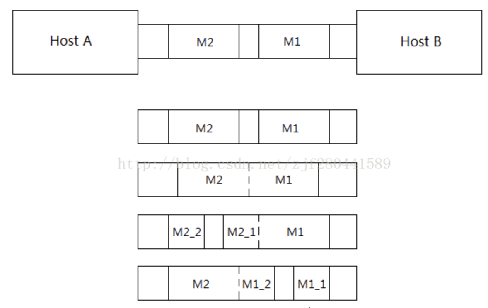
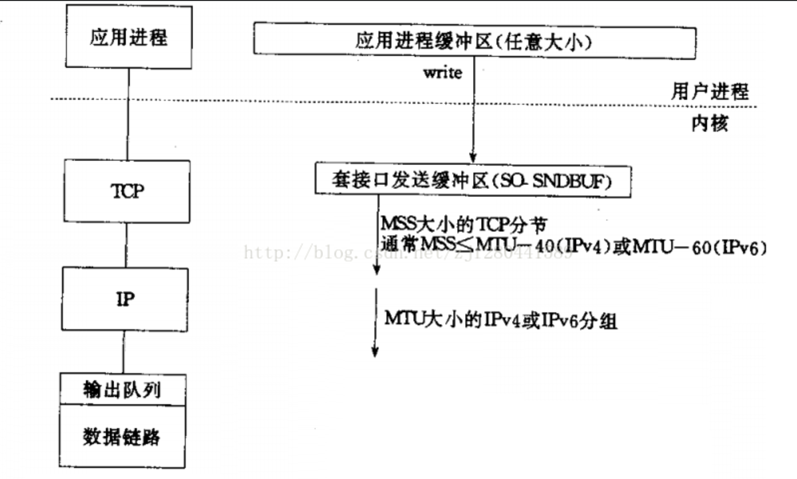
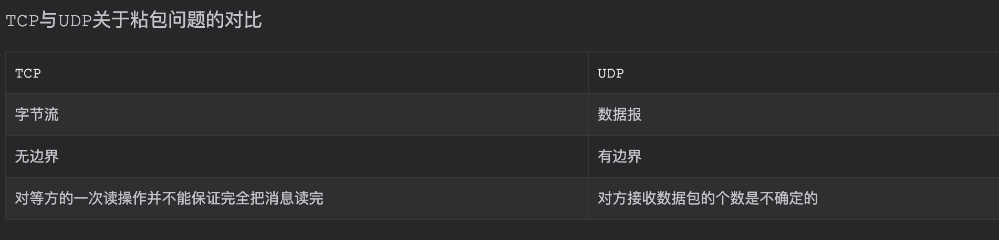

#  Socket编程实践五-TCP粘包问题与解决

> 由于TCP协议是基于字节流且无边界的传输协议，因此很有可能产生粘包问题。

其实简单来说就是因为传输问题，可能导致我们发送的数据和顺序跟我们想要的不一样。

> 假设发送M1,M2两个10k大小的数据包，会出现以下可能

* 第一次发送M1,第二次发送M2，这是我们想要的
* 第一次发送M2,第一次发送M1，这就是错误
* 第一次发送5k的M1,第二次发送15K的M1+M2
* 第一次发送5k的M2,第二次发送15k的M1+M2
* 也可能一次接受20K,

> 除了第一个，其他都不是我们想要的，当然错误的可能是很多的。

## 粘包原因

1. SO_SNDBUF套接字本事有缓冲区（发送缓冲区和接受缓冲区）
2. tcp传送端mss大小限制
3. 链路层也有MTU大小限制，如果数据包大于MTU要在IP层进行分片，导致消息分割。
4. tcp的流量控制和拥塞控制，也可能导致粘包
5. tcp延迟发送机制
6. 

### 解惑

对于tcp协议来说，客户端和服务端在建立tcp连接的时候，双方会通告自己的接收窗口大小（告诉对方自己能接收的数据大小），然后双方就会根据接收窗口来调整自己的发送窗口大小。

通过SO_RCVBUF和SO_SNDBUF套接字选项来改变默认的接收缓冲区和发送缓冲区的大小。

在设置套接字接收缓冲区大小需要注意的是：因为客户端的接收窗口是在建立tcp连接时确定的，所以必须在客户端调用connect函数之前设置SO_RCVBUF套接字选项。同理，服务端的接收窗口也是在建立tcp连接时确定的，所以服务端也必须在调用listen函数之前设置SO_RCVBUF套接字选项。然后服务端accept函数返回的新的套接字会从监听的套接字继承接收缓冲区大小。

client端代码解释：

~~~c
 setsockopt(sfd , SOL_SOCKET , SO_RCVBUF , (char *)&RecvBuf , sizeof(int));
        connect(sfd, (struct sockaddr *)&serv_addr ,  sizeof(serv_addr));

~~~

MSS，全称为Max Segment Size。根据RFC的定义，MSS是一个TCP选项，并且只出现在TCP三次握手的SYN包中（包括SYN+ACK），用于通知对端本地最大可以接收的TCP报文数据大小（不包含TCP和IP报文首部） —— 注意这里是本地可以接收的大小。同一个TCP连接，两个方向上的MSS大小可以不同，并且发送方的TCP报文的最大数据长度不能超过对端声明的MSS大小。

## TCP和UDP对比

## 粘包的解决方案**(本质上是要在应用层维护消息与消息的边界)**

1.定长包：

​		该方式并不实用: 如果所定义的长度过长, 则会浪费网络带宽, 而又如果定义的长度过短, 则一条消息又会拆分成为多条, 仅在TCP的应用一层就增加了合并的开销, 何况在其他层。

2.包结尾加标志：

​	比如加\r\n(FTP使用方案)，但是如果消息本事包含\r\n字符，那就分不清消息边界了。

3.报文长度+报文内容

​	简单说就是在发送数据的时候夹带报文长度。

4.其他更复杂的应用层协议。

## **readn / writen实现**

Socket, 管道以及某些设备(特别是终端和网络)有下列两种性质:

  1)一次read操作所返回的数据可能少于所要求的数据,即使还没到达文件尾端也可能这样,但这不是一个错误,应当继续读该设备;

  2)一次write操作的返回值也可能少于指定输入的字节数.这可能是由于某个因素造成的,如:内核缓冲区满...但这也不是一个错误,应当继续写余下的数据(通常,只有非阻塞描述符,或捕捉到一个信号时,才发生这种write的中途返回)

​    在读写磁盘文件时从未见到过这种情况,除非是文件系统用完了空间,或者接近了配额限制,不能将所要求写的数据全部写出!

​    通常,在读/写一个网络设备,管道或终端时,需要考虑这些特性.于是,我们就有了下面的这两个函数:readn和writen,功能分别是读/写指定的count字节数据,并处理返回值可能小于要求值的情况:

> 字面意思表达的不是很清晰，但是我觉得意思应该是，read和write不一样想像参数设定的大小一样进行读写，所以我们想写一个函数读写特定大小的数据吧。。。(简单来说就是保证读写完成)emmm

~~~c
/**实现:
这两个函数只是按需多次调用read和write系统调用直至读/写了count个数据
**/
/**返回值说明:
    == count: 说明正确返回, 已经真正读取了count个字节
    == -1   : 读取出错返回
    <  count: 读取到了末尾
**/
size_t readn(int fd, void *buf, size_t count)
{
    size_t nLeft = count;
    size_t nRead = 0;
    char *pBuf = (char *)buf;
    while (nLeft > 0)
    {
        if ((nRead = read(fd, pBuf, nLeft)) < 0)
        {
            //如果读取操作是被信号打断了, 则说明还可以继续读
            if (errno == EINTR)
                continue;
            //否则就是其他错误
            else
                return -1;
        }
        //读取到末尾
        else if (nRead == 0)
            return count-nLeft;
 
        //正常读取
        nLeft -= nRead;
        pBuf += nRead;
    }
    return count;
}
~~~

~~~c
/**返回值说明:
    == count: 说明正确返回, 已经真正写入了count个字节
    == -1   : 写入出错返回
**/
size_t writen(int fd, const void *buf, size_t count)
{
    size_t nLeft = count;
    size_t nWritten = 0;
    char *pBuf = (char *)buf;
    while (nLeft > 0)
    {
        if ((nWritten = write(fd, pBuf, nLeft)) < 0)
        {
            //如果写入操作是被信号打断了, 则说明还可以继续写入
            if (errno == EINTR)
                continue;
            //否则就是其他错误
            else
                return -1;
        }
        //如果 ==0则说明是什么也没写入, 可以继续写
        else if (nWritten == 0)
            continue;
 
        //正常写入
        nLeft -= nWritten;
        pBuf += nWritten;
    }
    return count;
}
~~~

> //不过感觉这么写会存在漏洞的,最好可以malloc动态分配缓存区吧

##报文长度+报文内容实践

  发报文时:前四个字节长度+报文内容一次性发送;

  收报文时:先读前四个字节，求出报文内容长度；根据长度读数据。

发送结构:

~~~c
struct Packet
{
    unsigned int    msgLen;     //数据部分的长度(网络字节序)
    char            text[1024]; //报文的数据部分
};
~~~

~~~c
//server端echo部分的改进代码
void echo(int clientfd)
{
    struct Packet buf;
    int readBytes;
    //首先读取首部
    while ((readBytes = readn(clientfd, &buf.msgLen, sizeof(buf.msgLen))) > 0)
    {
        //网络字节序 -> 主机字节序
        int lenHost = ntohl(buf.msgLen);
        //然后读取数据部分
        readBytes = readn(clientfd, buf.text, lenHost);
        if (readBytes == -1)
            err_exit("readn socket error");
        else if (readBytes != lenHost)
        {
            cerr << "client connect closed..." << endl;
            return ;
        }
        cout << buf.text;
 
        //然后将其回写回socket
        if (writen(clientfd, &buf, sizeof(buf.msgLen)+lenHost) == -1)
            err_exit("write socket error");
        memset(&buf, 0, sizeof(buf));
    }
    if (readBytes == -1)
        err_exit("read socket error");
    else if (readBytes != sizeof(buf.msgLen))
        cerr << "client connect closed..." << endl;
}
~~~

> 这个程序成功的先接受数据包长度进而解决粘包问题。

~~~c
//client端发送与接收代码
...
    struct Packet buf;
    memset(&buf, 0, sizeof(buf));
    while (fgets(buf.text, sizeof(buf.text), stdin) != NULL)
    {
        /**写入部分**/
        unsigned int lenHost = strlen(buf.text);
        buf.msgLen = htonl(lenHost);
        if (writen(sockfd, &buf, sizeof(buf.msgLen)+lenHost) == -1)
            err_exit("writen socket error");
 
        /**读取部分**/
        memset(&buf, 0, sizeof(buf));
        //首先读取首部
        ssize_t readBytes = readn(sockfd, &buf.msgLen, sizeof(buf.msgLen));
        if (readBytes == -1)
            err_exit("read socket error");
        else if (readBytes != sizeof(buf.msgLen))
        {
            cerr << "server connect closed... \nexiting..." << endl;
            break;
        }
 
        //然后读取数据部分
        lenHost = ntohl(buf.msgLen);
        readBytes = readn(sockfd, buf.text, lenHost);
        if (readBytes == -1)
            err_exit("read socket error");
        else if (readBytes != lenHost)
        {
            cerr << "server connect closed... \nexiting..." << endl;
            break;
        }
        //将数据部分打印输出
        cout << buf.text;
        memset(&buf, 0, sizeof(buf));
    }
...
~~~

> 不难理解

## 按行读取实践（重点）

~~~c
size_t recv(int sockfd, void *buf, size_t len, int flags);
size_t send(int sockfd, const void *buf, size_t len, int flags);
~~~

这些只能用于套接字文件描述符，而且多了一个flag.

recv的flags参数常用取值:

MSG_OOB(带外数据: 通过紧急指针发送的数据[需设置TCP头部紧急指针位有效])

  This flag requests receipt of out-of-band data that would not be received 

in the normal data stream.  Some protocols place expedited data at the head of 

the normal data queue, and thus this flag cannot be used with such protocols.

MSG_PEEK(可以读数据，但不从缓存区中读走[仅仅是一瞥]，利用此特点可以方便的实现按行读取数据;一个一个字符的读,多次调用系统调用read方法,效率不高)

  This flag causes the receive operation to return data from the beginning of 

the receive queue without removing that data from the queue. Thus, a subsequent 

receive call will return the same data.

> 紧急指针的坑以后填吧，太晚了。。。

~~~c
/**示例: 通过MSG_PEEK封装一个recv_peek函数(仅查看数据, 但不取走)**/
ssize_t recv_peek(int sockfd, void *buf, size_t len)
{
    while (true)
    {
        int ret = recv(sockfd, buf, len, MSG_PEEK);
        //如果recv是由于被信号打断, 则需要继续(continue)查看
        if (ret == -1 && errno == EINTR)
            continue;
        return ret;
    }
}
 
/**使用recv_peek实现按行读取readline(只能用于socket)**/
/** 返回值说明:
    == 0:   对端关闭
    == -1:  读取出错
    其他:    一行的字节数(包含'\n')
**/
ssize_t readline(int sockfd, void *buf, size_t maxline)
{
    int ret;
    int nRead = 0;
    int returnCount = 0;
    char *pBuf = (char *)buf;
    int nLeft = maxline;
    while (true)
    {
        ret = recv_peek(sockfd, pBuf, nLeft);
        //如果查看失败或者对端关闭, 则直接返回
        if (ret <= 0)
            return ret;
        nRead = ret;
        for (int i = 0; i < nRead; ++i)
            //在当前查看的这段缓冲区中含有'\n', 则说明已经可以读取一行了
            if (pBuf[i] == '\n')
            {
                //则将缓冲区内容读出
                //注意是i+1: 将'\n'也读出
                ret = readn(sockfd, pBuf, i+1);
                if (ret != i+1)
                    exit(EXIT_FAILURE);
                return ret + returnCount;
            }
 
        // 如果在查看的这段消息中没有发现'\n', 则说明还不满足一条消息,
        // 在将这段消息从缓冲中读出之后, 还需要继续查看
        ret = readn(sockfd, pBuf, nRead);;
        if (ret != nRead)
            exit(EXIT_FAILURE);
        pBuf += nRead;
        nLeft -= nRead;
        returnCount += nRead;
    }
    //如果程序能够走到这里, 则说明是出错了
    return -1;
}
~~~

在readline函数中，我们先用recv_peek”偷窥” 一下现在缓冲区有多少个字符并读取到pBuf，然后查看是否存在换行符'\n'。如果存在，则使用readn连同换行符一起读取(作用相当于清空socket缓冲区); 如果不存在，也清空一下缓冲区, 且移动pBuf的位置，回到while循环开头，再次窥看。注意，当我们调用readn读取数据时，那部分缓冲区是会被清空的，因为readn调用了read函数。还需注意一点是，如果第二次才读取到了'\n'，则先用returnCount保存了第一次读取的字符个数，然后返回的ret需加上原先的数据大小。

> read清空的是socket缓冲区的数据吧

## 代码改进

~~~c
void echo(int clientfd)
{
    char buf[512] = {0};
    int readBytes;
    while ((readBytes = readline(clientfd, buf, sizeof(buf))) > 0)
    {
        cout << buf;
        if (writen(clientfd, buf, readBytes) == -1)
            err_exit("writen error");
        memset(buf, 0, sizeof(buf));
    }
    if (readBytes == -1)
        err_exit("readline error");
    else if (readBytes == 0)
        cerr << "client connect closed..." << endl;
}
~~~

> client端读取与发送代码，不过是使用了封装的函数，没什么好说的。

~~~c
...
    char buf[512] = {0};
    memset(buf, 0, sizeof(buf));
    while (fgets(buf, sizeof(buf), stdin) != NULL)
    {
        if (writen(sockfd, buf, strlen(buf)) == -1)
            err_exit("writen error");
        memset(buf, 0, sizeof(buf));
        int readBytes = readline(sockfd, buf, sizeof(buf));
        if (readBytes == -1)
            err_exit("readline error");
        else if (readBytes == 0)
        {
            cerr << "server connect closed..." << endl;
            break;
        }
        cout << buf;
        memset(buf, 0, sizeof(buf));
    }
...
~~~

