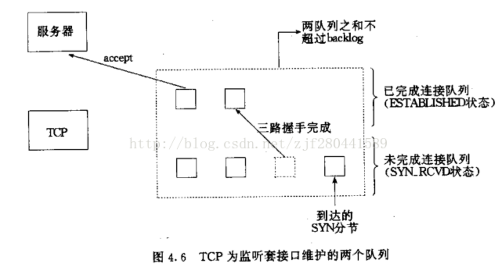

# socket编程实践 - 三（SOCKET API）

## SOCKET函数

~~~c
#include <sys/types.h>
#include <sys/socket.h>
int socket(int domain, int type, int protocol);
~~~

参数：

domain：指定通信协议族（protocol family）,常用取值AF_INET(IPv4)

  type：指定socket类型, 流式套接字SOCK_STREAM，数据报套接字SOCK_DGRAM，原始套接字SOCK_RAW

  protocol:协议类型,常用取值0, 使用默认协议

返回值：

  成功: 返回非负整数,套接字;

  失败: 返回-1

## bind函数

~~~c
int bind(int sockfd, const struct sockaddr *addr, socklen_t addrlen);
~~~

绑定一个本地地址到套接字。

参数:

  sockfd：socket函数返回的套接字

  addr：要绑定的地址

~~~c
//sockaddr_in结构, bind时需要强制转换成为struct sockaddr*类型
struct sockaddr_in
{
    sa_family_t    sin_family; /* address family: AF_INET */
    in_port_t      sin_port;   /* port in network byte order */
    struct in_addr sin_addr;   /* internet address */
};
/* Internet address. */
struct in_addr
{
    uint32_t       s_addr;     /* address in network byte order */
};
~~~

~~~c
/**示例:INADDR_ANY的使用, 绑定本机任意地址**/
int main()
{
    int listenfd = socket(AF_INET, SOCK_STREAM, 0);
    if (listenfd == -1)
        err_exit("socket error");
 
    struct sockaddr_in addr;
    addr.sin_family = AF_INET;
    addr.sin_port = htons(8001);
    //绑定本机的任意一个IP地址, 作用同下面两行语句
    addr.sin_addr.s_addr = htonl(INADDR_ANY);
    //inet_aton("127.0.0.1", &addr.sin_addr);
    //addr.sin_addr.s_addr = inet_addr("127.0.0.1");
    if (bind(listenfd, (const struct sockaddr *)&addr, sizeof(addr)) == -1)
        err_exit("bind error");
    else
        cout << "bind success" << endl;
}
~~~

## listen函数

~~~c
int listen(int sockfd,int backlog);
~~~

listen函数应该用在调用socket和bind函数之后， 并且用在调用accept之前, 用于将一个套接字从一个主动套接字转变成为被动套接字。

backlog说明:

对于给定的监听套接口，内核要维护两个队列：

  1、已由客户发出并到达服务器，服务器正在等待完成相应的TCP三路握手过程(SYN_RCVD状态)

  2、已完成连接的队列(ESTABLISHED状态)

但是两个队列长度之和不能超过backlog

backlog推荐使用SOMAXCONN(3.13.0-44-generic中该值为128), 使用等待队列的最大值;

### 重点

这里其实已经完成准备连接，进入了内核维护的队列，改步骤的作用在于把主动套接字转换成被动套接字，从而方便下一步进入等待连接。

## accept函数

~~~c
int accept(int sockfd, struct sockaddr *addr, socklen_t *addrlen);
~~~

从已完成连接队列返回第一个连接(the first connection request on the queue of pending connections for the listening 

socket, sockfd, creates a new connected socket, and returns a new file descriptor referring to that socket. 

The newly created socket is not in the listening state)，如果已完成连接队列为空，则阻塞。The original 

socket sockfd is unaffected by this call.

参数:

  sockfd：服务器套接字

  addr：将返回对等方的套接字地址, 不关心的话, 可以设置为NULL

  addrlen：返回对等方的套接字地址长度, 不关心的话可以设置成为NULL, 否则一定要初始化

返回值:

  On success, these system calls return a non-negative integer that is a descriptor for the accepted 

socket. On error, -1 is returned, and errno is set appropriately.

> 以上这些函数经常用于服务端

## connect函数

~~~c
int connect(int sockfd, const struct sockaddr *addr, socklen_t addrlen);
~~~

建立一个连接至addr所指定的套接字

参数：

​	sockfd : 未连接套接字

​	addr : 要连接的桃姐字地址

​	addrlen : 第二个参数addr长度

## 回声服务器实现

~~~c
//server端代码
int main()
{
    int listenfd = socket(AF_INET, SOCK_STREAM, 0);
    if (listenfd == -1)
        err_exit("socket error");
 
    struct sockaddr_in addr;
    addr.sin_family = AF_INET;
    addr.sin_port = htons(8001);
    addr.sin_addr.s_addr = htonl(INADDR_ANY);
    if (bind(listenfd, (const struct sockaddr *)&addr, sizeof(addr)) == -1)
        err_exit("bind error");
    if (listen(listenfd, SOMAXCONN) == -1)
        err_exit("listen error");
 
    char buf[512];
    int readBytes;
    struct sockaddr_in clientAddr;
    //谨记: 此处一定要初始化
socklen_t addrLen = sizeof(clientAddr);
    while (true)
    {
        int clientfd = accept(listenfd, (struct sockaddr *)&clientAddr, &addrLen);
        if (clientfd == -1)
            err_exit("accept error");
        //打印客户IP地址与端口号
        cout << "Client information: " << inet_ntoa(clientAddr.sin_addr)
             << ", " << ntohs(clientAddr.sin_port) << endl;
 
        memset(buf, 0, sizeof(buf));
        while ((readBytes = read(clientfd, buf, sizeof(buf))) > 0)
        {
            cout << buf;
            if (write(clientfd, buf, readBytes) == -1)
                err_exit("write socket error");
            memset(buf, 0, sizeof(buf));
        }
        if (readBytes == 0)
        {
            cerr << "client connect closed..." << endl;
            close(clientfd);
        }
        else if (readBytes == -1)
            err_exit("read socket error");
    }
    close(listenfd);
}
~~~

~~~c
//client端代码
int main()
{
    int sockfd = socket(AF_INET, SOCK_STREAM, 0);
    if (sockfd == -1)
        err_exit("socket error");
 
    //填写服务器端口号与IP地址
    struct sockaddr_in serverAddr;
    serverAddr.sin_family = AF_INET;
    serverAddr.sin_port = htons(8001);
    serverAddr.sin_addr.s_addr = inet_addr("127.0.0.1");
    if (connect(sockfd, (const struct sockaddr *)&serverAddr, sizeof(serverAddr)) == -1)
        err_exit("connect error");
 
    char buf[512];
    while (fgets(buf, sizeof(buf), stdin) != NULL)
    {
        if (write(sockfd, buf, strlen(buf)) == -1)
            err_exit("write socket error");
        memset(buf, 0, sizeof(buf));
        int readBytes = read(sockfd, buf, sizeof(buf));
        if (readBytes == 0)
        {
            cerr << "server connect closed... \nexiting..." << endl;
            break;
        }
        else if (readBytes == -1)
            err_exit("read socket error");
        cout << buf;
        memset(buf, 0, sizeof(buf));
    }
    close(sockfd);
}
~~~

在之前已经写过很多次了，这就不说了。