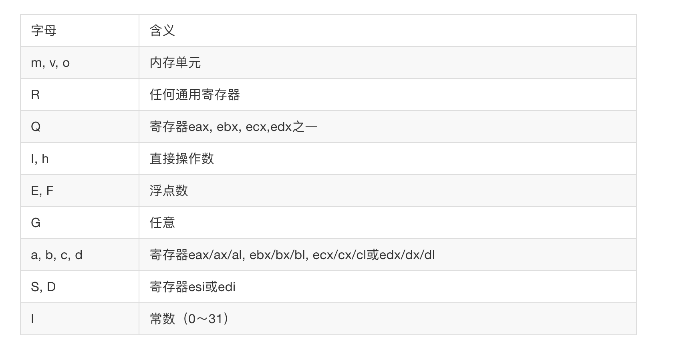

# Ucore-Gcc内联汇编

~~~asm
#define read_cr0() ({ \
unsigned int __dummy; \
__asm__( \
    "movl %%cr0,%0\n\t" \
    :"=r" (__dummy)); \
__dummy; \
})
~~~

基本格式：

~~~asm
asm [volatile] ( Assembler Template
   : Output Operands
   [ : Input Operands
   [ : Clobbers ] ])
~~~

* `volatile`可选项：其含义是避免 “asm” 指令被删除、移动或组合，在执行代码时，如果不希望汇编语句被 gcc 优化而改变位置，就需要在 asm 符号后添加 volatile 关键词

* 数字加前缀`%`,表示使用寄存器的样板操作数。可以使用的操作数总数取决于CPU里面通用寄存器的数量。`指令里面有多少个操作数，就说明有几个变量需要与寄存器结合`

* 使用到具体的寄存器的时候在前面加两个`%`

* 输出部分（output operand list），用以规定对输出变量（目标操作数）如何与寄存器结合的约束（constraint）,输出部分可以有多个约束，互相以逗号分开。每个约束以“＝”开头，接着用一个字母来表示操作数的类型，然后是关于变量结合的约束。

  * ~~~asm
    :"=r" (__dummy)
    ~~~

    表示相应的`目的操作数，如%0`可以使用任何一个通用寄存器，并且变量`__dummy`保存在这个寄存器里面

    

  * 

    ~~~asm
    :“＝m”(__dummy)
    ~~~

    `=m`就表明相应的目标操作数存放在内存单元`__dummy`里面。



* 输入部分和输出部分类似，但是没有`=`

~~~asm
#define __cli() __asm__ __volatile__("cli": : :"memory")
~~~

可以看到三部分：

* `指令部分`：`cli`
* 修改部分（clobber list,也称 乱码列表）:这部分常常以“memory”为约束条件
* `memory`表示操作完成之后内存中的内存已经发生改变
* 注意，指令部分为必选项，而输入部分、输出部分及修改部分为可选项，当输入部分存在，而输出部分不存在时，冒号“：”要保留，当“memory”存在时，三个冒号都要保留

~~~asm
a eax
b ebx
c ecx
d edx
S esi
D edi
I 常数值，(0 - 31)
q,r 动态分配的寄存器
g eax,ebx,ecx,edx或内存变量
A 把eax和edx合成一个64位的寄存器(use long longs)
~~~

- [1] 使用q指示编译器从eax, ebx, ecx, edx分配寄存器。 使用r指示编译器从eax, ebx, ecx, edx, esi, edi分配寄存器。
- [2] 不必把编译器分配的寄存器放入改变的寄存器列表，因为寄存器已经记住了它们。
- [3] "="是标示输出寄存器，必须这样用。
- [4] 数字%n的用法：数字表示的寄存器是按照出现和从左到右的顺序映射到用"r"或"q"请求的寄存器．如果要重用"r"或"q"请求的寄存器的话，就可以使用它们。
- [5] 如果强制使用固定的寄存器的话，如不用%1，而用ebx，则：

```c
asm("leal (%%ebx,%%ebx,4),%0"
    : "=r" (x)
    : "0" (x) 
);
```


