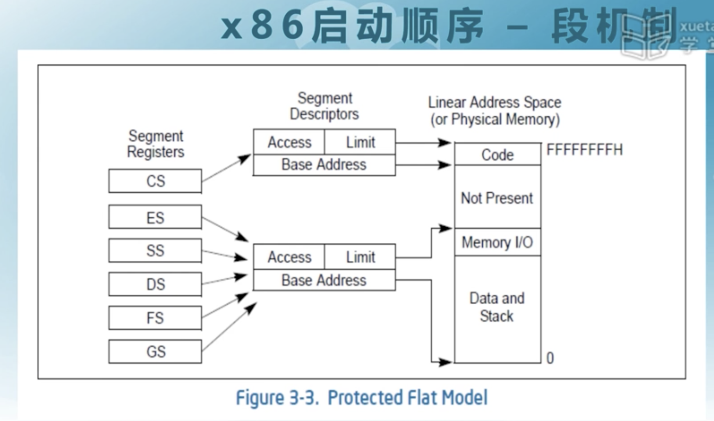
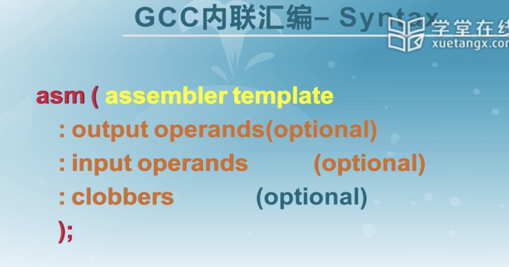
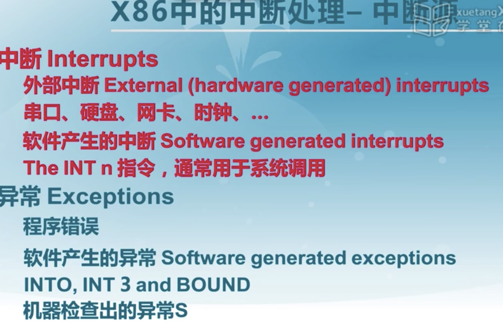
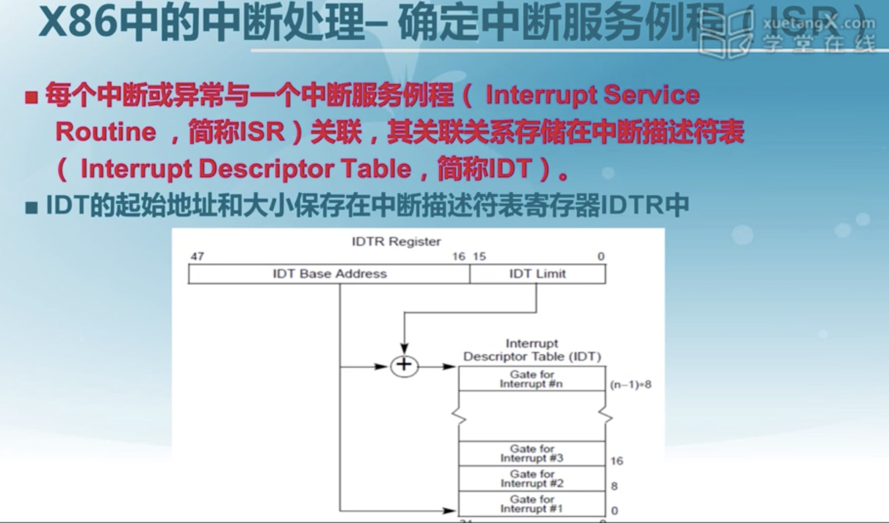
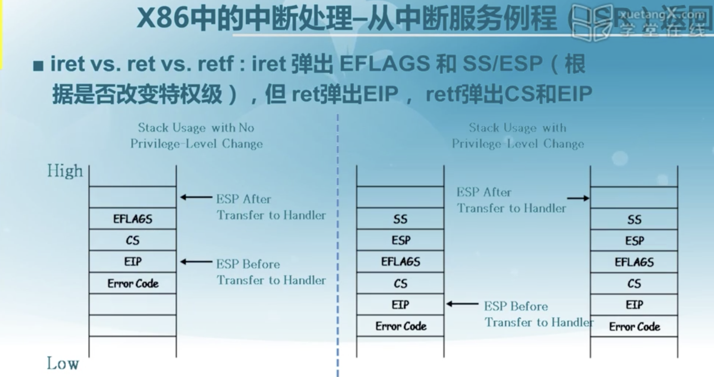
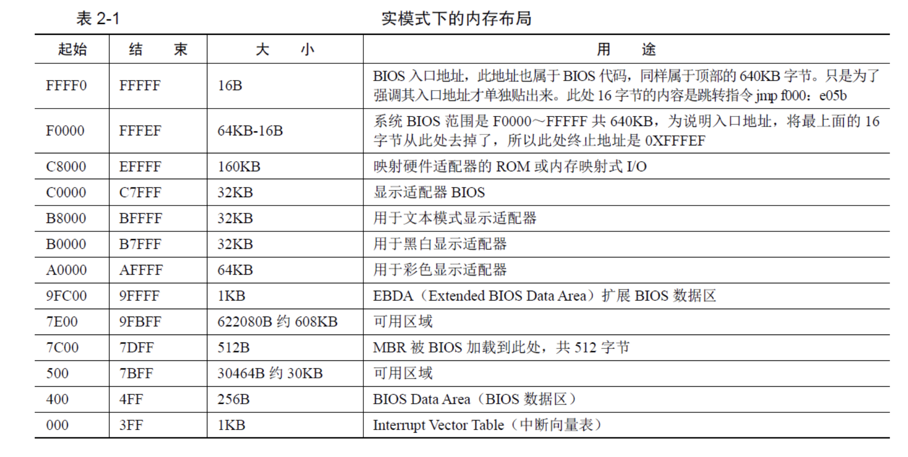
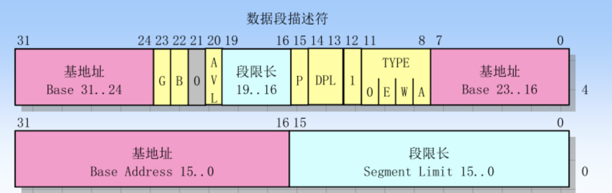
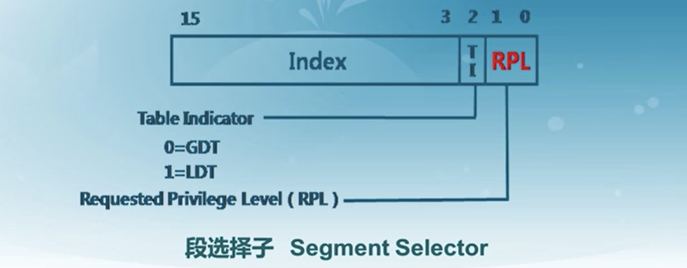
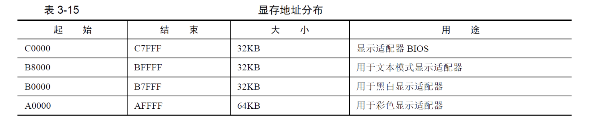

# Ucore-lab1-bootloader启动ucore

### 启动顺序




读取bootloader之后对ucore os进行加载。关键在于读懂代码。

### C函数调用的实现

这个，没讲什么，就是一些栈现场保存和参数传递的一些规则，比较简单。

### GCC内联汇编



感觉还是intel的内联汇编舒服一点。。。。

### 中断



每一种中断都有一个对应的中断号，中断号对应着中断处理程序，这些都由操作系统进行实现。



不同的特权级在产生中断的时候存在不同的操作。



# 知识点

> 参考K神，k神总结的也太好了吧，Orz，几乎是抄的，主要是把那天k神删了，没得看了，哭唧唧。
>
> https://github.com/Kiprey/Skr_Learning/blob/master/week9-19/uCore/doc/uCore-1.md

## BIOS中断，DOS中断，Linux中断

* BIOS和DOS位于实模式下，通过建立中断向量表建立中断调用，通过软中断指令`int`中断号调用。
* BIOS中断调用的主要功能是提供硬件访问的方法，改方法使得对硬件的操作简单化。
* DOS运行在实模式下，故其建立的中断也建立在中断向量表里面，但是其中断向量号不能与其冲突。
* Linux内核在进入保护模式后建立中断例程，但是中断向量表不存在了，取代的是中断描述符表，其类似于`DOS`，但是Linux是通过`int 0x80`指令进入一个中断程序然后再根据`eax`的值来调用不同子函数的功能。

## 操作系统识别文件系统

* 各个分区都有超级块，一般位于本分区的第2个扇区。超级块里面记录了此分区的信息，其中就有文件系统的魔数，一种文件系统对应一个魔数，通过比较即可得知文件系统类型。

## CPU实模式

CPU大体上可分为控制单元、运算单元、存储单元

- 控制单元是CPU的控制中心，大致由指令寄存器(IR, Instruction Register)、指令译码器(ID, Instruction Decoder)和操作控制器(OC, Operation Controller)组成。以下是一般的指令格式


- 运算单元根据控制单元的信号，进行运算。
- 存储单元CPU内部的L1、L2缓存及寄存器。这部分缓存采用SRAM存储器。SRAM不需要刷新电路即可保存内部存储的数据，但因为体积较大，集成度较低。

CPU中的寄存器分为两大类：

* 程序可见寄存器（通用寄存器，段寄存器）
* 程序不可见寄存器（中断描述符寄存器`IDTR`）

CPU实模式下的1MB内存

- CPU初始状态为16位实模式，在实模式下只能访问1MB(20bits)内存。而硬件工程师将1MB的内存空间分成多个部分。



- 其中地址`0-0x9ffff`的640KB内存是DRAM，即插在主板上的内存条。
  顶部`0xf0000-0xfffff`的64KB内存是ROM，存放BIOS代码。

  > BIOS检测并初始化硬件，同时建立中断向量表，并保证能运行一些基本硬件的IO操作

- CPU中，插在主板上的物理内存并不是眼中“全部的内存”。地址总线宽度决定可以访问的内存空间大小。
  并不是只有插在主板上的内存条需要通过地址总线访问，还有一些外设同样是需要通过地址总线来访问。
  故地址总线上会提前预留出来一些地址空间给这些外设，其余的可用地址再指向DRAM。

## CPU的分段机制（重要）

#### a. 内存访问为什么要分段

- 以前程序都是直接访问物理内存，所以编译出的两个程序如果内存冲突，则无法同时运行。
- CPU采用“段基址+段内偏移地址”的方式来访问任意内存。好处是程序可以重定位，可以执行多个程序。
- 段基址不需要得是65536的倍数。
- 加载用户程序时，只要将整个段的内容复制到新的位置，再将段基址寄存器中的地址改成该地址，程序便可准确无误地运行，因为程序中用的是段内偏移地址。
- 改变段基址，通过在内存中一个段来回挪位置的方式可以访问到任意内存位置。程序分段可以将大内存分成可以访问的小段，访问到所有内存。
- 通过分段，在早期CPU实模式16位寄存器的情况下，计算**段基址 << 4 + 段内偏移地址**，即可访问到20位地址空间。

> 代码中的分段与CPU的分段不同。编译器负责挑选出数据具备的属性，从而根据属性将程序片段分类，比如划分出了只读属性的代码段和可写属性的数据段。编译器并没有让段具备某种属性，对于代码段，编译器只是将代码归类到一起，并没有为代码段添加额外的信息。

- **在实模式下，段基址直接写在段寄存器中；而在保护模式下，段寄存器中的不再是段基址，而是段选择子。**
- 分段机涉及4个关键内容：逻辑地址、段描述符（描述段的属性）、段描述符表（包含多个段描述符的“数组”）、段选择子（段寄存器，用于定位段描述符表中表项的索引）。只有在**保护模式**下才能使用分段存储管理机制。

#### 将逻辑地址转换为物理地址的两步操作

> 逻辑地址是程序员能看到的虚拟地址。

- 分段地址转换：CPU把逻辑地址（由段选择子selector和段偏移offset组成）中的段选择子的内容作为段描述符表的索引，找到表中对应的段描述符，然后把段描述符中保存的段基址加上段偏移值，形成线性地址（Linear Address）。
- 分页地址转换，这一步中把线性地址转换为物理地址。

#### c. 段描述符

- 在分段存储管理机制的保护模式下，每个段由如下三个参数进行定义：段基地址(Base Address)、段界限(Limit)和段属性(Attributes)
  - 段基地址：规定线性地址空间中段的起始地址。任何一个段都可以从32位线性地址空间中的任何一个字节开始，不用像实模式下规定边界必须被16整除。
  - 段界限：规定段的大小。可以以字节为单位或以4K字节为单位。
  - 段属性：确定段的各种性质。
    - 段属性中的粒度位（Granularity），用符号G标记。G=0表示段界限以字节位位单位，20位的界限可表示的范围是1字节至1M字节，增量为1字节；G=1表示段界限以4K字节为单位，于是20位的界限可表示的范围是4K字节至4G字节，增量为4K字节。
    - 类型（TYPE）：用于区别不同类型的描述符。可表示所描述的段是代码段还是数据段，所描述的段是否可读/写/执行，段的扩展方向等。其4bit从左到右分别是
      - 执行位：置1时表示可执行，置0时表示不可执行；
      - 一致位：置1时表示一致码段，置0时表示非一致码段；
      - 读写位：置1时表示可读可写，置0时表示只读；
      - 访问位：置1时表示已访问，置0时表示未访问。
    - 描述符特权级（Descriptor Privilege Level）（DPL）：用来实现保护机制。
    - 段存在位（Segment-Present bit）：如果这一位为0，则此描述符为非法的，不能被用来实现地址转换。如果一个非法描述符被加载进一个段寄存器，处理器会立即产生异常。操作系统可以任意的使用被标识为可用（AVAILABLE）的位。
    - 已访问位（Accessed bit）：当处理器访问该段（当一个指向该段描述符的选择子被加载进一个段寄存器）时，将自动设置访问位。操作系统可清除该位。
- 段描述符的格式



* 段描述符的结构

~~~c
/* segment descriptors */
struct segdesc {
    unsigned sd_lim_15_0 : 16;        // low bits of segment limit
    unsigned sd_base_15_0 : 16;        // low bits of segment base address
    unsigned sd_base_23_16 : 8;        // middle bits of segment base address
    unsigned sd_type : 4;            // segment type (see STS_ constants)
    unsigned sd_s : 1;                // 0 = system, 1 = application
    unsigned sd_dpl : 2;            // descriptor Privilege Level
    unsigned sd_p : 1;                // present
    unsigned sd_lim_19_16 : 4;        // high bits of segment limit
    unsigned sd_avl : 1;            // unused (available for software use)
    unsigned sd_rsv1 : 1;            // reserved
    unsigned sd_db : 1;                // 0 = 16-bit segment, 1 = 32-bit segment
    unsigned sd_g : 1;                // granularity: limit scaled by 4K when set
    unsigned sd_base_31_24 : 8;        // high bits of segment base address
};
~~~

#### d. 全局描述符表

- 全局描述符表（GDT）是一个保存多个段描述符的“数组”，其起始地址保存在全局描述符表寄存器`GDTR`中。GDTR长48位，其中高32位为基地址，低16位为段界限。
- 全局描述符表的一个demo

~~~c
#define SEG(type, base, lim, dpl)                        \
    (struct segdesc){                                    \
        ((lim) >> 12) & 0xffff, (base) & 0xffff,        \
        ((base) >> 16) & 0xff, type, 1, dpl, 1,            \
        (unsigned)(lim) >> 28, 0, 0, 1, 1,                \
        (unsigned) (base) >> 24                            \
    }
/* *
 * Global Descriptor Table:
 *
 * The kernel and user segments are identical (except for the DPL). To load
 * the %ss register, the CPL must equal the DPL. Thus, we must duplicate the
 * segments for the user and the kernel. Defined as follows:
 *   - 0x0 :  unused (always faults -- for trapping NULL far pointers)
 *   - 0x8 :  kernel code segment
 *   - 0x10:  kernel data segment
 *   - 0x18:  user code segment
 *   - 0x20:  user data segment
 *   - 0x28:  defined for tss, initialized in gdt_init
 * */
static struct segdesc gdt[] = {
    SEG_NULL,
    [SEG_KTEXT] = SEG(STA_X | STA_R, 0x0, 0xFFFFFFFF, DPL_KERNEL),
    [SEG_KDATA] = SEG(STA_W, 0x0, 0xFFFFFFFF, DPL_KERNEL),
    [SEG_UTEXT] = SEG(STA_X | STA_R, 0x0, 0xFFFFFFFF, DPL_USER),
    [SEG_UDATA] = SEG(STA_W, 0x0, 0xFFFFFFFF, DPL_USER),
    [SEG_TSS]    = SEG_NULL,
};
~~~

#### e. 选择子

- 线性地址部分的选择子是用来选择哪个描述符表和在该表中索引哪个描述符的。选择子可以做为指针变量的一部分，从而对应用程序员是可见的，但是一般是由连接加载器来设置的。
- 段选择子结构
  - 索引（Index）：在描述符表中从8192个描述符中选择一个描述符。处理器自动将这个索引值乘以8（描述符的长度），再加上描述符表的基址来索引描述符表，从而选出一个合适的描述符。
  - 表指示位（Table Indicator，TI）：选择应该访问哪一个描述符表。0代表应该访问全局描述符表（GDT），1代表应该访问局部描述符表（LDT）。
  - 请求特权级（Requested Privilege Level，RPL）：保护机制。



- 全局描述符表的第一个描述符无法被CPU使用，所以当一个段选择子的索引（Index）部分和表指示位（Table Indicator）都为0的时（即段选择子指向全局描述符表的第一项时），可以当做一个空的选择子。当一个段寄存器被加载一个空选择子时，处理器并不会产生一个异常。但是，当用一个空选择子去访问内存时，则会产生异常。

### BIOS是如何苏醒的（重要）

- BIOS代码被写进ROM中，该ROM被映射到低端1M内存的顶部，即地址`0xF0000~0xFFFFF`。BIOS的入口地址为`0xFFFF0`。
  开机接电的一瞬间，CPU的CS:IP寄存器被强制初始化为`0xF000:0xFFF0`，即`0xFFFF0`。
  由于实模式下最高寻址1MB，故`0xFFFF0`处是一条跳转指令`jmp far f000:e05b`，跳转至BIOS真正的代码。之后便开始检测并初始化外设、与`0x000-0x3ff`建立数据结构，中断向量表IVT并填写中断例程。

- BIOS最后校验启动盘中位于0盘0道1扇区(MBR)的内容。如果此扇区末尾两个字节分别是魔数

  ```
  0x55
  ```

  和

  ```
  0xaa
  ```

  ，则BIOS认为此扇区中存在可执行的程序，并加载该512字节数据到

  ```
  0x7c00
  ```

  ，随后跳转至此继续执行。使用的跳转指令为

  ```
  jmp 0:0x7c00
  ```

  ，该指令是jmp指令的直接绝对远转移用法。

  > 磁盘与磁道的编号从0开始，扇区编号从1开始。 选择`0x7c00`是避免覆盖已有的数据以及被其他数据覆盖。

### 7. MBR/Bootloader

- bootloader的作用
  - 切换保护模式 & 段机制
  - 从硬盘上读取kernel in ELF格式的ucore kernel（跟在MBR后面的扇区），并放到内存中固定。
  - 跳转到ucoreOS的入口点执行，将控制权移交给ucore OS。
- MBR是主引导记录（Master Boot Record），也被称为主引导扇区，是计算机开机以后访问硬盘时所必须要读取的第一个扇区。其内部前446字节存储了bootloader代码，其后是4个16字节的“磁盘分区表”。

> MBR是整个硬盘最重要的区域，一旦MBR物理实体损坏时，则该硬盘基本报废。

* bootloader的入口点为`0x7c00`。以下是一个简单的类MBR程序，该程序只会将`1 MBR`字符串打印到屏幕上并挂起。通过该程序我们可以对MBR结构有了更深的了解。

~~~asm
;主引导程序
;------------------------------------------------------------
SECTION MBR vstart=0x7c00 ; 起始地址编译为0x7c00
  mov ax,cs   ; 此时的cs为0，用0来初始化所有的段寄存器
  mov ds,ax
  mov es,ax
  mov ss,ax
  mov fs,ax
  mov sp,0x7c00 ; 0x7c00 以下空间暂时安全，故可用做栈。

; 清屏 利用0x06号功能，上卷全部行，则可清屏。
; -----------------------------------------------------------
;INT 0x10   功能号:0x06   功能描述:上卷窗口
;------------------------------------------------------
;输入：
;AH 功能号= 0x06
;AL = 上卷的行数(如果为0,表示全部)
;BH = 上卷行属性
;(CL,CH) = 窗口左上角的(X,Y)位置
;(DL,DH) = 窗口右下角的(X,Y)位置
;无返回值：
  mov     ax, 0x600
  mov     bx, 0x700
  mov     cx, 0          ; 左上角: (0, 0)
  mov     dx, 0x184f     ; 右下角: (80,25),
        ; VGA文本模式中,一行只能容纳80个字符,共25行。
        ; 下标从0开始,所以0x18=24,0x4f=79
  int     0x10            ; int 0x10

;;;;;;;;;    下面这三行代码是获取光标位置    ;;;;;;;;;
;.get_cursor获取当前光标位置,在光标位置处打印字符.
  mov ah, 3   ; 输入: 3 号子功能是获取光标位置,需要存入ah寄存器
  mov bh, 0   ; bh寄存器存储的是待获取光标的页号

  int 0x10    ; 输出: ch=光标开始行,cl=光标结束行
      ; dh=光标所在行号,dl=光标所在列号

;;;;;;;;;    获取光标位置结束    ;;;;;;;;;;;;;;;;

;;;;;;;;;     打印字符串    ;;;;;;;;;;;
  ;还是用10h中断,不过这次是调用13号子功能打印字符串
  mov ax, message
  mov bp, ax    ; es:bp 为串首地址, es此时同cs一致，
      ; 开头时已经为sreg初始化

  ; 光标位置要用到dx寄存器中内容,cx中的光标位置可忽略
  mov cx, 5   ; cx 为串长度,不包括结束符0的字符个数
  mov ax, 0x1301  ; 子功能号13是显示字符及属性,要存入ah寄存器,
      ; al设置写字符方式 ah=01: 显示字符串,光标跟随移动
  mov bx, 0x2 ; bh存储要显示的页号,此处是第0页,
      ; bl中是字符属性, 属性黑底绿字(bl = 02h)
  int 0x10    ; 执行BIOS 0x10 号中断
;;;;;;;;;      打字字符串结束 ;;;;;;;;;;;;;;;

  jmp $   ; 始终跳转到这条代码，为死循环，使程序悬停在此

  message db "1 MBR"
  ; 用\0 将剩余空间填满
  times 510-($-$$) db 0 ; $指代当前指令的地址，$$指代当前section的首地址
  ; 最后两位一定是0x55, 0xaa
  db 0x55,0xaa
~~~

- 程序在section处使用了`vstart`伪指令。该指令只要求编译器将后面的所有数据与变量的地址以0x7c00开始编址，并不负责加载。而加载是由MBR加载器将该程序加载到0x7c00处。
- 执行以下代码，即可看到程序输出

~~~shell
# 编译汇编代码
nasm mbr.asm -o mbr.bin
# 制作img镜像。注意dd指令的复制操作与cp不一样，它是针对磁盘来进行的复制
#   将编译出的mbr.bin写进mbr.img中的第0块
dd if=mbr.bin of=mbr.img bs=512 count=1 conv=notrunc
# 使用i386架构启动mbr.img
qemu-system-i386 mbr.img
~~~

### 8. 硬件访问

- 硬件提供了软件方面的接口，操作系统通过软件（计算机指令）就能控制硬件。软件的逻辑需要作用在硬件上才能体现出来。
- 硬件在输出上大体分为串行和并行，相应的接口是串行接口和并行接口。
- 访问外部硬件的两种方式
  - 将某个外设的内存映射到一定范围内的地址空间。例如显卡。显卡是显示器的适配器，CPU 不直接和显示器交互，它只和显卡通信。其中的显存被映射到主机物理内存上的低端1MB的`0xB8000~0xBFFFF`。CPU往显存上写字节便是往屏幕上打印内容。显存地址分布如下



通过IO接口。CPU只访问IO接口，不关心另一边的外设。IO接口上也存在一些寄存器。

- CPU使用IO接口与外设通信。IO接口是连接CPU与外部设备的逻辑控制部件，可分为硬件软件两部分。

- 计算机与IO接口的通信是通过计算机指令来实现的。通过软件指令选择IO接口上的功能、工作模式的做法，称为“IO接口控制编程”，通常是用端口读写指令in/out实现。端口是IO接口开发给CPU的接口，一般的IO接口都有一组端口，每个端口都有自己的用途。`in/out`指令使用方式如下。

  ```asm
  in al, dx  # al/ax 用于存放从端口读入的数据，dx指端口号
  in ax, dx
  
  out dx, al
  out dx, ax
  out 立即数, al
  out 立即数, ax
  ```

例子：直接向显卡中写入数据

```asm
;主引导程序
;------------------------------------------------------------
SECTION MBR vstart=0x7c00 ; 起始地址编译为0x7c00
  mov ax,cs   ; 此时的cs为0，用0来初始化所有的段寄存器
  mov ds,ax
  mov es,ax
  mov ss,ax
  mov fs,ax
  mov sp,0x7c00 ; 0x7c00 以下空间暂时安全，故可用做栈。
  mov ax,0xb800 ; 0xb800-0xbffff 用于文本模式显示适配器
  mov gs,ax

; 清屏 利用0x06号功能，上卷全部行，则可清屏。
; -----------------------------------------------------------
;INT 0x10   功能号:0x06   功能描述:上卷窗口
;------------------------------------------------------
;输入：
;AH 功能号= 0x06
;AL = 上卷的行数(如果为0,表示全部)
;BH = 上卷行属性
;(CL,CH) = 窗口左上角的(X,Y)位置
;(DL,DH) = 窗口右下角的(X,Y)位置
;无返回值：
  mov     ax, 0x600
  mov     bx, 0x700
  mov     cx, 0          ; 左上角: (0, 0)
  mov     dx, 0x184f     ; 右下角: (80,25),
        ; VGA文本模式中,一行只能容纳80个字符,共25行。
        ; 下标从0开始,所以0x18=24,0x4f=79
  int     0x10            ; int 0x10

  ; 输出背景色绿色，前景色红色，并且跳动的字符串“1 MBR”
  mov byte [gs:0x00], '1'
  mov byte [gs:0x01], 0xa4   ; A表示绿色背景闪烁，4 表示前景色为红色
  mov byte [gs:0x02], ' '
  mov byte [gs:0x03], 0xa4
  mov byte [gs:0x04], 'M'
  mov byte [gs:0x05], 0xa4
  mov byte [gs:0x06], 'B'
  mov byte [gs:0x07], 0xa4
  mov byte [gs:0x08], 'R'
  mov byte [gs:0x09], 0xa4
  jmp $   ; 始终跳转到这条代码，为死循环，使程序悬停在此

  ; 用\0 将剩余空间填满
  times 510-($-$$) db 0
  ; 最后两位一定是0x55, 0xaa
  db 0x55,0xaa
```

### 9. 中断与异常（重要）

- 在操作系统中，有三种特殊的中断事件：
  - 异步中断(asynchronous interrupt)。这是由CPU外部设备引起的外部事件中断，例如I/O中断、时钟中断、控制台中断等。
  - 同步中断(synchronous interrupt)。这是CPU执行指令期间检测到不正常的或非法的条件(如除零错、地址访问越界)所引起的内部事件。
  - 陷入中断(trap interrupt)。这是在程序中使用请求系统服务的系统调用而引发的事件。
- 当CPU收到中断或者异常的事件时，它会暂停执行当前的程序或任务，通过一定的机制跳转到负责处理这个信号的相关处理例程中，在完成对这个事件的处理后再跳回到刚才被打断的程序或任务中。
- 其中，中断向量和中断服务例程的对应关系主要是由IDT（中断描述符表）负责。操作系统在IDT中设置好各种中断向量对应的中断描述符，留待CPU在产生中断后查询对应中断服务例程的起始地址。而IDT本身的起始地址保存在`idtr`寄存器中。
- 当CPU进入中断处理例程时，`eflags`寄存器上的`IF`标志位将会自动被CPU置为0，待中断处理例程结束后才恢复`IF`标志。

#### a. 中断描述符表

- 中断描述符表（Interrupt Descriptor Table, IDT）把每个中断或异常编号和一个指向中断服务例程的描述符联系起来。同GDT一样，IDT是一个8字节的描述符数组，但IDT的第一项可以包含一个描述符。
- IDT可以位于内存的任意位置，CPU通过IDT寄存器（IDTR）的内容来寻址IDT的起始地址。
- 


