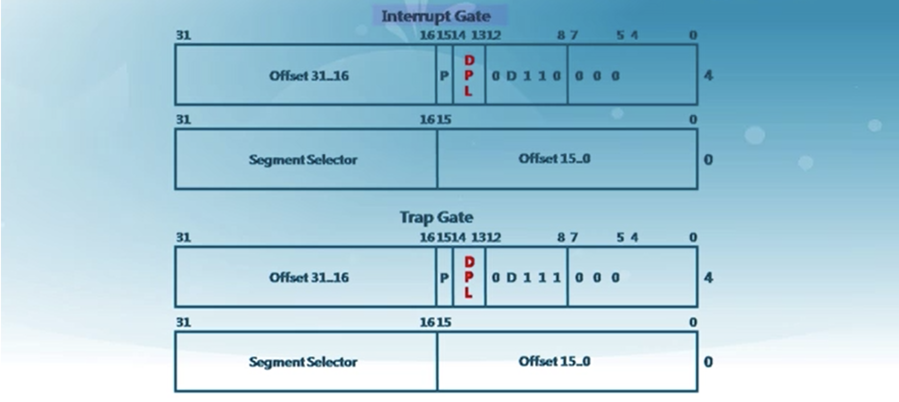
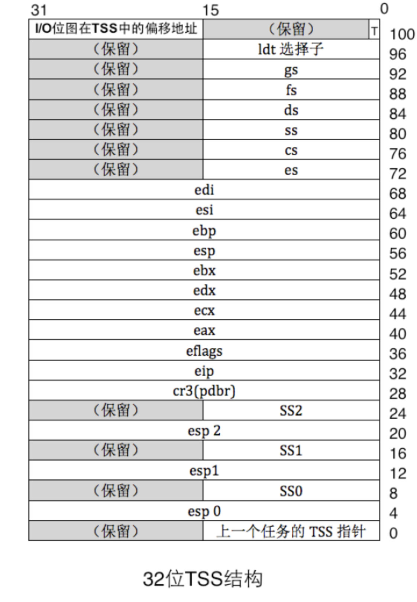

# Ucore-lab1-bootloader启动ucore

### 启动顺序


读取bootloader之后对ucore os进行加载。关键在于读懂代码。

### C函数调用的实现

这个，没讲什么，就是一些栈现场保存和参数传递的一些规则，比较简单。

### GCC内联汇编


感觉还是intel的内联汇编舒服一点。。。。

### 中断


每一种中断都有一个对应的中断号，中断号对应着中断处理程序，这些都由操作系统进行实现。


不同的特权级在产生中断的时候存在不同的操作。


# 知识点

> 参考K神，k神总结的也太好了吧，Orz，几乎是抄的，主要是把那天k神删了，没得看了，哭唧唧。
>
> https://github.com/Kiprey/Skr_Learning/blob/master/week9-19/uCore/doc/uCore-1.md

## BIOS中断，DOS中断，Linux中断

* BIOS和DOS位于实模式下，通过建立中断向量表建立中断调用，通过软中断指令`int`中断号调用。
* BIOS中断调用的主要功能是提供硬件访问的方法，改方法使得对硬件的操作简单化。
* DOS运行在实模式下，故其建立的中断也建立在中断向量表里面，但是其中断向量号不能与其冲突。
* Linux内核在进入保护模式后建立中断例程，但是中断向量表不存在了，取代的是中断描述符表，其类似于`DOS`，但是Linux是通过`int 0x80`指令进入一个中断程序然后再根据`eax`的值来调用不同子函数的功能。

## 操作系统识别文件系统

* 各个分区都有超级块，一般位于本分区的第2个扇区。超级块里面记录了此分区的信息，其中就有文件系统的魔数，一种文件系统对应一个魔数，通过比较即可得知文件系统类型。

## CPU实模式

CPU大体上可分为控制单元、运算单元、存储单元

- 控制单元是CPU的控制中心，大致由指令寄存器(IR, Instruction Register)、指令译码器(ID, Instruction Decoder)和操作控制器(OC, Operation Controller)组成。以下是一般的指令格式


- 运算单元根据控制单元的信号，进行运算。
- 存储单元CPU内部的L1、L2缓存及寄存器。这部分缓存采用SRAM存储器。SRAM不需要刷新电路即可保存内部存储的数据，但因为体积较大，集成度较低。

CPU中的寄存器分为两大类：

* 程序可见寄存器（通用寄存器，段寄存器）
* 程序不可见寄存器（中断描述符寄存器`IDTR`）

CPU实模式下的1MB内存

- CPU初始状态为16位实模式，在实模式下只能访问1MB(20bits)内存。而硬件工程师将1MB的内存空间分成多个部分。


- 其中地址`0-0x9ffff`的640KB内存是DRAM，即插在主板上的内存条。
  顶部`0xf0000-0xfffff`的64KB内存是ROM，存放BIOS代码。

  > BIOS检测并初始化硬件，同时建立中断向量表，并保证能运行一些基本硬件的IO操作

- CPU中，插在主板上的物理内存并不是眼中“全部的内存”。地址总线宽度决定可以访问的内存空间大小。
  并不是只有插在主板上的内存条需要通过地址总线访问，还有一些外设同样是需要通过地址总线来访问。
  故地址总线上会提前预留出来一些地址空间给这些外设，其余的可用地址再指向DRAM。

## CPU的分段机制（重要）

#### a. 内存访问为什么要分段

- 以前程序都是直接访问物理内存，所以编译出的两个程序如果内存冲突，则无法同时运行。
- CPU采用“段基址+段内偏移地址”的方式来访问任意内存。好处是程序可以重定位，可以执行多个程序。
- 段基址不需要得是65536的倍数。
- 加载用户程序时，只要将整个段的内容复制到新的位置，再将段基址寄存器中的地址改成该地址，程序便可准确无误地运行，因为程序中用的是段内偏移地址。
- 改变段基址，通过在内存中一个段来回挪位置的方式可以访问到任意内存位置。程序分段可以将大内存分成可以访问的小段，访问到所有内存。
- 通过分段，在早期CPU实模式16位寄存器的情况下，计算**段基址 << 4 + 段内偏移地址**，即可访问到20位地址空间。

> 代码中的分段与CPU的分段不同。编译器负责挑选出数据具备的属性，从而根据属性将程序片段分类，比如划分出了只读属性的代码段和可写属性的数据段。编译器并没有让段具备某种属性，对于代码段，编译器只是将代码归类到一起，并没有为代码段添加额外的信息。

- **在实模式下，段基址直接写在段寄存器中；而在保护模式下，段寄存器中的不再是段基址，而是段选择子。**
- 分段机涉及4个关键内容：逻辑地址、段描述符（描述段的属性）、段描述符表（包含多个段描述符的“数组”）、段选择子（段寄存器，用于定位段描述符表中表项的索引）。只有在**保护模式**下才能使用分段存储管理机制。

#### 将逻辑地址转换为物理地址的两步操作

> 逻辑地址是程序员能看到的虚拟地址。

- 分段地址转换：CPU把逻辑地址（由段选择子selector和段偏移offset组成）中的段选择子的内容作为段描述符表的索引，找到表中对应的段描述符，然后把段描述符中保存的段基址加上段偏移值，形成线性地址（Linear Address）。
- 分页地址转换，这一步中把线性地址转换为物理地址。

#### c. 段描述符

- 在分段存储管理机制的保护模式下，每个段由如下三个参数进行定义：段基地址(Base Address)、段界限(Limit)和段属性(Attributes)
  - 段基地址：规定线性地址空间中段的起始地址。任何一个段都可以从32位线性地址空间中的任何一个字节开始，不用像实模式下规定边界必须被16整除。
  - 段界限：规定段的大小。可以以字节为单位或以4K字节为单位。
  - 段属性：确定段的各种性质。
    - 段属性中的粒度位（Granularity），用符号G标记。G=0表示段界限以字节位位单位，20位的界限可表示的范围是1字节至1M字节，增量为1字节；G=1表示段界限以4K字节为单位，于是20位的界限可表示的范围是4K字节至4G字节，增量为4K字节。
    - 类型（TYPE）：用于区别不同类型的描述符。可表示所描述的段是代码段还是数据段，所描述的段是否可读/写/执行，段的扩展方向等。其4bit从左到右分别是
      - 执行位：置1时表示可执行，置0时表示不可执行；
      - 一致位：置1时表示一致码段，置0时表示非一致码段；
      - 读写位：置1时表示可读可写，置0时表示只读；
      - 访问位：置1时表示已访问，置0时表示未访问。
    - 描述符特权级（Descriptor Privilege Level）（DPL）：用来实现保护机制。
    - 段存在位（Segment-Present bit）：如果这一位为0，则此描述符为非法的，不能被用来实现地址转换。如果一个非法描述符被加载进一个段寄存器，处理器会立即产生异常。操作系统可以任意的使用被标识为可用（AVAILABLE）的位。
    - 已访问位（Accessed bit）：当处理器访问该段（当一个指向该段描述符的选择子被加载进一个段寄存器）时，将自动设置访问位。操作系统可清除该位。
- 段描述符的格式


* 段描述符的结构

~~~c
/* segment descriptors */
struct segdesc {
    unsigned sd_lim_15_0 : 16;        // low bits of segment limit
    unsigned sd_base_15_0 : 16;        // low bits of segment base address
    unsigned sd_base_23_16 : 8;        // middle bits of segment base address
    unsigned sd_type : 4;            // segment type (see STS_ constants)
    unsigned sd_s : 1;                // 0 = system, 1 = application
    unsigned sd_dpl : 2;            // descriptor Privilege Level
    unsigned sd_p : 1;                // present
    unsigned sd_lim_19_16 : 4;        // high bits of segment limit
    unsigned sd_avl : 1;            // unused (available for software use)
    unsigned sd_rsv1 : 1;            // reserved
    unsigned sd_db : 1;                // 0 = 16-bit segment, 1 = 32-bit segment
    unsigned sd_g : 1;                // granularity: limit scaled by 4K when set
    unsigned sd_base_31_24 : 8;        // high bits of segment base address
};
~~~

#### d. 全局描述符表

- 全局描述符表（GDT）是一个保存多个段描述符的“数组”，其起始地址保存在全局描述符表寄存器`GDTR`中。GDTR长48位，其中高32位为基地址，低16位为段界限。
- 全局描述符表的一个demo

~~~c
#define SEG(type, base, lim, dpl)                        \
    (struct segdesc){                                    \
        ((lim) >> 12) & 0xffff, (base) & 0xffff,        \
        ((base) >> 16) & 0xff, type, 1, dpl, 1,            \
        (unsigned)(lim) >> 28, 0, 0, 1, 1,                \
        (unsigned) (base) >> 24                            \
    }
/* *
 * Global Descriptor Table:
 *
 * The kernel and user segments are identical (except for the DPL). To load
 * the %ss register, the CPL must equal the DPL. Thus, we must duplicate the
 * segments for the user and the kernel. Defined as follows:
 *   - 0x0 :  unused (always faults -- for trapping NULL far pointers)
 *   - 0x8 :  kernel code segment
 *   - 0x10:  kernel data segment
 *   - 0x18:  user code segment
 *   - 0x20:  user data segment
 *   - 0x28:  defined for tss, initialized in gdt_init
 * */
static struct segdesc gdt[] = {
    SEG_NULL,
    [SEG_KTEXT] = SEG(STA_X | STA_R, 0x0, 0xFFFFFFFF, DPL_KERNEL),
    [SEG_KDATA] = SEG(STA_W, 0x0, 0xFFFFFFFF, DPL_KERNEL),
    [SEG_UTEXT] = SEG(STA_X | STA_R, 0x0, 0xFFFFFFFF, DPL_USER),
    [SEG_UDATA] = SEG(STA_W, 0x0, 0xFFFFFFFF, DPL_USER),
    [SEG_TSS]    = SEG_NULL,
};
~~~

#### e. 选择子

- 线性地址部分的选择子是用来选择哪个描述符表和在该表中索引哪个描述符的。选择子可以做为指针变量的一部分，从而对应用程序员是可见的，但是一般是由连接加载器来设置的。
- 段选择子结构
  - 索引（Index）：在描述符表中从8192个描述符中选择一个描述符。处理器自动将这个索引值乘以8（描述符的长度），再加上描述符表的基址来索引描述符表，从而选出一个合适的描述符。
  - 表指示位（Table Indicator，TI）：选择应该访问哪一个描述符表。0代表应该访问全局描述符表（GDT），1代表应该访问局部描述符表（LDT）。
  - 请求特权级（Requested Privilege Level，RPL）：保护机制。


- 全局描述符表的第一个描述符无法被CPU使用，所以当一个段选择子的索引（Index）部分和表指示位（Table Indicator）都为0的时（即段选择子指向全局描述符表的第一项时），可以当做一个空的选择子。当一个段寄存器被加载一个空选择子时，处理器并不会产生一个异常。但是，当用一个空选择子去访问内存时，则会产生异常。

### BIOS是如何苏醒的（重要）

- BIOS代码被写进ROM中，该ROM被映射到低端1M内存的顶部，即地址`0xF0000~0xFFFFF`。BIOS的入口地址为`0xFFFF0`。
  开机接电的一瞬间，CPU的CS:IP寄存器被强制初始化为`0xF000:0xFFF0`，即`0xFFFF0`。
  由于实模式下最高寻址1MB，故`0xFFFF0`处是一条跳转指令`jmp far f000:e05b`，跳转至BIOS真正的代码。之后便开始检测并初始化外设、与`0x000-0x3ff`建立数据结构，中断向量表IVT并填写中断例程。

- BIOS最后校验启动盘中位于0盘0道1扇区(MBR)的内容。如果此扇区末尾两个字节分别是魔数

  ```
  0x55
  ```

  和

  ```
  0xaa
  ```

  ，则BIOS认为此扇区中存在可执行的程序，并加载该512字节数据到

  ```
  0x7c00
  ```

  ，随后跳转至此继续执行。使用的跳转指令为

  ```
  jmp 0:0x7c00
  ```

  ，该指令是jmp指令的直接绝对远转移用法。

  > 磁盘与磁道的编号从0开始，扇区编号从1开始。 选择`0x7c00`是避免覆盖已有的数据以及被其他数据覆盖。

### 7. MBR/Bootloader

- bootloader的作用
  - 切换保护模式 & 段机制
  - 从硬盘上读取kernel in ELF格式的ucore kernel（跟在MBR后面的扇区），并放到内存中固定。
  - 跳转到ucoreOS的入口点执行，将控制权移交给ucore OS。
- MBR是主引导记录（Master Boot Record），也被称为主引导扇区，是计算机开机以后访问硬盘时所必须要读取的第一个扇区。其内部前446字节存储了bootloader代码，其后是4个16字节的“磁盘分区表”。

> MBR是整个硬盘最重要的区域，一旦MBR物理实体损坏时，则该硬盘基本报废。

* bootloader的入口点为`0x7c00`。以下是一个简单的类MBR程序，该程序只会将`1 MBR`字符串打印到屏幕上并挂起。通过该程序我们可以对MBR结构有了更深的了解。

~~~asm
;主引导程序
;------------------------------------------------------------
SECTION MBR vstart=0x7c00 ; 起始地址编译为0x7c00
  mov ax,cs   ; 此时的cs为0，用0来初始化所有的段寄存器
  mov ds,ax
  mov es,ax
  mov ss,ax
  mov fs,ax
  mov sp,0x7c00 ; 0x7c00 以下空间暂时安全，故可用做栈。

; 清屏 利用0x06号功能，上卷全部行，则可清屏。
; -----------------------------------------------------------
;INT 0x10   功能号:0x06   功能描述:上卷窗口
;------------------------------------------------------
;输入：
;AH 功能号= 0x06
;AL = 上卷的行数(如果为0,表示全部)
;BH = 上卷行属性
;(CL,CH) = 窗口左上角的(X,Y)位置
;(DL,DH) = 窗口右下角的(X,Y)位置
;无返回值：
  mov     ax, 0x600
  mov     bx, 0x700
  mov     cx, 0          ; 左上角: (0, 0)
  mov     dx, 0x184f     ; 右下角: (80,25),
        ; VGA文本模式中,一行只能容纳80个字符,共25行。
        ; 下标从0开始,所以0x18=24,0x4f=79
  int     0x10            ; int 0x10

;;;;;;;;;    下面这三行代码是获取光标位置    ;;;;;;;;;
;.get_cursor获取当前光标位置,在光标位置处打印字符.
  mov ah, 3   ; 输入: 3 号子功能是获取光标位置,需要存入ah寄存器
  mov bh, 0   ; bh寄存器存储的是待获取光标的页号

  int 0x10    ; 输出: ch=光标开始行,cl=光标结束行
      ; dh=光标所在行号,dl=光标所在列号

;;;;;;;;;    获取光标位置结束    ;;;;;;;;;;;;;;;;

;;;;;;;;;     打印字符串    ;;;;;;;;;;;
  ;还是用10h中断,不过这次是调用13号子功能打印字符串
  mov ax, message
  mov bp, ax    ; es:bp 为串首地址, es此时同cs一致，
      ; 开头时已经为sreg初始化

  ; 光标位置要用到dx寄存器中内容,cx中的光标位置可忽略
  mov cx, 5   ; cx 为串长度,不包括结束符0的字符个数
  mov ax, 0x1301  ; 子功能号13是显示字符及属性,要存入ah寄存器,
      ; al设置写字符方式 ah=01: 显示字符串,光标跟随移动
  mov bx, 0x2 ; bh存储要显示的页号,此处是第0页,
      ; bl中是字符属性, 属性黑底绿字(bl = 02h)
  int 0x10    ; 执行BIOS 0x10 号中断
;;;;;;;;;      打字字符串结束 ;;;;;;;;;;;;;;;

  jmp $   ; 始终跳转到这条代码，为死循环，使程序悬停在此

  message db "1 MBR"
  ; 用\0 将剩余空间填满
  times 510-($-$$) db 0 ; $指代当前指令的地址，$$指代当前section的首地址
  ; 最后两位一定是0x55, 0xaa
  db 0x55,0xaa
~~~

- 程序在section处使用了`vstart`伪指令。该指令只要求编译器将后面的所有数据与变量的地址以0x7c00开始编址，并不负责加载。而加载是由MBR加载器将该程序加载到0x7c00处。
- 执行以下代码，即可看到程序输出

~~~shell
# 编译汇编代码
nasm mbr.asm -o mbr.bin
# 制作img镜像。注意dd指令的复制操作与cp不一样，它是针对磁盘来进行的复制
#   将编译出的mbr.bin写进mbr.img中的第0块
dd if=mbr.bin of=mbr.img bs=512 count=1 conv=notrunc
# 使用i386架构启动mbr.img
qemu-system-i386 mbr.img
~~~

### 8. 硬件访问

- 硬件提供了软件方面的接口，操作系统通过软件（计算机指令）就能控制硬件。软件的逻辑需要作用在硬件上才能体现出来。
- 硬件在输出上大体分为串行和并行，相应的接口是串行接口和并行接口。
- 访问外部硬件的两种方式
  - 将某个外设的内存映射到一定范围内的地址空间。例如显卡。显卡是显示器的适配器，CPU 不直接和显示器交互，它只和显卡通信。其中的显存被映射到主机物理内存上的低端1MB的`0xB8000~0xBFFFF`。CPU往显存上写字节便是往屏幕上打印内容。显存地址分布如下


通过IO接口。CPU只访问IO接口，不关心另一边的外设。IO接口上也存在一些寄存器。

- CPU使用IO接口与外设通信。IO接口是连接CPU与外部设备的逻辑控制部件，可分为硬件软件两部分。

- 计算机与IO接口的通信是通过计算机指令来实现的。通过软件指令选择IO接口上的功能、工作模式的做法，称为“IO接口控制编程”，通常是用端口读写指令in/out实现。端口是IO接口开发给CPU的接口，一般的IO接口都有一组端口，每个端口都有自己的用途。`in/out`指令使用方式如下。

  ```asm
  in al, dx  # al/ax 用于存放从端口读入的数据，dx指端口号
  in ax, dx
  
  out dx, al
  out dx, ax
  out 立即数, al
  out 立即数, ax
  ```

例子：直接向显卡中写入数据

```asm
;主引导程序
;------------------------------------------------------------
SECTION MBR vstart=0x7c00 ; 起始地址编译为0x7c00
  mov ax,cs   ; 此时的cs为0，用0来初始化所有的段寄存器
  mov ds,ax
  mov es,ax
  mov ss,ax
  mov fs,ax
  mov sp,0x7c00 ; 0x7c00 以下空间暂时安全，故可用做栈。
  mov ax,0xb800 ; 0xb800-0xbffff 用于文本模式显示适配器
  mov gs,ax

; 清屏 利用0x06号功能，上卷全部行，则可清屏。
; -----------------------------------------------------------
;INT 0x10   功能号:0x06   功能描述:上卷窗口
;------------------------------------------------------
;输入：
;AH 功能号= 0x06
;AL = 上卷的行数(如果为0,表示全部)
;BH = 上卷行属性
;(CL,CH) = 窗口左上角的(X,Y)位置
;(DL,DH) = 窗口右下角的(X,Y)位置
;无返回值：
  mov     ax, 0x600
  mov     bx, 0x700
  mov     cx, 0          ; 左上角: (0, 0)
  mov     dx, 0x184f     ; 右下角: (80,25),
        ; VGA文本模式中,一行只能容纳80个字符,共25行。
        ; 下标从0开始,所以0x18=24,0x4f=79
  int     0x10            ; int 0x10

  ; 输出背景色绿色，前景色红色，并且跳动的字符串“1 MBR”
  mov byte [gs:0x00], '1'
  mov byte [gs:0x01], 0xa4   ; A表示绿色背景闪烁，4 表示前景色为红色
  mov byte [gs:0x02], ' '
  mov byte [gs:0x03], 0xa4
  mov byte [gs:0x04], 'M'
  mov byte [gs:0x05], 0xa4
  mov byte [gs:0x06], 'B'
  mov byte [gs:0x07], 0xa4
  mov byte [gs:0x08], 'R'
  mov byte [gs:0x09], 0xa4
  jmp $   ; 始终跳转到这条代码，为死循环，使程序悬停在此

  ; 用\0 将剩余空间填满
  times 510-($-$$) db 0
  ; 最后两位一定是0x55, 0xaa
  db 0x55,0xaa
```

### 9. 中断与异常（重要）

- 在操作系统中，有三种特殊的中断事件：
  - 异步中断(asynchronous interrupt)。这是由CPU外部设备引起的外部事件中断，例如I/O中断、时钟中断、控制台中断等。
  - 同步中断(synchronous interrupt)。这是CPU执行指令期间检测到不正常的或非法的条件(如除零错、地址访问越界)所引起的内部事件。
  - 陷入中断(trap interrupt)。这是在程序中使用请求系统服务的系统调用而引发的事件。
- 当CPU收到中断或者异常的事件时，它会暂停执行当前的程序或任务，通过一定的机制跳转到负责处理这个信号的相关处理例程中，在完成对这个事件的处理后再跳回到刚才被打断的程序或任务中。
- 其中，中断向量和中断服务例程的对应关系主要是由IDT（中断描述符表）负责。操作系统在IDT中设置好各种中断向量对应的中断描述符，留待CPU在产生中断后查询对应中断服务例程的起始地址。而IDT本身的起始地址保存在`idtr`寄存器中。
- 当CPU进入中断处理例程时，`eflags`寄存器上的`IF`标志位将会自动被CPU置为0，待中断处理例程结束后才恢复`IF`标志。

#### a. 中断描述符表

- 中断描述符表（Interrupt Descriptor Table, IDT）把每个中断或异常编号和一个指向中断服务例程的描述符联系起来。同GDT一样，IDT是一个8字节的描述符数组，但IDT的第一项可以包含一个描述符。
- IDT可以位于内存的任意位置，CPU通过IDT寄存器（IDTR）的内容来寻址IDT的起始地址。

#### b. IDT gate descriptors

- 中断/异常应该使用`Interrupt Gate`或`Trap Gate`。其中的唯一区别就是：当调用`Interrupt Gate`时，Interrupt会被CPU自动禁止；而调用`Trap Gate`时，CPU则不会去禁止或打开中断，而是保留原样。

  > 这其中的原理是当CPU跳转至`Interrupt Gate`时，其eflag上的IF位会被清除。而`Trap Gate`则不改变。

- IDT中包含了3种类型的Descriptor

  - Task-gate descriptor
  - Interrupt-gate descriptor （中断方式用到）
  - Trap-gate descriptor（系统调用用到） 下图图显示了80386的中断门描述符、陷阱门描述符的格式：



#### c. 中断处理过程

##### 1) 起始阶段

- CPU执行完每条指令后，判断中断控制器中是否产生中断。如果存在中断，则取出对应的中断变量。
- CPU根据中断变量，到IDT中找到对应的中断描述符。
- 通过获取到的中断描述符中的段选择子，从GDT中取出对应的段描述符。此时便获取到了中断服务例程的段基址与属性信息，跳转至该地址。
- CPU会根据CPL（用来描述该段的权限）和中断服务例程的段描述符的DPL信息确认是否发生了特权级的转换。若发生了特权级的转换，这时CPU会从当前程序的TSS信息（该信息在内存中的起始地址存在TR寄存器中）里取得该程序的内核栈地址，即包括内核态的ss和esp的值，并立即将系统当前使用的栈切换成新的内核栈。这个栈就是即将运行的中断服务程序要使用的栈。紧接着就将当前程序使用的用户态的ss和esp压到新的内核栈中保存起来；
- CPU需要**开始保存当前被打断的程序的现场**（即一些寄存器的值），以便于将来恢复被打断的程序继续执行。这需要利用内核栈来保存相关现场信息，即依次压入当前被打断程序使用的eflags，cs，eip，errorCode（如果是有错误码的异常）信息；
- CPU利用中断服务例程的段描述符将其第一条指令的地址加载到cs和eip寄存器中，**开始执行中断服务例程**。这意味着先前的程序被暂停执行，中断服务程序正式开始工作。

##### 2) 终止阶段

- 每个中断服务例程在有中断处理工作完成后需要通过

  ```
  iret
  ```

  （或

  ```
  iretd
  ```

  ）指令恢复被打断的程序的执行。CPU执行IRET指令的具体过程如下：

  - 程序执行这条iret指令时，首先会从内核栈里弹出先前保存的被打断的程序的现场信息，即eflags，cs，eip重新开始执行；
  - 如果存在特权级转换（从内核态转换到用户态），则还需要从内核栈中弹出用户态栈的ss和esp，即栈也被切换回原先使用的用户栈。
  - 如果此次处理的是带有错误码（errorCode）的异常，CPU在恢复先前程序的现场时，并不会弹出errorCode，需要要求相关的中断服务例程在调用iret返回之前添加出栈代码主动弹出errorCode。

### 10. 特权级

> 尽管特权级相关的内容在Lab2课程中提及，但由于Lab1中的Challenge会涉及到特权级的改变，故将该部分的内容迁移至此处。

- 特权级共分为四档，分别为0-3，其中`Kernel`为第0特权级（ring 0），用户程序为第3特权级（ring 3），操作系统保护分别为第1和第2特权级。
- 特权级的区别
  - 一些指令（例如特权指令`lgdt`）只能运行在ring 0下。
  - CPU在如下时刻会检查特权级
    - 访问数据段
    - 访问页
    - 进入中断服务例程（ISRs）
    - .......
  - 如果检查失败，则会产生**保护异常（General Protection Fault）**.

#### 1. CPL、DPL、RPL与IOPL

- **DPL存储于段描述符中**，规定**访问该段的权限级别**(Descriptor Privilege Level)，每个段的DPL固定。 当进程访问一个段时，需要进程特权级检查。

- **CPL**存在于CS寄存器的低两位，**即CPL是CS段描述符的DPL**，是当前代码的权限级别(Current Privilege Level)。

- **RPL存在于段选择子中**，说明的是**进程对段访问的请求权限**(Request Privilege Level)，是对于**段选择子**而言的，每个段选择子有自己的RPL。而且RPL对每个段来说不是固定的，两次访问同一段时的RPL可以不同。RPL可能会削弱CPL的作用，例如当前CPL=0的进程要访问一个数据段，它把段选择符中的RPL设为3，这样虽然它对该段仍然只有特权为3的访问权限。

- IOPL(I/O Privilege Level)即I/O特权标志，位于**eflag寄存器**中，用两位二进制位来表示，也称为I/O特权级字段。该字段指定了要求执行I/O指令的特权级。如 果当前的特权级别在数值上小于等于IOPL的值，那么，该I/O指令可执行，否则将发生一个保护异常。

  > 只有当CPL=0时，可以改变IOPL的值，当CPL<=IOPL时，可以改变IF标志位。

#### 2. 特权级检查

> 在下述的特权级比较中，需要注意特权级越低，其ring值越大。

- 访问门时（中断、陷入、异常），要求**DPL[段] <= CPL <= DPL[门]**

  > 访问门的代码权限**比门的特权级要高**，因为这样才能访问门。
  >
  > 但访问门的代码权限**比被访问的段的权限要低**，因为通过门的目的是**访问特权级更高的段**，这样就可以达到**低权限应用程序使用高权限内核服务**的目的。

- 访问段时，要求**DPL[段] >= max {CPL, RPL}**

  > 只能使用最低的权限来访问段数据。

#### 3. 通过中断切换特权级

##### 1) TSS

- **TSS(Task State Segment)** 是操作系统在进行进程切换时保存进程现场信息的段，其结构如下



~~~c
/* task state segment format (as described by the Pentium architecture book) */
struct taskstate {
    uint32_t ts_link;        // old ts selector
    uintptr_t ts_esp0;        // stack pointers and segment selectors
    uint16_t ts_ss0;        // after an increase in privilege level
    uint16_t ts_padding1;
    uintptr_t ts_esp1;
    uint16_t ts_ss1;
    uint16_t ts_padding2;
    uintptr_t ts_esp2;
    uint16_t ts_ss2;
    uint16_t ts_padding3;
    uintptr_t ts_cr3;        // page directory base
    uintptr_t ts_eip;        // saved state from last task switch
    uint32_t ts_eflags;
    uint32_t ts_eax;        // more saved state (registers)
    uint32_t ts_ecx;
    uint32_t ts_edx;
    uint32_t ts_ebx;
    uintptr_t ts_esp;
    uintptr_t ts_ebp;
    uint32_t ts_esi;
    uint32_t ts_edi;
    uint16_t ts_es;            // even more saved state (segment selectors)
    uint16_t ts_padding4;
    uint16_t ts_cs;
    uint16_t ts_padding5;
    uint16_t ts_ss;
    uint16_t ts_padding6;
    uint16_t ts_ds;
    uint16_t ts_padding7;
    uint16_t ts_fs;
    uint16_t ts_padding8;
    uint16_t ts_gs;
    uint16_t ts_padding9;
    uint16_t ts_ldt;
    uint16_t ts_padding10;
    uint16_t ts_t;            // trap on task switch
    uint16_t ts_iomb;        // i/o map base address
};
~~~

- 这里暂时只说明**特权级切换相关**的项。其中，TSS中分别保留了ring0、ring1、ring2的栈(`ss`、`esp`寄存器值)。当用户程序从ring3跳至ring0时(例如执行中断)，此时的栈就会从用户栈切换到内核栈。切换栈的操作从开始中断的那一瞬间（例如：从`int 0x78`到中断处理例程之间）就已完成。

  > 切换栈的操作为修改`esp`和`ss`寄存器。

- TSS段的段描述符保存在GDT中，其`ring0`的栈会在初始化GDT时被一起设置。`TR`寄存器会保存当前TSS的段描述符，以提高索引速度。

~~~c
static struct segdesc gdt[] = {
    SEG_NULL,
    [SEG_KTEXT] = SEG(STA_X | STA_R, 0x0, 0xFFFFFFFF, DPL_KERNEL),
    [SEG_KDATA] = SEG(STA_W, 0x0, 0xFFFFFFFF, DPL_KERNEL),
    [SEG_UTEXT] = SEG(STA_X | STA_R, 0x0, 0xFFFFFFFF, DPL_USER),
    [SEG_UDATA] = SEG(STA_W, 0x0, 0xFFFFFFFF, DPL_USER),
    [SEG_TSS]   = SEG_NULL,
};
static struct pseudodesc gdt_pd = {
      sizeof(gdt) - 1, (uintptr_t)gdt
};

  /* gdt_init - initialize the default GDT and TSS */
  static void
  gdt_init(void) {
    // 设置TSS的ring0栈地址，包括esp寄存器和SS段寄存器
      load_esp0((uintptr_t)bootstacktop);
      ts.ts_ss0 = KERNEL_DS;

      // 将TSS写入GDT中
      gdt[SEG_TSS] = SEGTSS(STS_T32A, (uintptr_t)&ts, sizeof(ts), DPL_KERNEL);

      // 加载GDT至GDTR寄存器
      lgdt(&gdt_pd);

      // 加载TSS至TR寄存器
      ltr(GD_TSS);
}
~~~

##### 2) trapFrame

- `trapframe`结构是进入中断门所必须的结构，其结构如下

~~~c
struct trapframe {
    // tf_regs保存了基本寄存器的值，包括eax,ebx,esi,edi寄存器等等
    struct pushregs tf_regs;
    uint16_t tf_gs;
    uint16_t tf_padding0;
    uint16_t tf_fs;
    uint16_t tf_padding1;
    uint16_t tf_es;
    uint16_t tf_padding2;
    uint16_t tf_ds;
    uint16_t tf_padding3;
    uint32_t tf_trapno;
    // 以下这些信息会被CPU硬件自动压入切换后的栈。包括下面切换特权级所使用的esp、ss等数据
    uint32_t tf_err;
    uintptr_t tf_eip;
    uint16_t tf_cs;
    uint16_t tf_padding4;
    uint32_t tf_eflags;
    // 以下这些信息会在切换特权级时被使用
    uintptr_t tf_esp;
    uint16_t tf_ss;
    uint16_t tf_padding5;
} __attribute__((packed));
~~~

##### 3) 中断处理例程的入口代码

- 中断处理例程的入口代码用于保存上下文并构建一个`trapframe`，其源代码如下：

~~~asm
  #include <memlayout.h>

# vectors.S sends all traps here.
.text
.globl __alltraps
__alltraps:
    # push registers to build a trap frame
    # therefore make the stack look like a struct trapframe
    pushl %ds
    pushl %es
    pushl %fs
    pushl %gs
    pushal

    # load GD_KDATA into %ds and %es to set up data segments for kernel
    movl $GD_KDATA, %eax
    movw %ax, %ds
    movw %ax, %es

    # push %esp to pass a pointer to the trapframe as an argument to trap()
    pushl %esp
    # call trap(tf), where tf=%esp
    call trap
    # pop the pushed stack pointer
    popl %esp

    # return falls through to trapret...
.globl __trapret
__trapret:
    # restore registers from stack
    popal

    # restore %ds, %es, %fs and %gs
    popl %gs
    popl %fs
    popl %es
    popl %ds

    # get rid of the trap number and error code
    addl $0x8, %esp
    iret
~~~

这段代码就很好理解了，这是一个在栈切换的时候，的寄存器保存和恢复的一个过程。

##### 4) 切换特权级的过程

###### a. 特权级提升

当通过陷入门**从ring3切换至ring0（特权提升）** 时

- 在陷入的一瞬间，CPU会因为特权级的改变，索引TSS，切换`ss`和`esp`为内核栈，并**按顺序自动**压入`user_ss`、`user_esp`、`user_eflags`、`user_cs`、`old_eip`以及`err`。 //这些应该是压入到了内核栈里面

  > 需要注意的是，CPU先切换到内核栈，此时的`esp`与`ss`不再指向用户栈。但此时CPU却可以再将用户栈地址存入内核栈。这种操作可能是依赖硬件来完成的。（这一点还留有疑问。）

  > 如果没有err，则CPU会自动压入0。

- 之后CPU会在中断处理例程入口处，先将剩余的段寄存器以及所有的通用寄存器压栈，构成一个`trapframe`。然后将该`trapframe`传入给真正的中断处理例程并执行。

- 该处理例程会判断传入的中断数(`trapno`)并执行特定的代码。在**提升特权级的代码**中，程序会处理传入的`trapframe`信息中的`CS、DS、eflags`寄存器，修改上面的**DPL、CPL与IOPL**以达到提升特权的目的。 //这里才是权限提升的核心，还是对于寄存器和相关标志位的修改。

- 将修改后的`trapframe`**压入用户栈**（这一步没有修改`user_esp`寄存器），并设置中断处理例程结束后将要弹出`esp`寄存器的值为**用户栈的新地址**（与刚刚不同，这一步修改了**将要恢复**的`user_esp`寄存器）。

  > 注意此时的用户栈地址指向的是修改后的`trapframe`。

- 这样在退出中断处理程序，准备恢复上下文的时候，首先弹出的栈寄存器值是修改后的用户栈地址，其次弹出的通用寄存器、段寄存器等等都是存储于用户栈中的`trapframe`。

> 为什么要做这么奇怪的操作呢？ 因为恢复`esp`寄存器的指令**只有一条`pop %esp`**
>
> (当前环境下的`iret`指令不会弹出栈地址)。
>
> 正常情况下，中断处理例程结束，恢复`esp`寄存器后，`esp`指向的还是内核栈。
>
> 但我们的目的是切换回用户栈，则此时只能修改原先要恢复的`esp`值，通过该指令切换到用户栈。

> 思考一下，进入中断处理程序前，上下文**保存在内核栈**。但将要恢复回上下文的数据却**存储于用户栈**。

* 在内核中，`将修改后的trapframe压入用户栈`这一步，需要舍弃`trapframe`中末尾两个旧的`ss`和`esp`寄存器数据，因为`iret`指令的特殊性：

  - `iret`指令的功能如下

    > `iret`指令会按顺序依次弹出`eip`、`cs`以及`eflag`的值到特定寄存器中，然后从新的`cs:ip`处开始执行。如果特权级发生改变，则还会在弹出`eflag`后再依次弹出`esp`与`ss`寄存器值。

  - 由于`iret`前后特权级不发生改变（**[中断中]ring0 -> ring0 [中断后]**），故`iret`指令不会弹出`esp`和`ss`寄存器值。如果这两个寄存器也被复制进用户栈，则相比于进入中断前的用户栈地址，`esp`最终会抬高8个字节，可能造成很严重的错误。

###### b. 特权级降低

通过陷入门**从ring0切换至ring3（特权降低）** 的过程与特权提升的操作基本一样，不过有几个不同点需要注意一下

- 与ring3调用中断不同，当ring0调用中断时，进入中断前和进入中断后的这个过程，栈不发生改变。

  > 因为在调用中断前的权限已经处于ring0了，而中断处理程序里的权限也是ring0，所以这一步陷入操作的特权级没有发生改变，故不需要访问TSS并重新设置`ss` 、`esp`寄存器。

- 修改后的`trapFrame`不需要像上面那样保存至将要使用的栈，因为当前环境下`iret`前后特权级会发生改变，执行该命令会弹出`ss`和`esp`，所以可以通过`iret`来设置返回时的栈地址。

# 练习解答

### 1. 练习1

> 理解通过make生成执行文件的过程.

- 操作系统镜像文件ucore.img是如何一步一步生成的？执行命令

  ```
  make v=
  ```

  ，通过阅读其输出的步骤，我们可以得知

  - make执行将所有的源代码编译成对象文件，并分别链接形成`kernel`、`bootblock`文件。

  - 使用`dd`命令，将生成的两个文件的数据拷贝至img文件中，形成映像文件。

    > `dd`命令与`cp`命令不同，该命令针对于磁盘，功能更加底层。

- 一个被系统认为是符合规范的硬盘主引导扇区的特征是什么？

  - 阅读源码`lab1/tools/sign.c`，可以发现，**符合规范的MBR特征是其512字节数据的最后两个字节是`0x55`、`0xAA`**

  - 以下是部分源码

    ```
    // 读取文件至内存中
    // ....
    // 修改512字节的最后两个字节为magic number
    buf[510] = 0x55;
    buf[511] = 0xAA;
    // 写入内存中的数据至新文件中
    // ....
    ```

- 如何初始化GDT表

  - 设置GDT中的第一项描述符为空。
  - 设置GDT中的第二项描述符为代码段使用，其属性为可读写可执行。
  - 设置GDT中的第三项描述符为数据段使用，其属性为可读写。

  ```
    # Bootstrap GDT
  .p2align 2                                          # force 4 byte alignment
  gdt:
      SEG_NULLASM                                     # null seg
      SEG_ASM(STA_X|STA_R, 0x0, 0xffffffff)           # code seg for bootloader and kernel
      SEG_ASM(STA_W, 0x0, 0xffffffff)                 # data seg for bootloader and kernel
  
  gdtdesc:
      .word 0x17                                      # sizeof(gdt) - 1
      .long gdt                                       # address gdt
  ```

- 如何使能和进入保护模式

  - 将%cr0寄存器置1。
  - %cr0寄存器置1后，长跳转`ljmp $PROT_MODE_CSEG, $protcseg`以更新cs基地址。

bootloader是如何加载ELF格式的OS？

- bootloader先将ELF格式的OS加载到地址`0x10000`。

  ```
  readseg((uintptr_t)ELFHDR, SECTSIZE * 8, 0);
  ```

- 之后通过比对ELF的magic number来判断读入的ELF文件是否正确。

- 再将ELF中每个段都加载到特定的地址。

  ```
  // load each program segment (ignores ph flags)
  ph = (struct proghdr *)((uintptr_t)ELFHDR + ELFHDR->e_phoff);
  eph = ph + ELFHDR->e_phnum;
  for (; ph < eph; ph ++)
      readseg(ph->p_va & 0xFFFFFF, ph->p_memsz, ph->p_offset);
  ```

- 最后跳转至ELF文件的程序入口点(entry point)。

剩下的就是一些代码练习了，就不重复写一遍啦。


