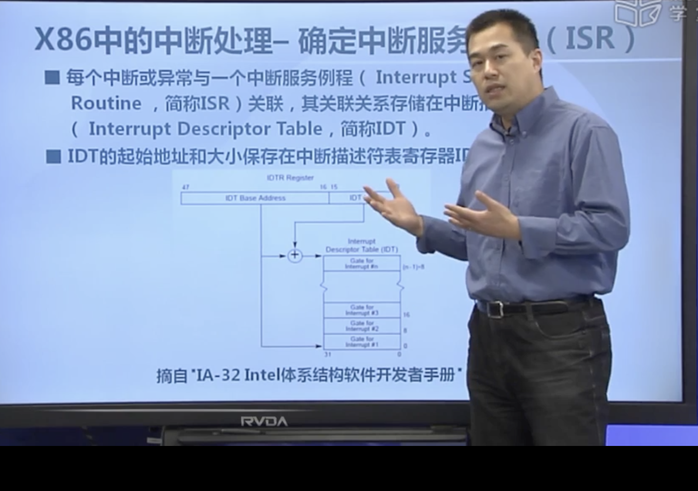
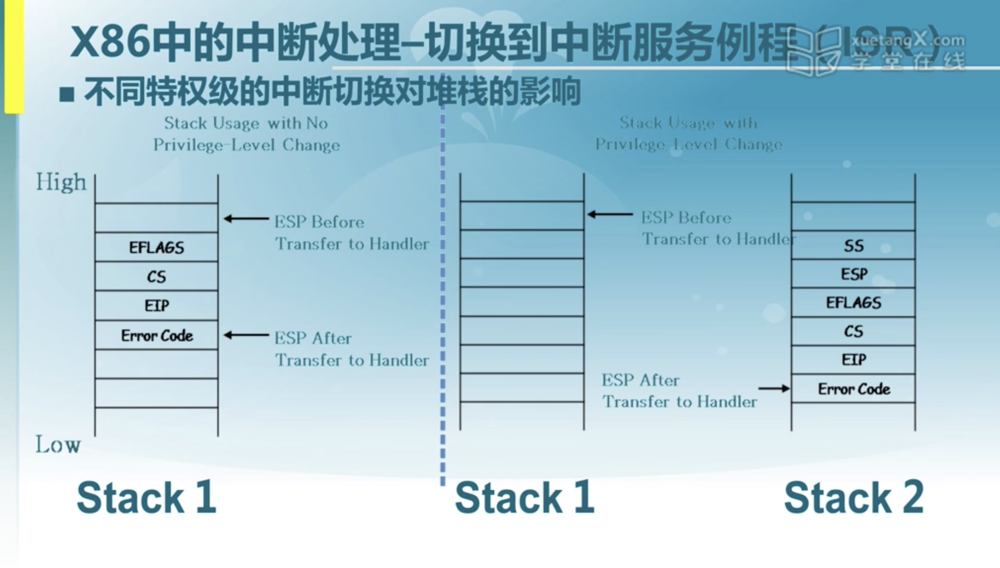

# Ucore-lab1

## 练习1

> 这个练习的重点在于理解makefile的语法。

### 变量赋值

~~~makefile
PROJ	:= challenge
EMPTY	:=
SPACE	:= $(EMPTY) $(EMPTY)
SLASH	:= /

V       := @
~~~

如上是变量赋值，makefile中有多种变量赋值的方法。

~~~
VARIABLE = value
# 在执行时扩展，允许递归扩展,其就是遍历整个Makefile，获得value的最终值来赋给右值。

VARIABLE := value
# 在定义时扩展。

VARIABLE ?= value
# 只有在该变量为空时才设置值。

VARIABLE += value
# 将值追加到变量的尾端。
~~~

### @符号的使用

makefile在执行的过程中会进行输出，但是在命令前加上@就可以关闭回声。

### 条件语句

~~~makefile
ifndef GCCPREFIX
GCCPREFIX := $(shell if i386-elf-objdump -i 2>&1 | grep '^elf32-i386$$' >/dev/null 2>&1; \
	then echo 'i386-elf-'; \
	elif objdump -i 2>&1 | grep 'elf32-i386' >/dev/null 2>&1; \
	then echo ''; \
	else echo "***" 1>&2; \
	echo "*** Error: Couldn't find an i386-elf version of GCC/binutils." 1>&2; \
	echo "*** Is the directory with i386-elf-gcc in your PATH?" 1>&2; \
	echo "*** If your i386-elf toolchain is installed with a command" 1>&2; \
	echo "*** prefix other than 'i386-elf-', set your GCCPREFIX" 1>&2; \
	echo "*** environment variable to that prefix and run 'make' again." 1>&2; \
	echo "*** To turn off this error, run 'gmake GCCPREFIX= ...'." 1>&2; \
	echo "***" 1>&2; exit 1; fi)
endif
~~~

这个其实不难理解，跟c语言里面的很像，值得注意的是$符号,makefile中的变量以$开头，为了避免和shell的变量冲突，shell里面的变量要以$$开头。

#### 语义解析

如果没有定义GCCPREFIX变量的话，$里面的语句将得到执行，这个语句我没太懂，就看了binlep师傅的笔记，原来是判断 i386-elf-objdump 这一命令是否存在，存在的话就由echo输出`i386-elf-`命令就会结束，因为是$()里面的命令，所以会被当做value被赋值给GCCPREFIX。

如果命令不存在的话，则对`elf32-i386`命令进行测试。

如果都不存在的话，那么就输出错误信息，提示对错误进行纠正。

### 条件语句2

~~~makefile
QEMU := $(shell if which qemu-system-i386 > /dev/null; \
	then echo 'qemu-system-i386'; exit; \
	elif which i386-elf-qemu > /dev/null; \
	then echo 'i386-elf-qemu'; exit; \
	elif which qemu > /dev/null; \
	then echo 'qemu'; exit; \
	else \
	echo "***" 1>&2; \
	echo "*** Error: Couldn't find a working QEMU executable." 1>&2; \
	echo "*** Is the directory containing the qemu binary in your PATH" 1>&2; \
	echo "***" 1>&2; exit 1; fi)
endif
~~~

#### 语义解析

这个语句跟上一个差不多，但是多了个if which，其实也是进行判断的意思，判断是否有这个程序存在。

### 语句3

~~~makefile
# eliminate default suffix rules
.SUFFIXES: .c .S .h

# delete target files if there is an error (or make is interrupted)
.DELETE_ON_ERROR:

# define compiler and flags
ifndef  USELLVM
HOSTCC        := gcc
HOSTCFLAGS    := -g -Wall -O2
CC        := $(GCCPREFIX)gcc
CFLAGS    := -march=i686 -fno-builtin -fno-PIC -Wall -ggdb -m32 -gstabs -nostdinc $(DEFS)
CFLAGS    += $(shell $(CC) -fno-stack-protector -E -x c /dev/null >/dev/null 2>&1 && echo -fno-stack-protector)
else
HOSTCC        := clang
HOSTCFLAGS    := -g -Wall -O2
CC        := clang
CFLAGS    := -march=i686 -fno-builtin -fno-PIC -Wall -g -m32 -nostdinc $(DEFS)
CFLAGS    += $(shell $(CC) -fno-stack-protector -E -x c /dev/null >/dev/null 2>&1 && echo -fno-stack-protector)
endif

CTYPE    := c S

LD      := $(GCCPREFIX)ld
LDFLAGS    := -m $(shell $(LD) -V | grep elf_i386 2>/dev/null | head -n 1)
LDFLAGS    += -nostdlib

OBJCOPY := $(GCCPREFIX)objcopy
OBJDUMP := $(GCCPREFIX)objdump

COPY    := cp
MKDIR   := mkdir -p
MV        := mv
RM        := rm -f
AWK        := awk
SED        := sed
SH        := sh
TR        := tr
TOUCH    := touch -c

OBJDIR    := obj
BINDIR    := bin

ALLOBJS    :=
ALLDEPS    :=
TARGETS    :=
~~~

#### 语义解析

定义了使用的各个工具，同时也是可以看出上面的GCCPREFIX是为了确定GCC版本和一些其他工具的版本，同时删除错误文件和一些特定结尾的文件。

### include语句

~~~makefile
include tools/function.mk
~~~

这表示引用了一个文件，这个文件真的看不懂系列（我太菜了吧，哭死），只能看看其他师傅(**binlep**)的笔记了，加了一些自己的想法。

#### addsuffix函数

~~~makefile
$(addprefix <prefix>, <name1 name2 ...>)
~~~

把 \<prefix> 加到 name 序列中的每一个元素前面，即将 \<prefix> 作为序列中每个元素的前缀

注：addsuffix 用法与 addprefix 相同，只是一个是前缀，一个是后缀，简单来说这就是一个拼接用的函数。

**实例：**

```makefile
result = $(addprefix %., c cpp)
test:
    @echo $(result)
```

**输出：**

```
%.c %.cpp
```

###### if 函数：

```makefile
$(if <condition>, <then-part>,<else-part>)
```

\<condition> 参数是 if 的表达式，如果其返回的为非空字符串，那么这个表达式就相当于返回真

于是 \<then-part> 会被计算，返回计算结果字符串；否则 \<else- part> 会被计算，返回计算结果字符串

注：\<else-part> 可以省略

类似于c语言的 if elesif之类的。

**实例：**

```makefile
suffix := 
result1 := $(if $(suffix), $(addprefix %.,$(suffix)), %)

suffix := c cpp
result2 := $(if $(suffix), $(addprefix %.,$(suffix)), %)

test:
    @echo result1 is $(result1)
    @echo result2 is $(result2)
```

**输出：**

```
result1 is %
result2 is %.c %.cpp
```

###### wildcard 函数：

```makefile
$(wildcard <pattern1 pattern2 ...>)
```

展开 pattern 中的通配符

**实例：**

```makefile
$(wildcard src/*)
```

输出结果为src目录下的文件列表。

#### filter函数

这个比较简单了，从字面上可以看出这是一个过滤器的作用

```makefile
$(filter <pattern1 pattern2 ...>, <text>)
```

以 \<pattern> 模式过滤 \<text> 字符串中的单词，保留符合模式 \<pattern> 的单词，可以有多个模式

**实例：**

```makefile
$(filter %.c %.cpp, $(wildcard src/*))
```

**输出：**

src 目录下所有后缀是 \.c 和 \.cpp 的文件序列。

> 文件内重要函数都懂了，就开始自己分析一下文件内容吧。

### function.mk -- part1

~~~makefile
OBJPREFIX	:= __objs_

.SECONDEXPANSION:
# -------------------- function begin --------------------

# list all files in some directories: (#directories, #types)
listf = $(filter $(if $(2),$(addprefix %.,$(2)),%),\
		  $(wildcard $(addsuffix $(SLASH)*,$(1))))

# get .o obj files: (#files[, packet])
toobj = $(addprefix $(OBJDIR)$(SLASH)$(if $(2),$(2)$(SLASH)),\
		$(addsuffix .o,$(basename $(1))))

# get .d dependency files: (#files[, packet])
todep = $(patsubst %.o,%.d,$(call toobj,$(1),$(2)))

totarget = $(addprefix $(BINDIR)$(SLASH),$(1))

# change $(name) to $(OBJPREFIX)$(name): (#names)
packetname = $(if $(1),$(addprefix $(OBJPREFIX),$(1)),$(OBJPREFIX))
~~~

`listf`里面就是先判断 $(2) 里面是否为空字符串，如果不为空的话，就把其内容追加到%.的后面，如果为空的话，就返回%,`$(wildcard $(addsuffix $(SLASH)*,$(1)))` 用来获得 \$(1) 目录下的所有文件

`filter` 函数的作用就是从 \$(1) 目录下找出符合 ==if 函数返回值内序列== 模式的所有文件

其他的大概也都差不多，不过还有一个函数。

#### patsubst函数

patsubst（ patten substitude, 匹配替换的缩写）函数。它需要3个参数：第一个是一个需要匹配的式样，第二个表示用什么来替换它，第三个是一个需要被处理的由空格分隔的字列。例如，处理那个经过上面定义后的变量， 

​    OBJS = $(patsubst %.c，%.o，$(SOURCES))

这行将处理所有在 SOURCES列个中的字（一列文件名），如果它的 结尾是 '.c' ，就用'.o' 把 '.c' 取代。注意这里的 % 符号将匹配一个或多个字符，而它每次所匹配的字串叫做一个‘柄’(stem) 。在第二个参数里， % 被解读成用第一参数所匹配的那个柄。

#### basename函数

```makefile
$(basename <names...>)
```

从文件名序列 `<names>` 中取出各个文件名的前缀部分

可以理解为截取文件的文件名，从头开始直到最后一个 `.` 的前一个字符

返回文件名序列 `<names>` 的前缀序列，如果文件没有前缀，则返回空字串

### function.mk -- part2

~~~makefile
define cc_template
$$(call todep,$(1),$(4)): $(1) | $$$$(dir $$$$@)
	@$(2) -I$$(dir $(1)) $(3) -MM $$< -MT "$$(patsubst %.d,%.o,$$@) $$@"> $$@
$$(call toobj,$(1),$(4)): $(1) | $$$$(dir $$$$@)
	@echo + cc $$<
	$(V)$(2) -I$$(dir $(1)) $(3) -c $$< -o $$@
ALLOBJS += $$(call toobj,$(1),$(4))
endef

# compile file: (#files, cc[, flags, dir])
define do_cc_compile
$$(foreach f,$(1),$$(eval $$(call cc_template,$$(f),$(2),$(3),$(4))))
endef

# add files to packet: (#files, cc[, flags, packet, dir])
define do_add_files_to_packet
__temp_packet__ := $(call packetname,$(4))
ifeq ($$(origin $$(__temp_packet__)),undefined)
$$(__temp_packet__) :=
endif
__temp_objs__ := $(call toobj,$(1),$(5))
$$(foreach f,$(1),$$(eval $$(call cc_template,$$(f),$(2),$(3),$(5))))
$$(__temp_packet__) += $$(__temp_objs__)
endef

# add objs to packet: (#objs, packet)
define do_add_objs_to_packet
__temp_packet__ := $(call packetname,$(2))
ifeq ($$(origin $$(__temp_packet__)),undefined)
$$(__temp_packet__) :=
endif
$$(__temp_packet__) += $(1)
endef

# add packets and objs to target (target, #packes, #objs[, cc, flags])
define do_create_target
__temp_target__ = $(call totarget,$(1))
__temp_objs__ = $$(foreach p,$(call packetname,$(2)),$$($$(p))) $(3)
TARGETS += $$(__temp_target__)
ifneq ($(4),)
$$(__temp_target__): $$(__temp_objs__) | $$$$(dir $$$$@)
	$(V)$(4) $(5) $$^ -o $$@
else
$$(__temp_target__): $$(__temp_objs__) | $$$$(dir $$$$@)
endif
endef

# finish all
define do_finish_all
ALLDEPS = $$(ALLOBJS:.o=.d)
$$(sort $$(dir $$(ALLOBJS)) $(BINDIR)$(SLASH) $(OBJDIR)$(SLASH)):
	@$(MKDIR) $$@
endef
~~~

至此，我决定先封笔，我tmd要回去看看Shell编程再和你们玩。

### 未完待续。。。

### 练习1.2

一个被系统认为是符合规范的硬盘主引导扇区的特征是什么？

#### 答案：

这个就简单了，老师直接说了，扇区最后两个字节为0x55AA,该扇区有512个字节。

## 练习2：使用qemu执行并调试lab1中的软件

看了result里面的makefile ，qemu起，然后gdb连上就行，跟之前调试内核挺像。

## 练习3：分析bootloader进入保护模式的过程

一段段的分析boot.S的代码：

~~~assembly
.set PROT_MODE_CSEG,        0x8                     # kernel code segment selector
.set PROT_MODE_DSEG,        0x10                    # kernel data segment selector
.set CR0_PE_ON,             0x1                     # protected mode enable flag
~~~

这部分就是汇编里面定义的一些常量。

bootloader 会被 BIOS 加载到内存的 0x7c00 处，此时 cs = 0，eip = 0x7c00。

~~~assembly
.globl start
start:
.code16                                             # Assemble for 16-bit mode
    cli                                             # Disable interrupts
    cld                                             # String operations increment

    # Set up the important data segment registers (DS, ES, SS).
    xorw %ax, %ax                                   # Segment number zero
    movw %ax, %ds                                   # -> Data Segment
    movw %ax, %es                                   # -> Extra Segment
    movw %ax, %ss                                   # -> Stack Segment
~~~

根据后面的注释也不难猜出关键：

cli  --> 关闭中断   sti  --> 开启中断

CLD与STD是用来操作方向标志位DF（Direction Flag）。CLD使DF复位，即DF=0，STD使DF置位，即DF=1.用于串操作指令中。

所以总结如下：关闭中断，修改字符串操作标志位，然后把段寄存器置0.

~~~assembly
seta20.1:
    inb $0x64, %al                                  # Wait for not busy(8042 input buffer empty).
    testb $0x2, %al
    jnz seta20.1

    movb $0xd1, %al                                 # 0xd1 -> port 0x64
    outb %al, $0x64                                 # 0xd1 means: write data to 8042's P2 port
~~~

```
inb 从I/O端口读取一个字节(BYTE, HALF-WORD) ;
```

第一句的意思是把地址0x64上的一个字节内容放入al寄存器，然后判断寄存器里面是不是0x2地址上的数字相等，然后关于模式修改就看了binlep师傅的笔记了。

`jnz seta20.1` 假如上一句汇编满足相等条件就向下执行，不满足就退回到 `inb $0x64, %al` 继续循环运行

直到吸收完所有的字符，也就是最后在 test 那句满足相等条件的时候，缓冲区是无字符的

即 8042 的 Input Buffer 寄存器已经被清空了

`movb $0xd1, %al` 和 `outb %al, $0x64` 这两句的直面翻译是把 0xd1 地址存入 0x64 地址

注意存的是地址（端口）不是地址上的值，具体的意思需要知道 i8042 键盘控制器的知识：

**0xD1：**准备写 Output 端口，随后通过 0x60 端口写入的字节，会被放置在 Output Port 中

**0x60：**驱动中把 0x60 叫数据端口

**0x64：**驱动中把 0x64 叫命令端口

所以这两句汇编的意思就是往 0x64 命令端口写入 0xD1 命令，表示修改 8042 的 P2 port

**8042 有三个 port：**
**Input Port Pl, Output Port P2，Test Port T**

==System Reset== 和 ==A20 Gate== 是两个与键盘无关的重要的控制位
==GateA20==：决定 CPU 是否可以访问以 MB 为单位的偶数内存
    0：CPU 工作于 DOS 的==实模式==
    1：CPU 可进入==保护模式==
==KRST\*==：向系统发送 Reset 信号，可让主机重新启动
    0：normal
    1：reset computer

~~~assembly
seta20.2:
    inb $0x64, %al                                  # Wait for not busy(8042 input buffer empty).
    testb $0x2, %al
    jnz seta20.2

    movb $0xdf, %al                                 # 0xdf -> port 0x60
    outb %al, $0x60                                 # 0xdf = 11011111, means set P2's A20 bit(the 1 bit) to 1
~~~

这个就是等待8042 input buffer 为空，之后向0x60端口输入数值0xdf，从而将8042芯片的P2端口设置为1，开启A20，现在内核进入保护模式之后可以充分使用4G的寻址能力。

总结：seta20.1是往端口0x64写数据0xd1，告诉CPU我要往8042芯片的P2端口写数据；seta20.2是往端口0x60写数据0xdf，从而将8042芯片的P2端口设置为1。

~~~assembly
# Switch from real to protected mode, using a bootstrap GDT
    # and segment translation that makes virtual addresses
    # identical to physical addresses, so that the
    # effective memory map does not change during the switch.
    lgdt gdtdesc
    movl %cr0, %eax
    orl $CR0_PE_ON, %eax
    movl %eax, %cr0

    # Jump to next instruction, but in 32-bit code segment.
    # Switches processor into 32-bit mode.
    ljmp $PROT_MODE_CSEG, $protcseg
~~~

`lgdt gdtdesc` 用来初始化GDT表，一个简单的GDT表和其描述符已经静态储存在引导区中，载入即可。

#### GDT

**gdt**给出了全局描述符表的具体内容，共三项，每项8字节，第一项为NULL，后两项分别为代码段和数据段的描述符，它们的base都设置为0，limit都设置为0xffffffff，长度均为4G，代码段可读可执行，数据段可读可写（按书上的解释，好像一旦开启可写权限，可读权限也一并开启）。

`lgdt gdtdesc`把全局描述符表的大小和地址共8字节加载到全局描述符寄存器GDTR中

#### 进入保护模式

就是将cr0寄存器的最低位设置为1，`ljmp $PROT_MODE_CSEG, $protcseg` 使用长跳转指令，将cs修改为32位段寄存器

并跳转到 protcseg 这一 32 位代码入口处，此时 CPU 进入 32 位模式

~~~~assembly
.code32                                             # Assemble for 32-bit mode
protcseg:
    # Set up the protected-mode data segment registers
    movw $PROT_MODE_DSEG, %ax                       # Our data segment selector
    movw %ax, %ds                                   # -> DS: Data Segment
    movw %ax, %es                                   # -> ES: Extra Segment
    movw %ax, %fs                                   # -> FS
    movw %ax, %gs                                   # -> GS
    movw %ax, %ss                                   # -> SS: Stack Segment

    # Set up the stack pointer and call into C. The stack region is from 0--start(0x7c00)
    movl $0x0, %ebp
    movl $start, %esp
    call bootmain

    # If bootmain returns (it shouldn't), loop.
spin:
    jmp spin
~~~~

gdb调试发现是把寄存器 的值都设置为了0x10，$PROT_MODE_DSEG这个的值为0x10.

之后初始化栈的 frame pointer 和 stack pointer，再调用 C 语言编写的 bootmain 函数，加载操作系统的内核

至此，bootloader 已经完成了从实模式进入到保护模式的任务。

## 练习4分析bootloader加载ELF格式的OS的过程

~~~c
    readseg((uintptr_t)ELFHDR, SECTSIZE * 8, 0);

    // is this a valid ELF?
    if (ELFHDR->e_magic != ELF_MAGIC) {
        goto bad;
    }

    struct proghdr *ph, *eph;

    // load each program segment (ignores ph flags)
    ph = (struct proghdr *)((uintptr_t)ELFHDR + ELFHDR->e_phoff);
    eph = ph + ELFHDR->e_phnum;
    for (; ph < eph; ph ++) {
        readseg(ph->p_va & 0xFFFFFF, ph->p_memsz, ph->p_offset);
    }

    // call the entry point from the ELF header
    // note: does not return
    ((void (*)(void))(ELFHDR->e_entry & 0xFFFFFF))();

bad:
    outw(0x8A00, 0x8A00);
    outw(0x8A00, 0x8E00);

    /* do nothing */
    while (1);
~~~

main函数是这样的，首先就调用了readseg函数。

~~~c
#define SECTSIZE        512
#define ELFHDR          ((struct elfhdr *)0x10000)
static void
readseg(uintptr_t va, uint32_t count, uint32_t offset) {
    uintptr_t end_va = va + count;

    // round down to sector boundary
    va -= offset % SECTSIZE;

    // translate from bytes to sectors; kernel starts at sector 1
    uint32_t secno = (offset / SECTSIZE) + 1;

    // If this is too slow, we could read lots of sectors at a time.
    // We'd write more to memory than asked, but it doesn't matter --
    // we load in increasing order.
    for (; va < end_va; va += SECTSIZE, secno ++) {
        readsect((void *)va, secno);
    }
}
~~~

这个函数的意思就是找到文件头然后不断的从扇区读取数据，所以关键在于readsect函数。

~~~c
/* readsect - read a single sector at @secno into @dst */
static void
readsect(void *dst, uint32_t secno) {
    // wait for disk to be ready
    waitdisk();

    outb(0x1F2, 1);                         // count = 1
    outb(0x1F3, secno & 0xFF);
    outb(0x1F4, (secno >> 8) & 0xFF);
    outb(0x1F5, (secno >> 16) & 0xFF);
    outb(0x1F6, ((secno >> 24) & 0xF) | 0xE0);
    outb(0x1F7, 0x20);                      // cmd 0x20 - read sectors

    // wait for disk to be ready
    waitdisk();

    // read a sector
    insl(0x1F0, dst, SECTSIZE / 4);
}
~~~

~~~c
#include <defs.h>
#include <x86.h>
#include <elf.h>

#define SECTSIZE        512
#define ELFHDR          ((struct elfhdr *)0x10000)      // scratch space

/* waitdisk - wait for disk ready */
static void
waitdisk(void) {
    while ((inb(0x1F7) & 0xC0) != 0x40)
        /* do nothing */;
}
~~~

该函数的作用是从 0x1F7 地址(端口)连续不断地读取磁盘的状态，直到磁盘不忙为止。

`outb(0x1F2, 1);` 往 0X1F2 地址中写入要读取的扇区数，由于此处需要读一个扇区，因此参数为 1

`outb(0x1F3, secno & 0xFF);` 输入 LBA 参数的 0 \- 7 位

`outb(0x1F4, (secno >> 8) & 0xFF);` 输入 LBA 参数的 8 \- 15 位

`outb(0x1F5, (secno >> 16) & 0xFF);` 输入 LBA 参数的 16 \- 23 位

`outb(0x1F6, ((secno >> 24) & 0xF) | 0xE0);`

输入 LBA 参数的 24 \- 27 位（对应到 0 \- 3 位），第 4 位为 0 表示从主盘读取，其余位被强制置为 1

`outb(0x1F7, 0x20);` 向磁盘发出读命令 0x20（上文提到写命令是 0x60）

`waitdisk();` 等待磁盘不忙（完成读取操作）

`insl(0x1F0, dst, SECTSIZE / 4);`

从数据端口 0x1F0 读取数据，除以 4 是因为此处是以 4 个字节为单位的

从这个 insl 指令是以 l(long) 结尾这点可以推测出来

PS：

```
0x1f0 读数据，当 0x1f7 不为忙状态时，可以读。
0x1F3 R/W，数据寄存器
0x1F2 R/W，扇区数寄存器，记录操作的扇区数
0x1F3 R/W，扇区号寄存器，记录操作的起始扇区号
0x1F4 R/W，柱面号寄存器，记录柱面号的低 8 位
0x1F5 R/W，柱面号寄存器，记录柱面号的高 8 位
0x1F6 R/W，驱动器/磁头寄存器，记录操作的磁头号，驱动器号，和寻道方式，前 4 位代表逻辑扇区号的高 4 位，DRV = 0/1 代表主/从驱动器，LBA = 0/1 代表 CHS/LBA 方式
0x1F7 R，状态寄存器，第 6、7 位分别代表驱动器准备好，驱动器忙
0x1F8 W，命令寄存器，0x20 命令代表读取扇区
```

### 练习4.2

bootloader 加载 ELF 格式的 OS 的代码位于 bootmain.c 中的 bootmain 函数中

接下来不妨分析这部分代码来描述加载 ELF 格式 OS 的过程：

##### readseg 函数：

```c
/* *
 * readseg - read @count bytes at @offset from kernel into virtual address @va,
 * might copy more than asked.
 * */
static void
readseg(uintptr_t va, uint32_t count, uint32_t offset) {
    uintptr_t end_va = va + count;

    // round down to sector boundary
    va -= offset % SECTSIZE;

    // translate from bytes to sectors; kernel starts at sector 1
    uint32_t secno = (offset / SECTSIZE) + 1;

    // If this is too slow, we could read lots of sectors at a time.
    // We'd write more to memory than asked, but it doesn't matter --
    // we load in increasing order.
    for (; va < end_va; va += SECTSIZE, secno ++) {
        readsect((void *)va, secno);
    }
}
```

可以看出改函数从第1个扇区（第0个是bootloader）读取数据，一共读取了8 * 512，也就是4kb的代码。

~~~c
bootmain(void) {
    // read the 1st page off disk
    readseg((uintptr_t)ELFHDR, SECTSIZE * 8, 0);

    // is this a valid ELF?
    if (ELFHDR->e_magic != ELF_MAGIC) {
        goto bad;
    }

    struct proghdr *ph, *eph;

    // load each program segment (ignores ph flags)
    ph = (struct proghdr *)((uintptr_t)ELFHDR + ELFHDR->e_phoff);
    eph = ph + ELFHDR->e_phnum;
    for (; ph < eph; ph ++) {
        readseg(ph->p_va & 0xFFFFFF, ph->p_memsz, ph->p_offset);
    }

    // call the entry point from the ELF header
    // note: does not return
    ((void (*)(void))(ELFHDR->e_entry & 0xFFFFFF))();

bad:
    outw(0x8A00, 0x8A00);
    outw(0x8A00, 0x8E00);

    /* do nothing */
    while (1);
}
~~~

然后就是判断e_magic信息，这个可以判断是否为合法的elf文件。

ph会指向e_phoff所在的位置，eph会指向e_phnum所在的位置，接下来的for循环会把段表的内容全部读入内存，这样就把os全部加载到内存当中。

ELF文件0x1000位置后面的0xd1ec比特被载入内存0x00100000

ELF文件0xf000位置后面的0x1d20比特被载入内存0x0010e000（数据为调试所得）

`((void (*)(void))(ELFHDR->e_entry & 0xFFFFFF))();`这个首先找到内核的入口，然后利用函数指针执行的方式将控制权成功交给内核，最后bootloader加载elf格式的os kernel过程完成。

## 练习5

修改函数为：

~~~c
    uint32_t ebp = read_ebp(), eip = read_eip();

    int i, j;
    for (i = 0; ebp != 0 && i < STACKFRAME_DEPTH; i ++) {
        cprintf("ebp:0x%08x eip:0x%08x args:", ebp, eip);
        uint32_t *args = (uint32_t *)ebp + 2;
        for (j = 0; j < 4; j ++) {
            cprintf("0x%08x ", args[j]);
        }
        cprintf("\n");
        print_debuginfo(eip - 1);
        eip = ((uint32_t *)ebp)[1];
        ebp = ((uint32_t *)ebp)[0];
    }
~~~

这个挺简单的，首先获取eip和ebp的地址，然后通过ebp找到参数所在的位置，然后提示里面说了4个参数，就把他们都打印出来之后`call print_debuginfo(eip-1) to print the C calling function name and line number, etc.`，然后更换栈帧接着打印就可以了。

在循环里，先打印出 ebp 和 eip 的值，然后获取 ebp + 8 的地址作为 ptr 的值

这个值是 ret + 4 的位置（也就是传参的初始位置）

然后打印出 ptr 的值所对应的地址以及它的后 3 位地址上的值，即打印参数

调用 print_debuginfo 函数，输出调代码内调用函数的信息

调整 ebp 和 eip 为下一轮的值，继续进行循环

直到 i 等于 STACKFRAME_DEPTH 或者是 ebp 的值为 0 时，退出循环。

## 练习6：完善中断初始化和处理

中断来源：





中断流程：首先idt也是一个数组，里面的每一项称为中断门或者陷阱门（一个中断号对应一个index,通过中断号可以找到中断门或者陷阱门），trap是软中断的意思，通过中断门或者陷阱门我们可以找到相关的段选择子和段类的偏移，我们就可以知道中断服务历程的地址，所以IDT和GDT合在一起就完成了这个流程。


捋一捋：产生中断-》IDT里面得到中断号，-》查找GDT，得到一个段描述符，里面存有base地址，然后加上IDT里存储的offset 就可以得到一个线性地址指向ISR中断服务例程。

### 中断对堆栈的影响



内核态产生的中断和用户态产生的中断和处理方式是不同的，因为涉及到了特权级的变化。

#### 相同特权：


在中断产生的时候会压入一下数据：Error Code（代表产生了很严重的异常，不一定有的） EIP CS EFLAGS等数据，恢复的时候很类似于调用函数结束的恢复。

#### 不同特权：


有两个不同的栈空间，相比于相投特权，这次多压入了esp 和 ss两个寄存器的值，这代表的是产生中断时用户态的栈的地址。

#### 恢复：


它会通过ret和retf完成中断例程服务的返回。

如果是相同特权级的话就会根据之前压入的cs和eip，把这两个弹出来继续执行，但是函数的ret只是弹出eip，这就是实现了远程跳转。

如果特权级不同的话，那么会弹出大量数据，ss esp eflags cs eip 都要弹出。

这些都要硬件执行。

### Exercise 6.1：

中断描述符表（也可简称为保护模式下的中断向量表）中一个表项占多少字节？其中哪几位代表中断处理代码的入口？

1. IDT 中的每一个表项均占 8 个字节

   ```c
   struct gatedesc {
   unsigned gd_off_15_0 : 16;  // 低16位为段内偏移
   unsigned gd_ss : 16;        // 段选择子占16位
   unsigned gd_args : 5;       // # args, 0 for interrupt/trap gates ,also 0
   unsigned gd_rsv1 : 3;       // reserved(should be zero I guess)
   unsigned gd_type : 4;       // type(STS_{TG,IG32,TG32}) interrupt or trap
   unsigned gd_s : 1;          // must be 0 (system)
   unsigned gd_dpl : 2;        // descriptor(meaning new) privilege level
   unsigned gd_p : 1;          // Present
   unsigned gd_off_31_16 : 16; // 作为高16位的段内偏移。
   };
   ```

2. (gd_off_31_16 << 16) + gd_off_15_0

   0-15 位为偏移的低 16 位，高 16 位位于中断描述符的最高 16 位(48 - 64 位)

   第 16 - 31 位定义了处理代码入口地址的段选择子

   使用其在 GDT 中查找到相应段的 base address，加上 offset 就是中断处理代码的入口。

SETGATE 函数：

~~~c#
/* *
 * Set up a normal interrupt/trap gate descriptor
 *   - istrap: 1 for a trap (= exception) gate, 0 for an interrupt gate
 *   - sel: Code segment selector for interrupt/trap handler
 *   - off: Offset in code segment for interrupt/’；‘； handler
 *   - dpl: Descriptor Privilege Level - the privilege level required
 *          for software to invoke this interrupt/trap gate explicitly
 *          using an int instruction.
 * */
#define SETGATE(gate, istrap, sel, off, dpl) {            \
    (gate).gd_off_15_0 = (uint32_t)(off) & 0xffff;        \
    (gate).gd_ss = (sel);                                \
    (gate).gd_args = 0;                                    \
    (gate).gd_rsv1 = 0;                                    \
    (gate).gd_type = (istrap) ? STS_TG32 : STS_IG32;    \
    (gate).gd_s = 0;                                    \
    (gate).gd_dpl = (dpl);                                \
    (gate).gd_p = 1;                                    \
    (gate).gd_off_31_16 = (uint32_t)(off) >> 16;        \
}
~~~

翻译一下注释里的内容：

```
设置一个正常的中断/陷阱门描述符
  - istrap: 1 为陷阱(= 异常)门，0 为中断门
  - sel:代码段选择中断/陷阱处理程序
  - off:中断/陷阱处理程序代码段中的偏移量，即 __vectors[] 中的内容
  - dpl: 描述符权限级别 - 软件使用int指令显式调用中断/陷阱门所需的权限级别。
```

分析原答案：

~~~c
void
idt_init(void) {
    extern uintptr_t __vectors[];
    int i;
    for (i = 0; i < sizeof(idt) / sizeof(struct gatedesc); ++i) {
        SETGATE(idt[i], 0, GD_KTEXT, __vectors[i], DPL_KERNEL);
    }
    // set for switch from user to kernel
    SETGATE(idt[T_SWITCH_TOK], 0, GD_KTEXT, __vectors[T_SWITCH_TOK], DPL_USER);
    // load the IDT
    lidt(&idt_pd);
}
~~~

binlep师傅笔记：

idt_init 函数的功能是初始化 IDT 表，IDT 表中每个元素均为门描述符，记录一个中断向量的属性


包括中断向量对应的中断处理函数的 段选择子/偏移量、门类型（是中断门还是陷阱门）、DPL等

因此初始化 IDT 表实际上是初始化每个中断向量的这些属性

`extern uintptr_t __vectors[];` 

调用外部定义变量 \_\_vectors\[\]

将其放在函数内部，使其仅在本函数内可见，结构上更合理

`for (i = 0; i < sizeof(idt) / sizeof(struct gatedesc); ++i) ...`

这里一般就是 i < 0x100 了，接下来调用 SETGATE 函数

由 vector.S 文件开头可知，中断处理函数属于 .text 的内容

因此中断处理函数的段选择子即 .text 的段选择子 -- GD_KTEXT

在中断表中有两个中断， ==T_SWITCH_TOU== 和 ==T_SWITCH_TOK== ，一个是切换到用户态，另一个是切换回内核态

跟 pkfxxxx 师傅交流后了解到了这些东西：

==T_SWITCH_TOU== 和 ==T_SWITCH_TOK== 是专门用来在 lab 中做一个模拟测试的，在之后的 lab 里这两者会被弃用

且 ==T_SWITCH_TOK== 调用是用 ==T_SYSCALL== 实现的，所以这里写 ==T_SWITCH_TOK== 也行，写 ==T_SYSCALL== 也行

`lidt(&idt_pd);` 加载 IDT 表，使其完成初始化

## 扩展训练Challenge 1:


