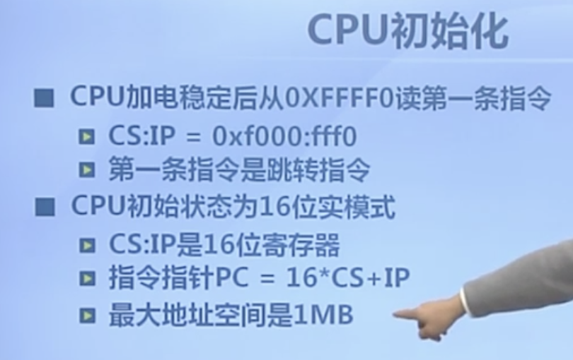
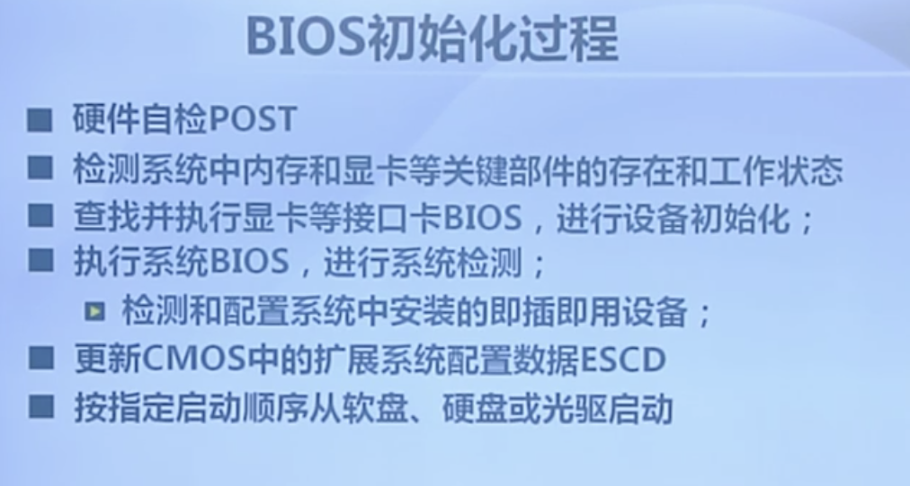
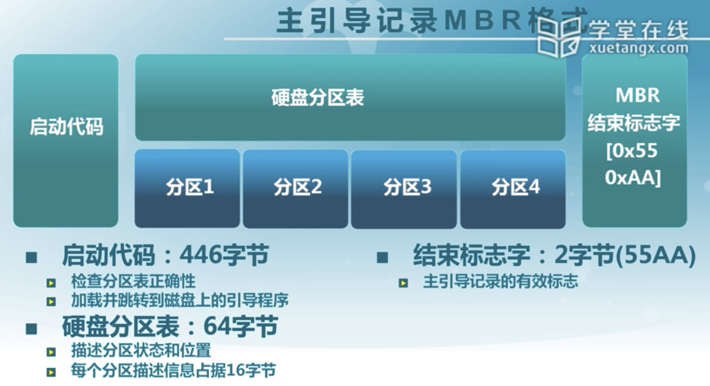
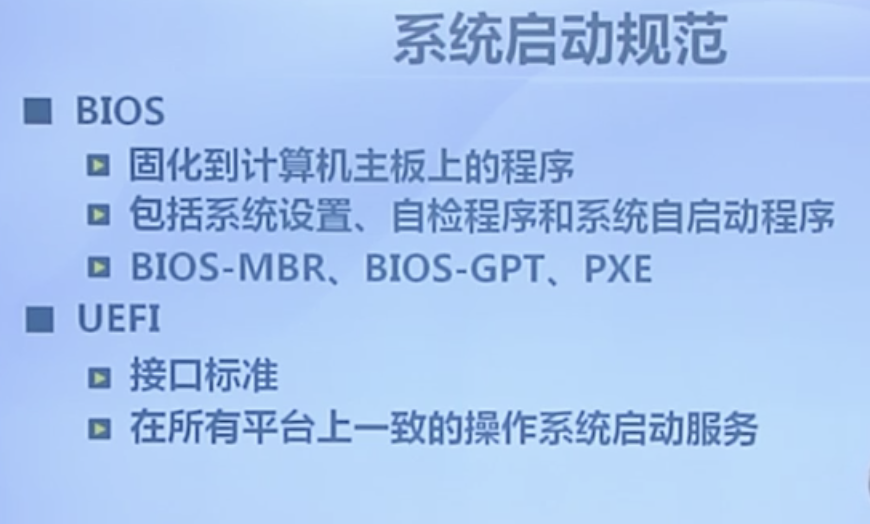
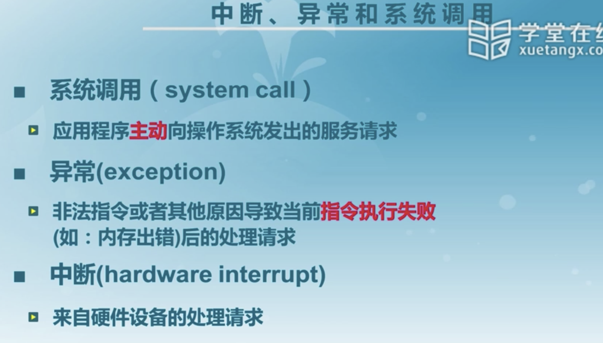
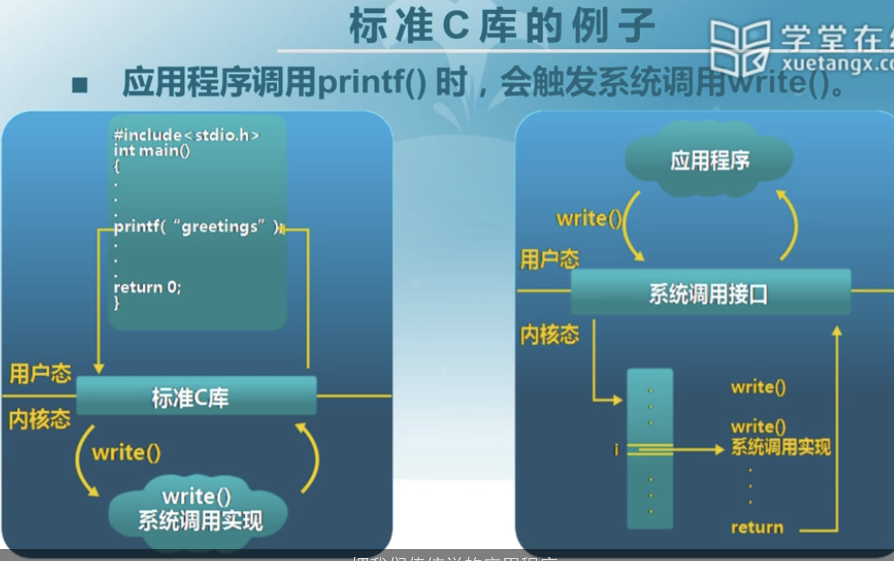

# Ucore-启动，中断，异常和系统调用

## BIOS

这个的话，在印象笔记里，不过并不关键，应该是常识吧，不会可搜一下，逃.jpg。。

## 系统调用流程

在系统加电，BIOS初始化硬件之后，实际上不会直接去寻找文件系统，因为现在的电脑大多不是一个分区，有的还可能存在双系统之类，所以会有一个**主引导记录**的存在。

主引导记录之后才会进入分区，然后分区也存在分区引导，又分区引导来帮我们加载之前所说的加载程序进而加载内核。

总体概览如下：

### CPU初始化

### BIOS初始化

### 主引导记录

值得一提的是，主引导记录为512字节，其中启动代码占据446字节，64字节用来描述分区状态

其中结束标志字非常关键，只有存在这个的情况下才会认为他是合法的。

### 分区引导扇区格式

跳转指令与平台相关，平台不同可能调转指令不同，不一样的是启动代码并不一定在这512字节之中，他可能在我们的磁盘上，我们可以改动的。

### 加载程序-bootloader

不同的内核（windows/linux）都会有不同格式的加载程序，其文件系统也有很大不同。

### 系统启动规范

## 中断，异常和系统调用比较

## 系统调用

