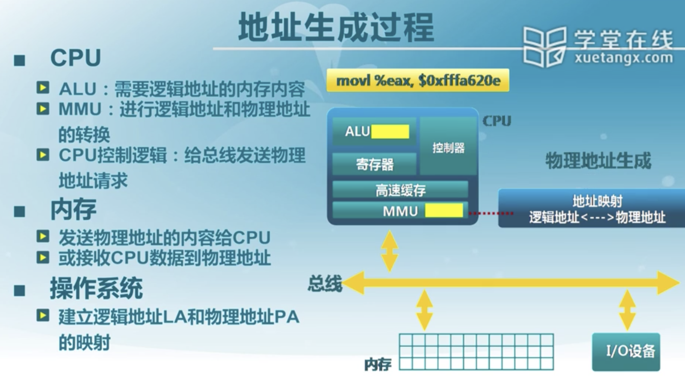

## 计算机体系结构和内存层次

在高速缓存里面进行访问不需要操作系统进行控制，但是从内存或者外存里面寻找数据就会需要使用到操作系统。

## 连续内存分配

希望在分配时可以减少这些碎片的出现

### 动态分区分配

其实也没啥，有点稍微类似于mallco的内存动态分配，不过按照内存块的寻找方式不同分成了不同的分配策略。

## 碎片整理

这个有不同的方法，但是要同时兼顾与系统开销和内存利用率

我们可以通过紧凑进程的方式，某个进程释放的时候我们通过移动进程来保证不会出现较大的碎片。

我们不太可能为了一小块的内存来移动所有的进程，这就是我们所说的考虑到开销的问题。

### 分区对换

把暂停的进程放入外存，把要执行的进程放入内存，内外存的交换开销是非常大的，所以交换什么程序是操作系统的一个问题。

如果内存中进程空间占满，那么就会把处于等待状态的进程放入外存，以此来缓解内存紧张。

早期计算机内存只可以放一个进程的情况下，这种方式实现了多进程的并行。

## 伙伴系统Buddy System

这个其实就是用来控制内存分配的，它会分配为2的u次方个块，所以，你需要的大小<你得到的大小<你需要大小的2倍。这是ucore操作系统内存分配的基本道理。

ucore内存管理接口

