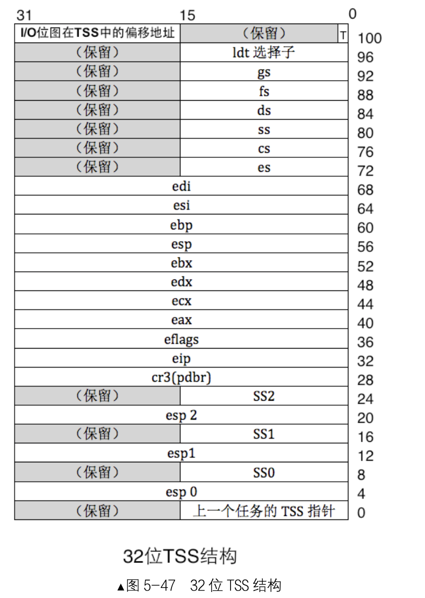
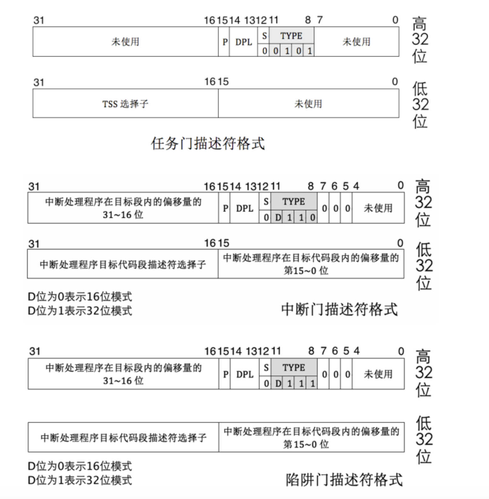
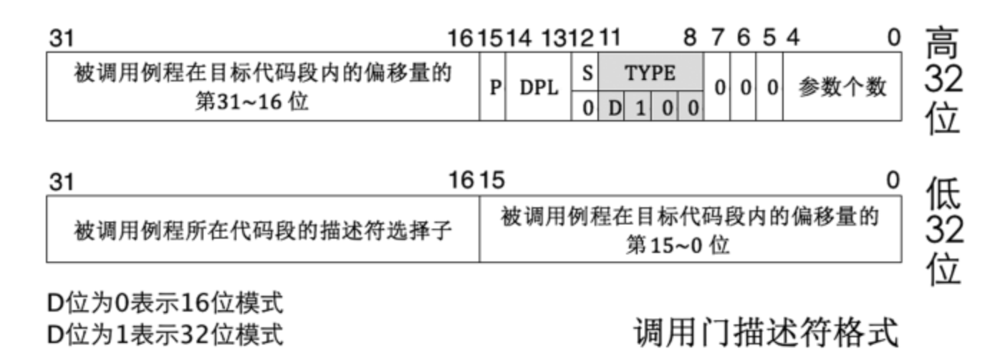
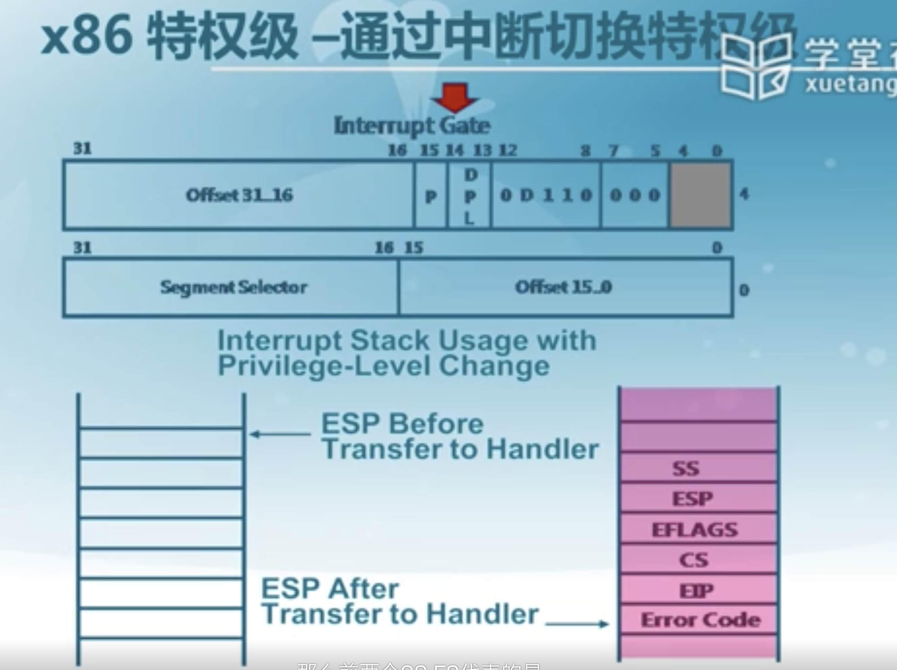
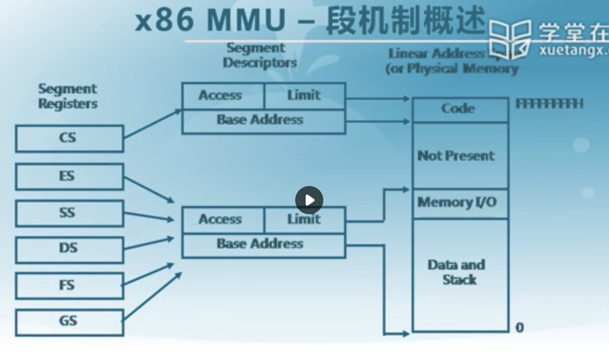

# 物理内存管理

## x86保护模式特权级

特权级决定了，应用程序无法破坏内核态的代码或者数据，但是可以得到操作系统的服务，level1和level2其实是没用的。

CPU对内核态完全信任，也就是操作系统内核对硬件资源拥有完全的访问权限，低级特权无法访问被指定了高级特权能访问的硬件资源，也就是用户态的进程无法直接访问操作系统的内存空间以及代码，只能通过中断陷入内核，然后调用内核的异常处理程序来向内核请求服务，这样就保证了操作系统基本的安全。

那么这种机制是如何实现的呢？首先就是在段寄存器中储存的段选择子上，选择子的第1-0位上就是请求特权级，编码上的00，01，10，11就对应了0，1，2，3这四级特权级。对于栈段和数据段来说，这个特权级就代表了请求访问它们对应的段所需要的最小特权级，而对于代码段来说，这个特权级就代表了这段代码执行的特权级，因此代码段的RPL叫CPL(current privilege level)，也就是当前指令的特权级。前面说描述符的时候有提到，描述符里也有它自己的特权级DPL，因此DPL也在安全特权检查之列。

****

****

段选择子位于我们的段寄存器里面，**RPL位于数据段，RCL位于代码段**

TI用于表示其对应的是GDT和LDT。描述符分为两种，一个是全局描述符表GDT，一种是局部描述符表LDT，GDT被所有的进程共享，LDT是单个进程独有的，由于linux kernel在2.4之后并不使用LDT，这里就略过了，但它们都是一样的东西，唯一区别只是公用和私用而已。

### 全局描述符表

全局描述符表其实是位于内存中的一个描述符的数组，他的首地址就是第一个描述符的地址，一个描述符的大小为8字节64位，每一份意义如下：

RPL 段寄存器 DS ES FS GS  低两位（其对应的就是数据段的特权级）

RCL 段寄存器 CS SS 的低两位 （01位，其对应的是代码段的特权级）

这两位其实代表了特权级的0-3

段描述符：（DPL）

其实里面还存储了 TSS段的地址

### 中断门和陷入门

可以看到这里面其实也是有DPL的，所以在产生中断或者进行内存访问的时候都会有相应的DPL和CPL,RPL(),通过这些就可以完成特权级检查。

访问判断：

首先段寄存器依据里面的RLP(CPL)发出访问请求，然后找到对应的段描述符，根据里面的DPL进行判断，如图中所示：

访问门：中断，陷入，异常。

### 重点

其重点在于cpu执行流程要清楚，首先从cs:eip里面拿到地址，然后根据CS得到两个信息：段描述符的位置（15-3位），以及CPL（1-0位），CPL代表的是这个指令的特权级，然后进入分段，找到段描述的DPL，确认CPL的特权级比它高，然后执行指令，否则报内存保护错（比如用户访问kernel区代码段），然后机器会看当前指令会用什么资源，如果只是访问数据段（比如访问栈段的push，pop），那就再根据访问的段，检查RPL和CPL之一是否小于等于段描述符DPL，然后检查指令的CPL是否小于等于门的DPL，检查通过后跳到内核代码区执行相应服务

对应流程如下：

- 首先根据CS的index检索到对应代码段的段描述符，得到描述符的DPL，然后用CS的CPL比较，如果CPL>DPL，则报保护错(数字越小特权越高)
- CPL大于等于代码段描述符DPL，则通过描述符提供的段基址+EIP的偏移地址得到指令的线性虚拟地址，然后通过页表缓存或页表查询到物理地址，取指令执行
- 指令执行时会如果访问到相应的数据段或者栈段，则对应段选择则先indexing到对应的段描述符，然后检查保证CPL或者访问段选择子的RPL有一个小于等于该段描述符的DPL，如果max{CPL,RPL}>DPL，则报保护错
- 检查通过，然后访问相应资源，指令执行完毕后加载下一条指令跳回第一步

## 特权级的提升与降低

> 这个其实可以参照 pwn 中的 srop的手法

CPU还要考虑陷入内核态后上下文的保存问题，进程触发异常后会陷入内核态，然后内核调用相应的异常处理程序，此时特权级就从3提升到0，在执行完内核代码之后（如果不是终止异常）又返回用户态。那么一个进程从3跳到0的过程要有4组栈寄存器来对应每个特权级的栈段和栈底。32位机器下4GB的寻址空间中最高位的1GB是内核才能访问的，这里面就有内核使用的栈段，肯定要和用户用的低3GB地址下的栈段区分，并且在进程陷入内核态之时，用户态的上下文信息肯定要保存下来，等待内核代码做完事情以后恢复现场。实现的方法就是一个叫TSS(task state segment)的数据结构：

一共104个字节，但是是可以扩展的，这是他的最小的大小。0-28位记录了3个栈

那为什么 TSS 中只有 3 个栈:ss0 和 esp0、ss1 和 esp1、ss2 和 esp2?它们分别代表 0 级栈的 段选择子和偏移量、1 级栈的段选择子和偏移量、2 级栈的段选择子和偏移量。

可以看到TSS只能保留3组栈，因为用户态本来就是最低权限，已经降不下去了，，而且汇编指令的`int,call`会将用户态的栈保存，TSS就只用记录0，1，2这三个特权级的栈寄存器就OK。每个进程都有自己的TSS，并且x86 CPU会有专门的寄存器TR(task register)来保存它的地址，当用户态的进程陷入内核态时，除了SS，ESP以外的上下文信息就会被保存，然后使用0级特权栈配合CRL为0的内核代码完成相应异常处理程序，最后再恢复现场，把特权级降回用户态就完事了。

> call 会帮助我们保存栈，

降低特权级可以通过恢复进程上下文实现，但还得考虑怎么提升特权级的问题。CPU又提供了一组和硬件支持的数据结构来实现，这种数据结构称为‘门’。一共四种，任务门，中断门，陷阱门和调用门：

门也是一种描述符，只不过和全局描述符表中的描述符不一样的是，全局描述符表是记录数据的描述符，而门中除了任务门以外记录的是一段历程地址的描述符，用于支持内核的系统调用：

- call和jmp指令的选择子会成为调用门的参数，指令CPL通过调用门的DPL特权检查后call会以调用高CPL函数例程形式实现特权级提升，jmp只能转移到CPL平行的代码上。
- int指令会触发中断，指令CPL通过中断门的DPL特权检查后，linux并根据中断类型调用相应的异常处理程序，然后以中断形式进入内核态实现特权提升。
- int3指令通过触发中断形式在陷阱门中实现特权提升，一般是编译器调试用，不用管
- 任务(进程)在中断发生后如果中断向量号是任务门，则通过任务门以TSS为单位实现任务切换，不过linux并没有使用这样的硬件机制，所以不用管

综上，一个指令在执行的时候，它的CPL必须满足以下条件：

- 访问门（向内核请求服务）：CPL≤DPL(gate) and CPL≥DPL(seg)
- 访问段：max{CPL,RPL}≤DPL

这就是特权在保护模式下提供的安全机制，可见这些安全机制一部分是由硬件实现，一部分是由操作系统内核实现的。

## 特权级切换

### 中断门

当前栈的数据会被压入内核栈进行保存

## mmu内存管理单元

可以看到全局描述符表里面存储的有段描述符，

* cs这些里面的高十几位是index,来找到全局描述符表里面的对应描述符
* 段描述符里面表明了他要访问的地址（base address + eip得到最终的线性基址，没有启用页机制的情况下，线性地址等于物理地址）的对应的映射关系

### 段选择子

其实全局描述符表就是段表

