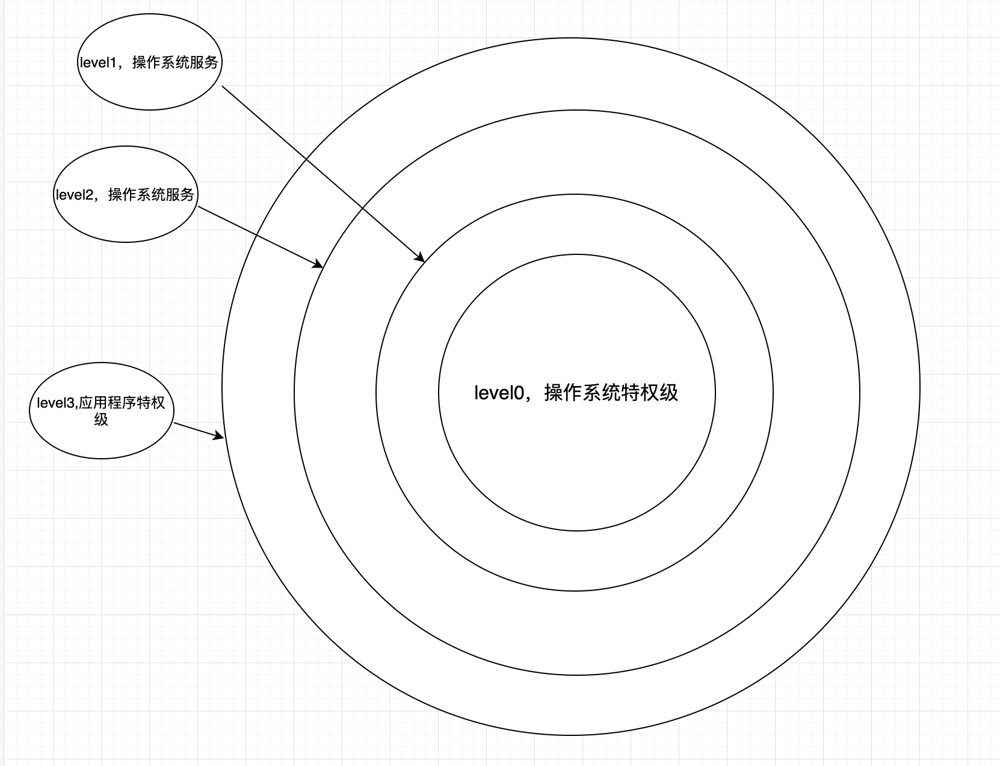
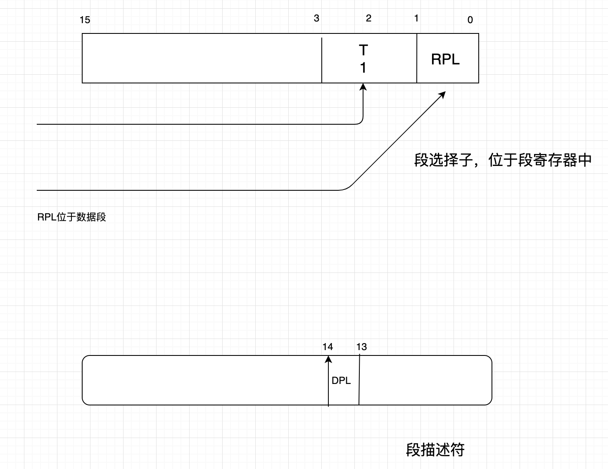
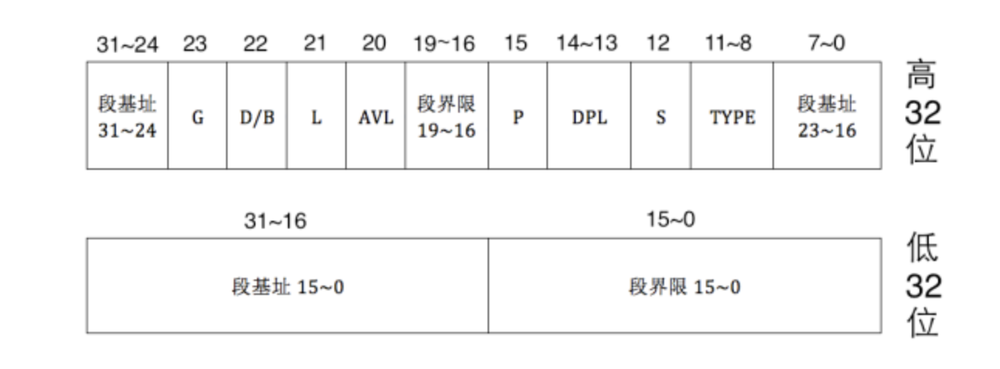
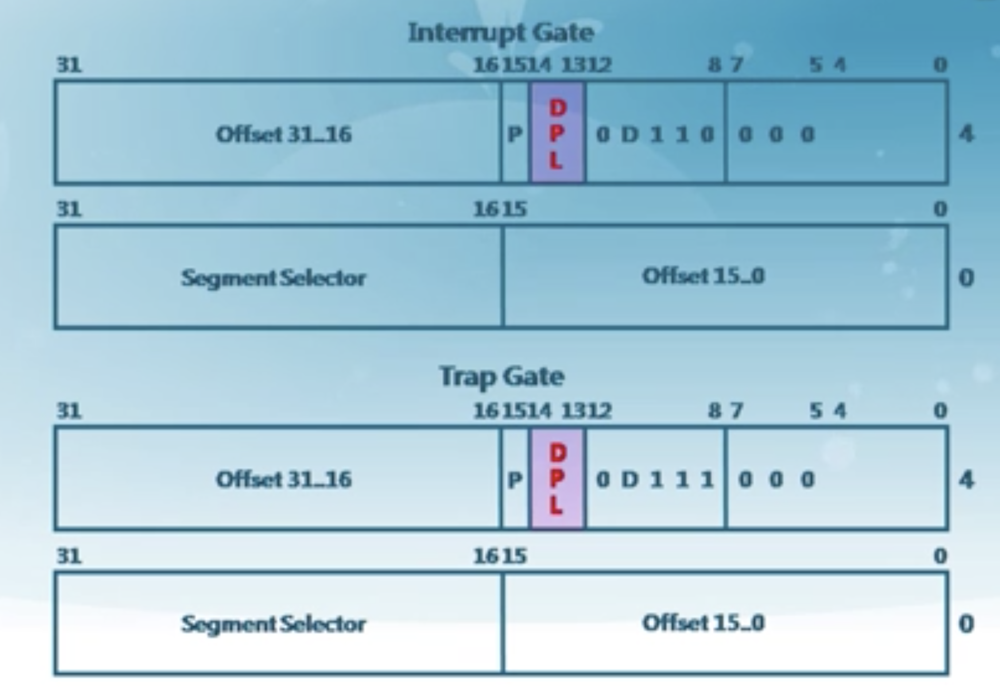

# 物理内存管理

## x86保护模式特权级

特权级决定了，应用程序无法破坏内核态的代码或者数据，但是可以得到操作系统的服务，level1和level2其实是没用的。

****

****

段选择子位于我们的段寄存器里面，**RPL位于数据段，RCL位于代码段**

TI用于表示其对应的是GDT和LDT。描述符分为两种，一个是全局描述符表GDT，一种是局部描述符表LDT，GDT被所有的进程共享，LDT是单个进程独有的，由于linux kernel在2.4之后并不使用LDT，这里就略过了，但它们都是一样的东西，唯一区别只是公用和私用而已。

### 全局描述符表

全局描述符表其实是位于内存中的一个描述符的数组，他的首地址就是第一个描述符的地址，一个描述符的大小为8字节64位，每一份意义如下：

RPL 段寄存器 DS ES FS GS  低两位（其对应的就是数据段的特权级）

RCL 段寄存器 CS SS 的低两位 （01位，其对应的是代码段的特权级）

这两位其实代表了特权级的0-3

段描述符：（DPL）

### 中断门和陷入门

可以看到这里面其实也是有DPL的，所以在产生中断或者进行内存访问的时候都会有相应的DPL和CPL,RPL(),通过这些就可以完成特权级检查。

访问判断：

首先段寄存器依据里面的RLP(CPL)发出访问请求，然后找到对应的段描述符，根据里面的DPL进行判断，如图中所示：

访问门：中断，陷入，异常。

### 重点

其重点在于cpu执行流程要清楚，首先从cs:eip里面拿到地址，然后根据CS得到两个信息：段描述符的位置（15-3位），以及CPL（1-0位），CPL代表的是这个指令的特权级，然后进入分段，找到段描述的DPL，确认CPL的特权级比它高，然后执行指令，否则报内存保护错（比如用户访问kernel区代码段），然后机器会看当前指令会用什么资源，如果只是访问数据段（比如访问栈段的push，pop），那就再根据访问的段，检查RPL和CPL之一是否小于等于段描述符DPL，然后检查指令的CPL是否小于等于门的DPL，检查通过后跳到内核代码区执行相应服务

