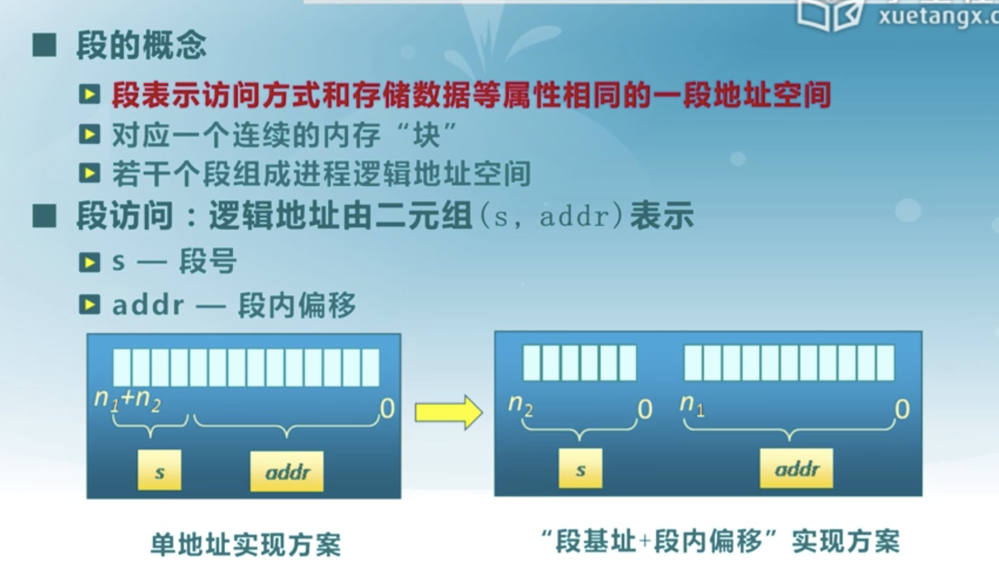
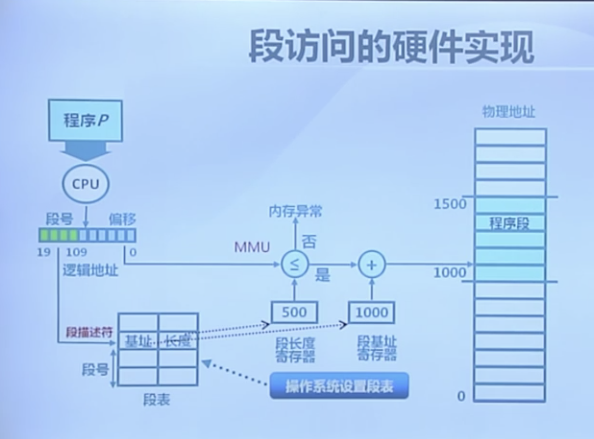
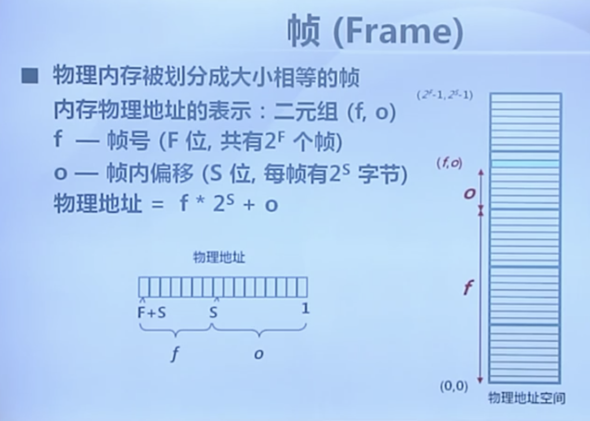
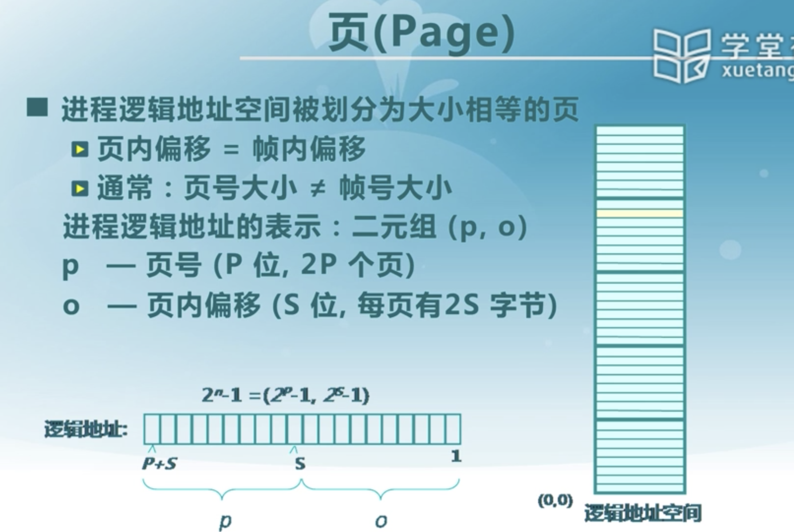
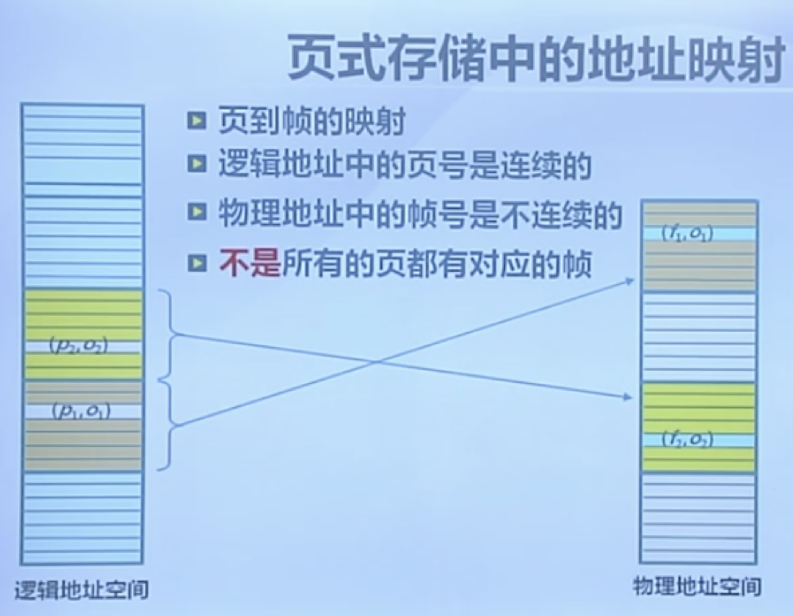
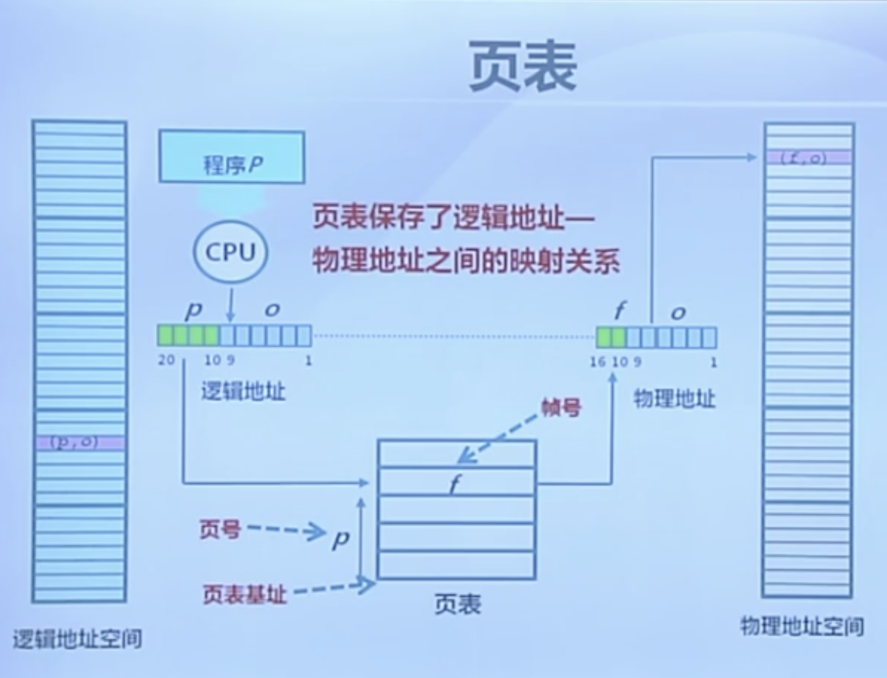
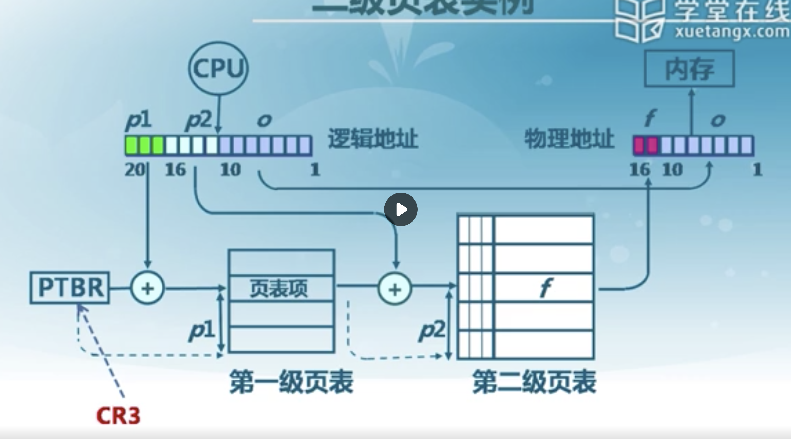

# 非连续内存分配

## 段式存储管理

X86家族的cpu在硬件上就要求一定需要分段机制，但是分页机制是可以打开和关闭的，同时在32位时，寻址范围大幅度增加，所以我们通过32位寄存器就可以完成访问，所以此时的段寄存器的作用就在于实现代码，数据和栈的分离了。

but还有一个重要原因在于段描述符，保护模式下的段寄存器存储的东西不再称为“段基址”，而是“段选择子”(selector)，而这个选择的目标就是对应的段描述符。

首先cpu得到的逻辑地址分为段号（对应的就是段描述符）和段内偏移，通过段号在段表里面进行查找，那么我们就可以得到段基址和段的长度，这时候mmu进行越界检查，检查通过后，通过段基址和段内偏移我们可以得到物理地址。

## 页式存储机制

其核心在于页表和MMU/TLB(快表)，页表用来帮助实现页帧和页面之间的转换，那么快表就用来实现这个转换关系的高速运行。

### 页帧

通过帧号可以确定其在第几帧，然后f * 2的s次方，我们得到了所要找的帧的地址，加上帧内偏移，我们可以确定每一个内存单元的地址。

其访问方式和帧类似。

### 页和帧之间的内存映射

可以看到页帧之间不是直接对应的，所以我们需要用页表来表明映射关系。

页中的逻辑地址包含页号和页内偏移（和帧内偏移相等），页表由页内基址可以查到（有专门的寄存器存放改地址），然后页号作为偏移我们可以在这个数组里面找到帧号进而确定物理地址。

## 页表

页表会随着进程的运行状态而发生动态变化，

* 存在位：我们有一个逻辑页面是否有一个物理页面和它像对应。
* 修改为：对应的页面内容是否修改。
* 引用位：这个页面在过去一段时间内是否有过对他的引用，也就是是否访问过这个页面里的存储单元。

页式的存储管理是的我们可以动态的进行内存管理，因为有的页号其实并没有对应的帧号存在，即是存在位为0.

### 访问性能问题

页表可能占据大量空间，而且访问时由于需要访问页表而造成了访问一个内存单元需要访问两次的情况发生，进而影响性能。

缓存容易理解，就是简单的把访问可能性大的页表都先缓存下来方便访问。

间接访问的话就是切断分成多个子表，先找到在哪个子表里面，这个其实就是多级页表的访问方式。

## 快表和多级页表

快表就是cpu中加上的一组关联存储器（缓存了一部分的页表项），其特殊性在于在cpu提出访问请求的时候，可以并行的进行查表（快表中的页表项）。

### 快表无法命中请求时

这是就要安装之前的方式进行查内存中的页表，然后把页表缓存到cpu里面去

关键词**关联存储**

### 多级页表

**寻址方式：**

3级页表存在p1,p2,p3,需要访问k+1 = 4次才能找到内存单元。

p1作为一级页表的偏移找到第二级页表的起始，然后p2作为偏移找到第三级页表的起始，然后p3作为偏移找到内存单元的物理页号，然后访问内存单元。

> 多级页表的方式可以使得我们依赖页表中的存在位使得有些没用过的页表在内存中实际上不存在，那么我们就会节省大量的空间。

举个二级页表的例子：

## 反置页表

使用反置页表的原因就是64位时地址空间增多，使用多级页表十分繁琐。

做法：让页表项和物理地址空间对应起来

## 段页式存储管理

其实就是结合起来，在段表里面加入寻页表的单元来最终获得物理地址

