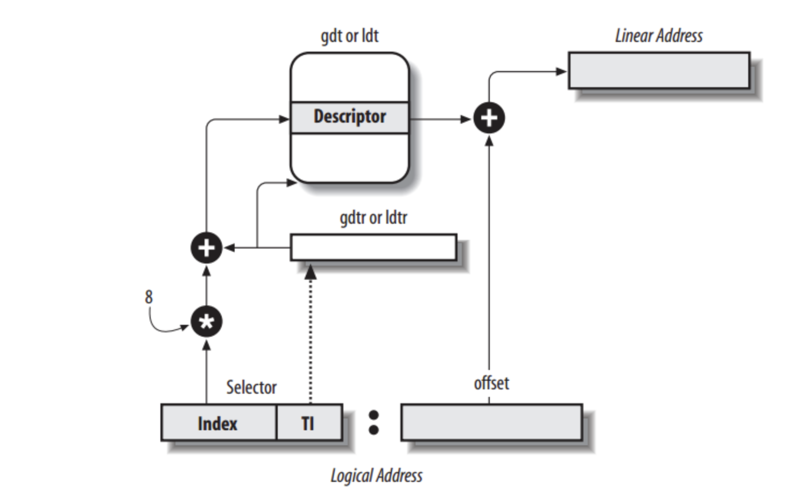

# 非连续内存分配

> https://chenyuzhuwhiskey.github.io/2020/09/07/%E7%AE%80%E6%98%93%E5%86%85%E6%A0%B8%E5%AE%9E%E7%8E%B0%E7%AC%94%E8%AE%B0-%E4%BA%8C/   大佬博客值得参考

## 段式存储管理

X86家族的cpu在硬件上就要求一定需要分段机制，但是分页机制是可以打开和关闭的，同时在32位时，寻址范围大幅度增加，所以我们通过32位寄存器就可以完成访问，所以此时的段寄存器的作用就在于实现代码，数据和栈的分离了。

but还有一个重要原因在于段描述符，保护模式下的段寄存器存储的东西不再称为“段基址”，而是“段选择子”(selector)，而这个选择的目标就是对应的段描述符。

首先cpu得到的逻辑地址分为段号（对应的就是段描述符）和段内偏移，通过段号在段表里面进行查找，那么我们就可以得到段基址和段的长度，这时候mmu进行越界检查，检查通过后，通过段基址和段内偏移我们可以得到物理地址。

可以看到这里面是有段基址的，所以保护模式的分段实际过程就是段寄存器通过存储全局描述符表基址的寄存器GDT再加上index*8寻址到对应的段描述符，然后取出对应的段基址再加上偏移地址就可以了。

绕了大半天，其实就是为了让寻址时加上额外的一些段信息，它们意义如下，由于一些向下兼容的原因，一些东西是不连续的，但不妨碍我们理解：

- 段界限：一个段的最大大小是20位，如果索引超过段界限CPU会触发异常。

- G：段界限的粒度，如果G为0就代表粒度是1位，对应到段界限就是20位1MB。G为1就代表粒度为4KB，对应到段界限就是4GB，因此实际的段界限大小等=粒度大小*段界限-1

- > 20位是1MB，粒度是1，乘以4kb就是4GB了

- 段基址：顾名思义，不用说了

- D/B：一个用来兼容80286保护模式的位，表示有效地址和操作数的位数。D为0表示16位，D为1表示32位（所以对我们不用80286的就没什么用）

- L：为1表示64位代码段，0表示32位

- AVL：available字段，这个available是对于用户来说的，不是硬件，所以是可以随便用的

- P：用于指示段是否存在于内存中，用到这个段时如果它不存在，就会触发CPU的异常，然后跳转到异常处理程序中把它加载到内存中。

- DPL：Descriptor Privilege Level，表示描述符的特权级。

- S：为1表示系统段，0表示非系统段

- type：段的类型，这三位对于系统段和非系统段有不同的定义：

- 

在计算机位数不断上升的今天，32位寻址其实就已经不再需要分段寻址了，BTW linux kernel认为段基址是没有意义的，因为偏移地址已经可以给出完整的线性地址，因此linux kernel的全局描述符表中的段基址位全都置为了0用以规避分段机制，因此在linux下偏移地址就等于线性地址。因此GDT对于linux存在的唯一意义就是实现内存访问的安全机制了。

## 页式存储机制

其核心在于页表和MMU/TLB(快表)，页表用来帮助实现页帧和页面之间的转换，那么快表就用来实现这个转换关系的高速运行。

### 页帧

通过帧号可以确定其在第几帧，然后f * 2的s次方，我们得到了所要找的帧的地址，加上帧内偏移，我们可以确定每一个内存单元的地址。

其访问方式和帧类似。

### 页和帧之间的内存映射

可以看到页帧之间不是直接对应的，所以我们需要用页表来表明映射关系。

页中的逻辑地址包含页号和页内偏移（和帧内偏移相等），页表由页内基址可以查到（有专门的寄存器存放改地址），然后页号作为偏移我们可以在这个数组里面找到帧号进而确定物理地址。

## 页表

页表会随着进程的运行状态而发生动态变化，

* 存在位：我们有一个逻辑页面是否有一个物理页面和它像对应。
* 修改为：对应的页面内容是否修改。
* 引用位：这个页面在过去一段时间内是否有过对他的引用，也就是是否访问过这个页面里的存储单元。

页式的存储管理是的我们可以动态的进行内存管理，因为有的页号其实并没有对应的帧号存在，即是存在位为0.

### 访问性能问题

页表可能占据大量空间，而且访问时由于需要访问页表而造成了访问一个内存单元需要访问两次的情况发生，进而影响性能。

缓存容易理解，就是简单的把访问可能性大的页表都先缓存下来方便访问。

间接访问的话就是切断分成多个子表，先找到在哪个子表里面，这个其实就是多级页表的访问方式。

> 页表是虚拟地址与物理地址的映射关系，由于将来每个操作系统下的进程，包括操作系统自己都是在32位虚拟地址空间中运行的，因此每个进程都需要有自己的页表，我们将物理地址分页，每个页占有4kB的大小，一个页表项就占32位4字节，检索4GB的虚拟内存空间总共需要1M个页表，在内存中占4MB，这个大小显然是无法接受的，因此我们再创建一个页表的页表，也就是页目录表，一个页目录项也是32位4字节，因此一个页目录项也可以索引4kB的空间，那么检索4GB的虚拟地址空间只需要4GB/4kB/4kB=1024个页目录，只需要4096个字节就可以了，这样的开销就可以接受。

## 快表和多级页表

快表就是cpu中加上的一组关联存储器（缓存了一部分的页表项），其特殊性在于在cpu提出访问请求的时候，可以并行的进行查表（快表中的页表项）。

### 快表无法命中请求时

这是就要安装之前的方式进行查内存中的页表，然后把页表缓存到cpu里面去

关键词**关联存储**

### 多级页表

**寻址方式：**

3级页表存在p1,p2,p3,需要访问k+1 = 4次才能找到内存单元。

p1作为一级页表的偏移找到第二级页表的起始，然后p2作为偏移找到第三级页表的起始，o是真实物理地址的偏移量，然后p3所在这个页中存储的就是真实物理地址的偏移量，再加上最低12位虚拟地址就得到了对应的真实物理地址了，低12是页中的偏移地址，一个页大小是4kb，12位正好完全检索

> 多级页表的方式可以使得我们依赖页表中的存在位使得有些没用过的页表在内存中实际上不存在，那么我们就会节省大量的空间。

举个二级页表的例子：

总结：

对于1024个页目录，我们需要10位地址来进行索引，这10位地址就是虚拟地址中的高10位，我们将这10位地址*4就是对应页表的偏移地址，再加上页目录表的起始地址就得到了对应页表所在的物理地址，一个页表中有1024个页，因此检索它也需要10位地址，这10位地址就是虚拟地址中的中间10位，我们用这中间10位地址*4就得到了所在页的偏移地址，加上前面得到的页表物理地址就得到了对应页所在物理地址，这个页中存储的就是真实物理地址的基地址，再加上最低12位虚拟地址就得到了对应的真实物理地址了。

注意：页表项里面是线下地址奥。

### 重点：

因为每个页表项都是4字节，因此它们的值里面低12位全是0，因此为了避免浪费就要往里面加一些关于页表的安全信息：

其中：

- P：该页存在于物理地址中
- R/W：读写权限，0表示只读，1表示可读可写
- US：普通用户/超级用户位，为1表示在普通用户级，普通用户在特权级3
- PWT：通写位，1表示处于通写模式，表示改该页是高速缓存
- PCD：打开使用高速缓存
- A:访问位，如果CPU访问过该页，就会把它置为1，之后的操作系统我们会将它置为0，通过count置为1的次数就能判断它是否常常被使用，是就将这个页存入缓存中
- D：脏页位，CPU对一个页进行写操作时，就会把这个位置为1，仅对页表项有效
- G：global位，若为global，那么这个页表就会一直在高速缓存TLB中保存
- AVL：软件的可用为，CPU不会管，怎么用就是软件定义的了

## 反置页表

使用反置页表的原因就是64位时地址空间增多，使用多级页表十分繁琐。

做法：让页表项和物理地址空间对应起来

## 段页式存储管理

其实就是结合起来，在段表里面加入寻页表的单元来最终获得物理地址

