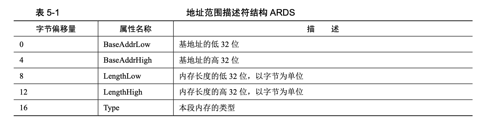
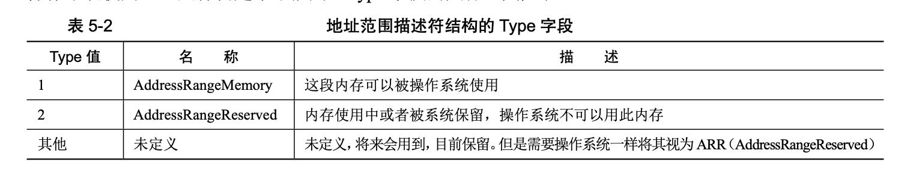
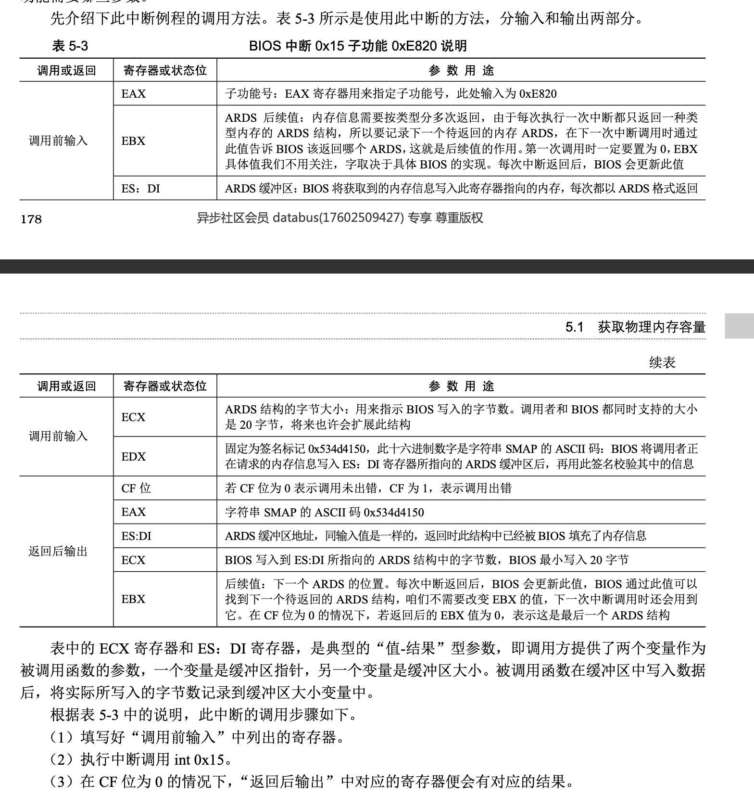
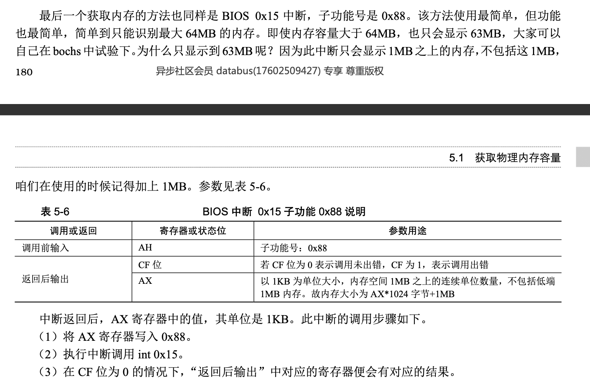
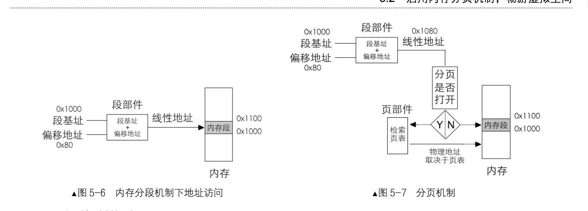
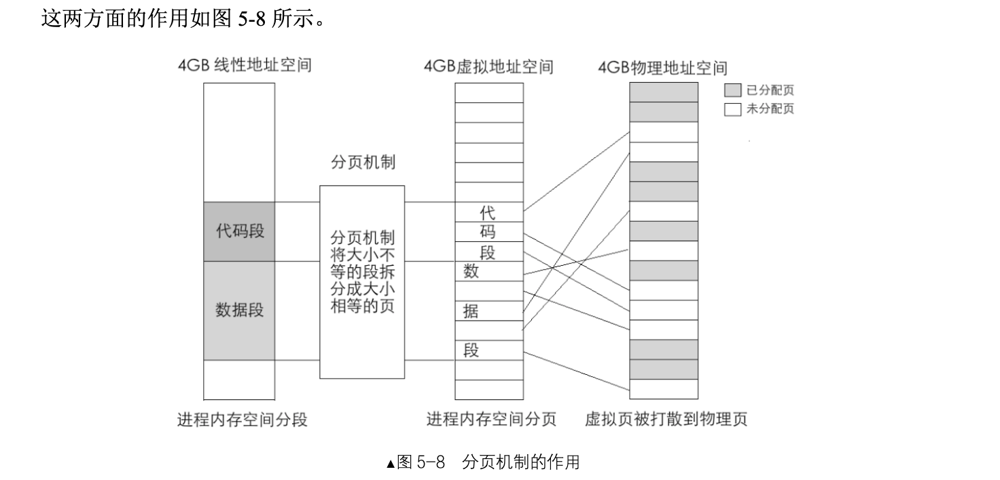
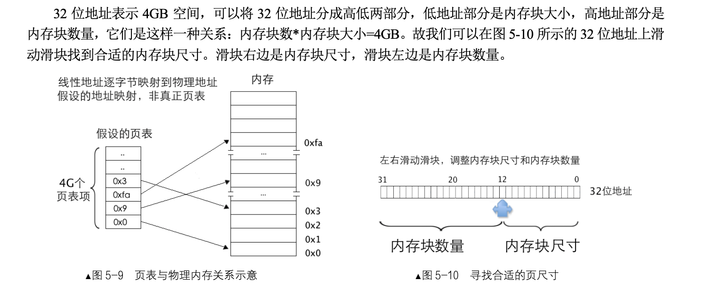
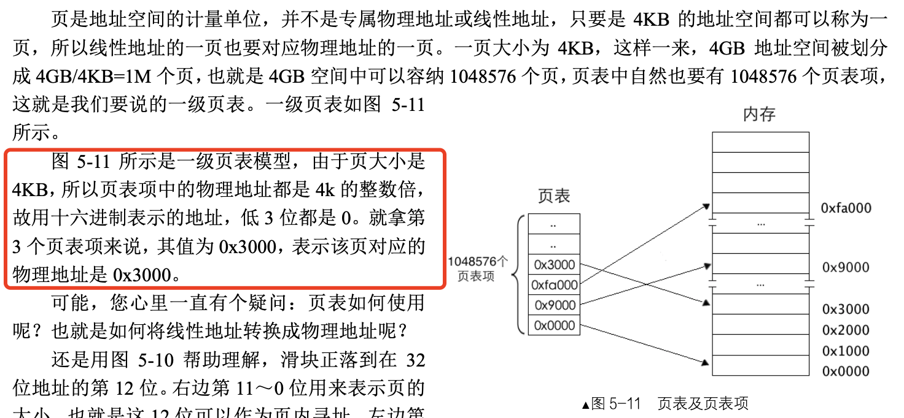

# 保护模式进阶，向内核迈进

## 获取物理内存容量

### LINUX获取内存的方法

功能从上到下不断减弱，但是操作越来越简单，**bios机器中断也是一组软件所以其访问硬件也需要调用硬件的应用程序接口（API）**

### BIOS中断0x15子功能0xe820获取内存

> 内存信息的内容是用地址范围描述符来描述的，用于存储这种描述符的结构称之为地址范围描述符。

每次int 0x15之后，BIOS会返回一个这样的数据结构。值得注意的是type字段用来描述这段内存的类型，类型：这段内存的用途，即其是可以被操作系统使用还是被保存起来不能用。

这个倒是无所谓，真用到了查一下就行了。

### BIOS中断0x15子功能0x88获取内存

## 内存分页机制

### 段机制

保护模式中断寄存器中的内容已经是选择子，但是段选择子最终是为了找到段基址，访问核心为： 段基址：段内偏移地址的方式。

### 分页机制的作用

* 将线性地址转换成物理地址。
* 用大小相等的页代替大小不等的段。

页表的建立：

可以看出左边的页表建立方式不合理，因为4G*4Byte(每个页表项都要4个字节来存储)所占据的内存太大了，得不偿失，所有我们采用内存块数量+内存块尺寸的方式来建立页表，同时我们应该保证内存块的尺寸较大来保证页表合理的建立。

#### 一级页表

