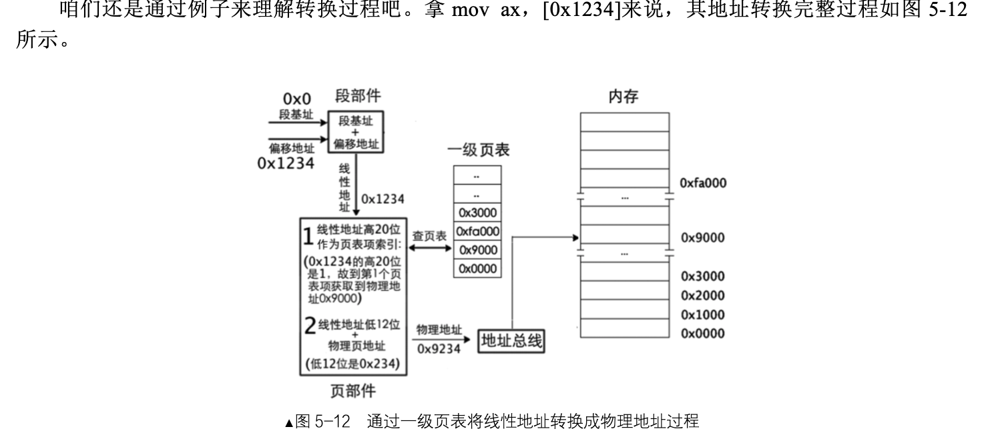
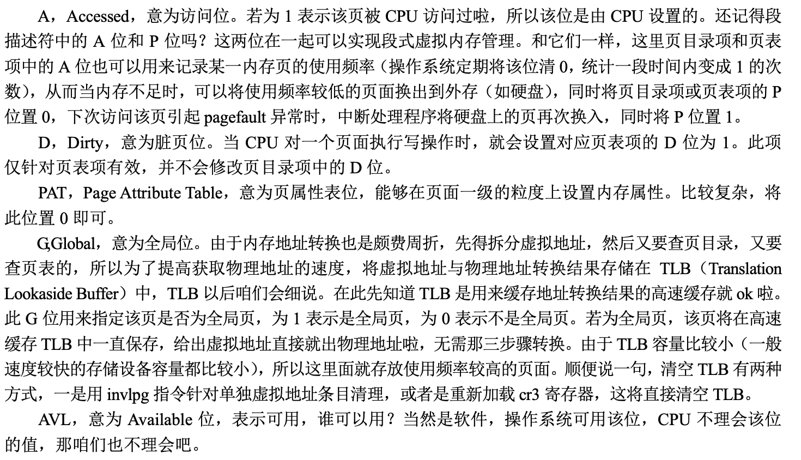

# 保护模式进阶，向内核迈进

## 获取物理内存容量

### LINUX获取内存的方法

功能从上到下不断减弱，但是操作越来越简单，**bios机器中断也是一组软件所以其访问硬件也需要调用硬件的应用程序接口（API）**

### BIOS中断0x15子功能0xe820获取内存

> 内存信息的内容是用地址范围描述符来描述的，用于存储这种描述符的结构称之为地址范围描述符。

每次int 0x15之后，BIOS会返回一个这样的数据结构。值得注意的是type字段用来描述这段内存的类型，类型：这段内存的用途，即其是可以被操作系统使用还是被保存起来不能用。

这个倒是无所谓，真用到了查一下就行了。

### BIOS中断0x15子功能0x88获取内存

## 内存分页机制

### 段机制

保护模式中断寄存器中的内容已经是选择子，但是段选择子最终是为了找到段基址，访问核心为： 段基址：段内偏移地址的方式。

### 分页机制的作用

* 将线性地址转换成物理地址。
* 用大小相等的页代替大小不等的段。

页表的建立：

可以看出左边的页表建立方式不合理，因为4G*4Byte(每个页表项都要4个字节来存储)所占据的内存太大了，得不偿失，所有我们采用内存块数量+内存块尺寸的方式来建立页表，同时我们应该保证内存块的尺寸较大来保证页表合理的建立。

#### 一级页表

其中页表的0-11位来表示页的大小并用作页内寻址，12-31位来表示页的数量，同时这20位也用来索引一个页，表示第几个页。

* 分页机制打开前需要将页表地址加载到cr3寄存器，这个地址是物理地址，页表中的表项的地址也是物理地址。
* 索引：表项的高20位作为页表项的索引，每个页表项要占用4字节的大小，低12位与物理页的地址相加可以得到最终要访问的物理地址。

### 二级页表

二级页表是将1M的标准页平均放置1k个页表中，每个页表含有1k个页表项，每个是4字节，所以每个二级页表大小为4kb，恰恰是一个标准页的大小。

#### 页目录

产生的新的物理内存定位方式：

### 页表项

## 操作系统和用户进程的关系

#### 启用分页机制

   

#### 代码实现页表和页目录结构

#### 缺页异常的原因

其实本质是物理内存不足，操作系统会把物理页换出到磁盘上，cpu无法直接访问，所以以中断程序进行处理。

#### 共享的实质

其原因在于把内核所用到的页表的位置都确定下来，这样的话用户进程的目录页区域都会加载相同的内核页表，进而实现内核的共享。

### 用虚拟地址访问页表

> 低端的1mb的虚拟空间和物理地址直接一一对应的关系。

### 快表

处理器准备了一个高速缓存，可以匹配高速的处理器速率和低速的内 存访问速度，它专门用来存放虚拟地址页框与物理地址页框的映射关系，这个调整缓存就是 TLB，即 Translation Lookaside Buffer，俗称快表，其结构如图 5-25 所示。

简单的想就是11对应的关系建立在了一个表中方便查询使用。

#### 重点

由于寻址的原因，快表必须及时刷新，TLB 是页表的缓存，处理器寻址时最先访 问的是 TLB，TLB 里面存储的是程序运行所依赖的指令和数据的内存地址，任意时刻都必须保证地址的有 效性，否则程序必然出错，所以 TLB 必须实时更新。

如果要更改快表的话，需要重载cr3寄存器，就是把其中数据读取出来然后写入，这会使得整个tlb表失效，或者专门的指令，invlpg，这个用于刷新某个虚拟地址对应的条目。

