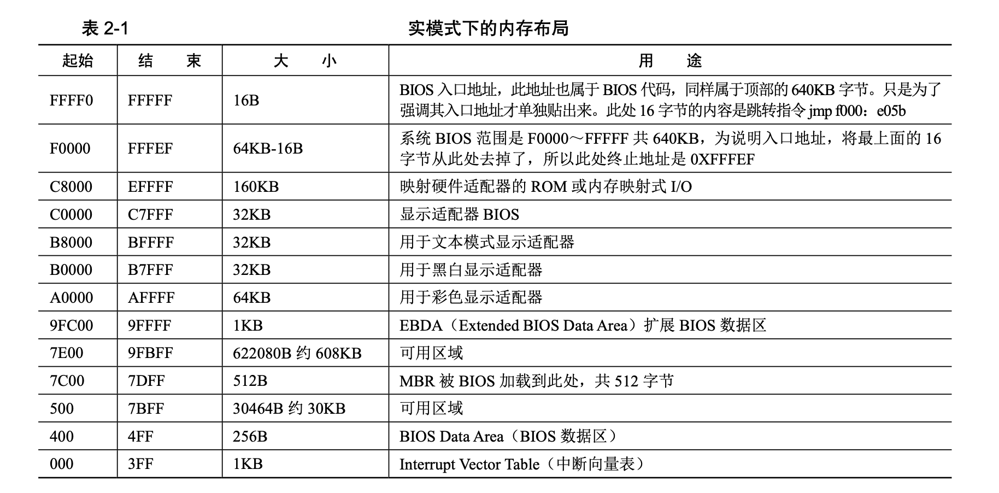

# 编写MBR主引导记录

## BIOS

> CPU:Intel 8086 , 地址线20条 ，访问地址空间1MB 0x00000 到 0xFFFFF

电脑启动后会跳转到bios的一个固定地址，以实模式运行该条指令，这个指令一般是个跳转指令，跳转向bios真正的程序执行的路线。

### MBR

其所在位置为磁盘上最开始的那个扇区，此扇区的末尾的两个字节分别是魔数**0x55和0xaa**（这是一个辨认标识），然后加载物理地址0x7c00，随后跳转到此地址，继续执行。

#### 系统调用int 0x10

编程实现屏幕打印字符，位于最开始的扇区，512字节

~~~assembly
SECTION MBR vstart=0x7c00 ;起始地址0x7c00
	mov ax,cs ;利用cs进行赋值，cs初始为0，因为bios初始为jmp 0:0x7c00
	mov ds,ax
	mov es,ax
	mov ss,ax
	mov fs,ax
	mov sp,0x7c00
	mov ax,0x600
	mov bx,0x700
	mov cx,0
	mov dx,0x184f
	int 0x10
	mov ah,3
	mov bh,0
	int 0x10
	mov ax,message
	mov bp,ax
	mov cx,5
	mov ax,0x1301
	mov bx,0x2
	int 0x10
	jmp $
	message db "1 MBR"
	times 510-($-$$) db 0
	db 0x55,0xaa
~~~

### 段机制的由来

利用段机制可以扩大访问的内存空间。

### 实模式下的ret

ret将当前esp内容弹出给eip,但是retf指令只会从栈中弹出两个字节的偏移地址和2字节的段地址。

call和ret是一对配合，call far 和 retf是一对配合用于远调用和返回。

### CPU与外设通信

1.设置数据缓冲，解决 CPU 与外设的速度不匹配

CPU 和外设速度上的差异可以通过设置缓冲区来解决，也就是说，数据先存储在缓冲区里，等需要 的时候(无论缓冲区是否满了)就传送出去。

2.设置信号电平转换电路

CPU 和外设的信号电平不同，如 CPU 所用的信号是 TTL 电平，而外设大多数是机电设备，故不能使 用 TTL 电平驱动，可以在接口电路中设置电平转换电路来解决。

3.设置数据格式转换

外设是多种多样的，输出的信息可能是数字信号、模拟信号等，而 CPU 只能处理数字信号。数字信 号需要经过数/模转换(D/A)成模拟量才能被送到外设以驱动硬件，模拟量也同样需要经过模/数(A/D)转换成数字量才能被 CPU 处理。所以接口电路中需要包括 A/D 转换器和 D/A 转换器。另外，即使双方使 用的都是数字信号，这也牵涉到格式和字长的问题，如 CPU 使用的是 8 位、16 位或 32 位并行数据，而 外设使用并行或串行数据都有可能，所以 IO 接口中必须能够识别格式并且转换成对方需要的形式才行。

4.设置时序控制电路来同步 CPU 和外部设备

硬件的工作也按照某种时序，它们都有自己的时序系统，就像 CPU 工作在自己的晶振时序上一样。 双方时序不同，接口电路就要协调这两种不同的时间计法。例如，CPU 发控制信号、定时信号给 IO 接口 电路，IO 接口用它们来控制和管理硬件。随后硬件有了反馈后，其应答信号也需要通过接口返回给 CPU， 这样 CPU 先“问”，硬件后“回答”，就实现了一次握手，之后便可以实现 IO 的同步操作。

5.提供地址译码

CPU 同多个硬件打交道，每个硬件要反馈的信息很多，所以一个 IO 接口必须包含多个端口，即 IO 接口上的寄存器，来存储这些信息内容。但同一时刻，只能有一个端口和 CPU 数据交换，这就需要 IO 接 口提供地址译码电路，使 CPU 可以选中某个端口，使其可以访问数据总线。

