# 进程管理

## 数据结构

每个进程或者每个资源都有一个数据结构`（进程信息表）`，内含指针，它们会形成队列结构方便调用和管理。

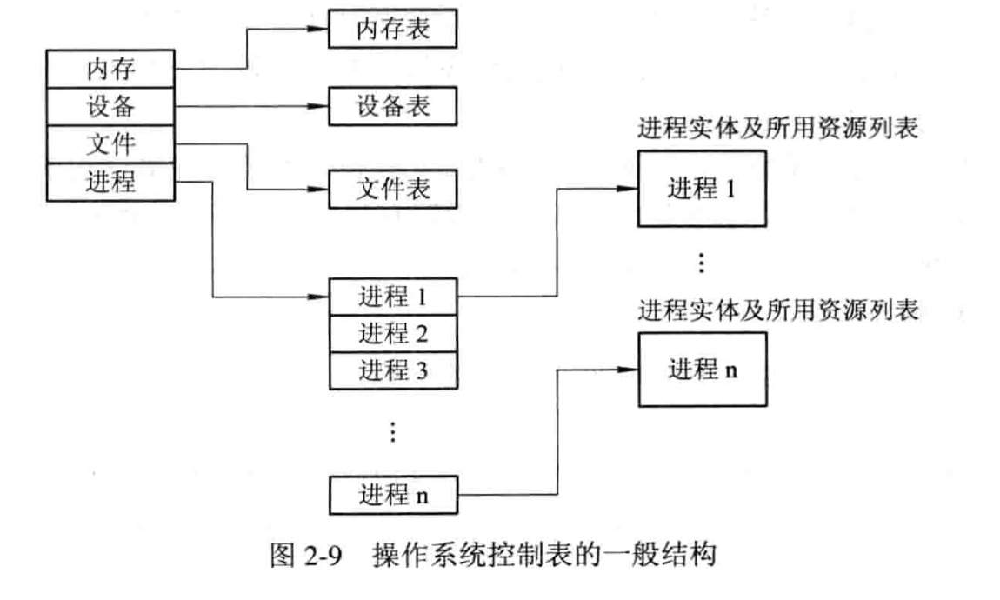

进程表被称为PCB。

`PCB进程控制块`的作用是使得一个在多道程序环境下不能独立运行的程序称为一个能独立运行的基本单位。

作用：

* 作为独立运行的基本单位的标志。
* 能实现间断性运行方式。
* 提供进程管理所需要的信息。
* 提供进程调度所需要的信息。
* 实现与其他进程的同步和通信。

包含信息：

* 进程标识符
* 处理机状态 --- 就是寄存器那些资源信息，方便被中断后恢复执行。
* 进程调度信息：进程状态，进程优先级等。。。
* 进程控制信息：
  * 程序和数据地址
  * 进程同步和通信机制（消息队列指针，信号量）
  * 资源清单
  * 链接指针，PCB队列里面的下一个进程的PCB的首地址

PCB的组织方式：

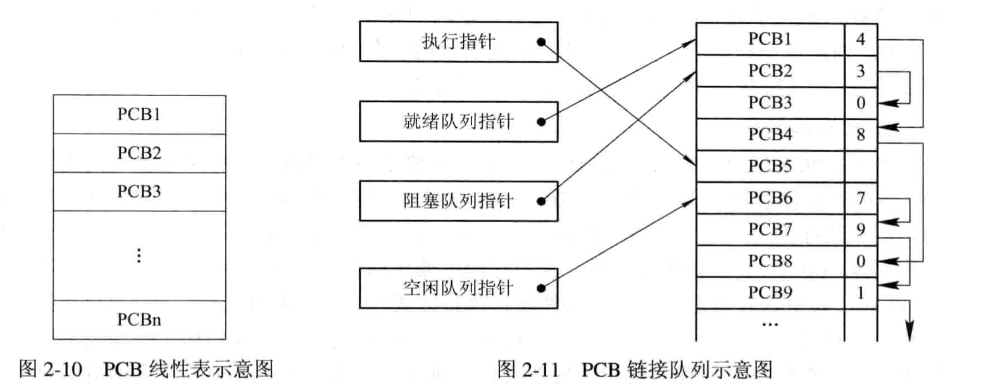

线性方式就很简单了。

* 链接方式：相同状态的进程PCB链接成一个队列
* 索引方式：操作系统根据进程状态不一样，建立索引表，把索引表里面在内存的首地址记录在内存的一些专用单元里面。

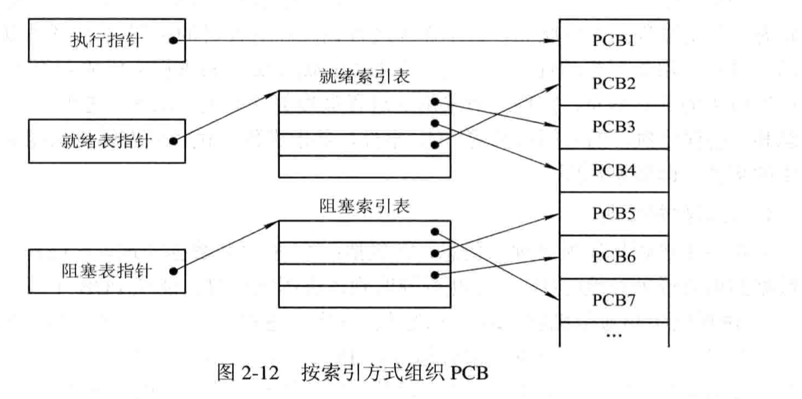

## 进程控制

操作系统核心功能：

支撑功能：

* 中断处理
* 时钟管理：比如在时间片用完的时候，时钟管理会产生相关的中断信号等等。
* 原语操作：内核中存在很多的原语（因为有些操作必须要么全做，要么不做，不能中断）。

资源管理功能：

* 进程管理
* 存储器管理
* 设备管理

进程的层次结构：

Linux：

* 子进程继承父进程的所有资源，但是子进程销毁的时候必须归还资源，销毁父进程时也必须销毁子进程，要不会产生僵尸进程。

Windows：

* windows不存在等级关系，每个进程都有一个句柄进行标识，等级相同，同时句柄可以用来控制进程且可以进行传递。

进程 创建：

* 申请PCB，为进程分配标识符
* 为新进程分配资源
* 初始化进程控制块。

进程终止：

* 正常终止
* 异常终止
* 外界干预

进程阻塞（block原句），进程唤醒（wakeup原句），进程挂起（suspend原句），进程激活（active原句）。

我觉得阻塞和挂起的最大差别就是挂起的话会终止进程，保存相关信息，方便将来激活，而阻塞只是简单的进程停止，其对资源的控制和信息都在利用之中。

# 进程控制。

> 其主要目的在于并发执行的程序可以共享系统资源，多个进程为了完成一个任务可以很好的相互合作。

相互制约：

* 间接相互制约：对一些资源入IO等的争夺引起相互制约。
* 直接相互制约：进程的结果相互影响。

临界资源：进程间必须互斥方式访问。

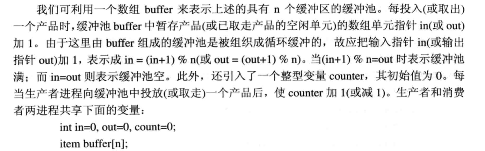

可以看到这个生产者和消费者问题，主要是这个循环缓冲区最开始差点没理解。

这其实就是类似于循环队列。

临界区：代码里面访问临界资源的那段。

## 硬件同步

1. 关中断，这就是在硬件条件上关闭中断，使得在进入临界区操作期间计算机不响应中断。
2. 利用Test-and-Set指令

~~~c
boolean TS(boolean *lock){
 Boolean old;
 old = *lock;
 *lock = TRUE;
 return old;
}
~~~

当`lock=TRUE`的时候表示资源正在使用，`lock=FASLE`的时候，表示资源空闲，这样就相当于形成了一把锁。

~~~c
do{
...
while TS(&lock); 
....
lock = FALSE;
over
}while(TRUE)
~~~

3. 利用`swap`指令实现进程互斥

~~~c
void swap(boolean *a,boolean *b)
{
	boolean temp;
	temp = *a;
	*a = *b;
	*b = temp;
}
~~~

如何实现互斥？

~~~c
do{
	key = TRUE;
	do{
		swap(&lock,&key);
	}while(key!=FALSE);
	.....
	lock=FASLE;
	...
}while(TRUE)
~~~

这其实原理还是跟第二个一样的。但是它们都不符合`让权等待的原则`因为其他访问进程必须不断测试，处于一种`忙等`的状态。

`信号量机制`：

1. 整形信号量
   1. 定义一个整形变量`S`，除了初始化意外，只能由标准的原子操作`wait(S)`和`signal(S)来访问`。
   2. 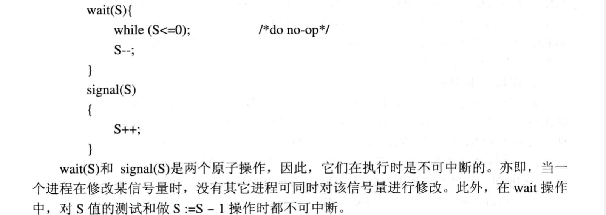
   3. 可以看出还是不符合`让权等待原则`
2.  记录型信号量
   1. 其特点在于**除了资源数目value意外，还增加一个进程链表list**用于链接所有的等待进程。

~~~c
typedef struct{
	int value;
	struct process_control_block *list;
}semaphore;
~~~

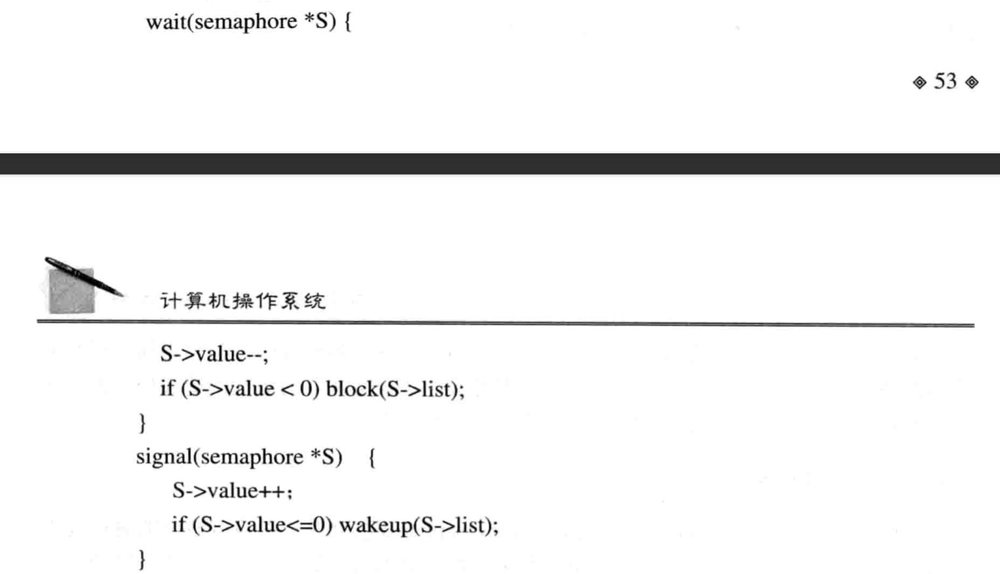

* `block(S->list)`其意思是，把列表进程进行阻塞
* S->value为负值的时候，其绝对值还可以表示表中已经阻塞的进程的数量。
* `wakeup(S->list)`其意思是唤醒列表里面的第一个进程。

那么如何实现互斥呢？

​	当`S->value`的初始值为1的时候，表示只允许一个进程访问临界资源，此时信号量转化为互斥信号量。`可以看到这符合让权等待原则，不需要进程不断的进行互斥量访问。`

3. `AND`型信号量
   1. 记录性信号量可能引发的`死锁`状态

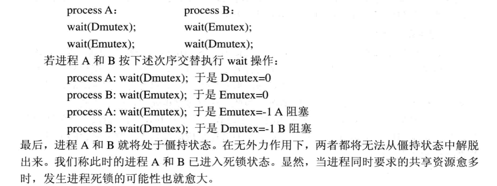

`AND`型信号量基本思想：

* 将进程在整个运行过程中所需要的所有资源，一次性全部分配给进程.
* 进程使用完资源之后一起释放相关资源。
* 对若干个临界资源的分配采用`原子操作`，要么全分配，要么一个不分配。
* 由`死锁`原理可以知道，这成功避免了上述死锁的发生。

`wait`操作中加上`AND`条件。

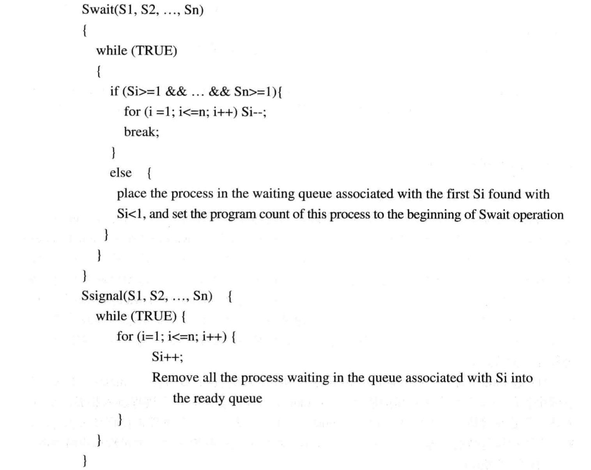

4. 信号量集

为了解决上述信号量只能单个操作的问题，此时进程对信号量`S1`的测试值不再是1，而是资源分配的下限值`t1`，要求`S1>=t`(因为，为了操作系统安全，当申请的资源少于某个下限的时候必须进行管制，不予分配)。

对应的`swait`和`ssignal`格式：

d1这些表示，请求的资源数量。

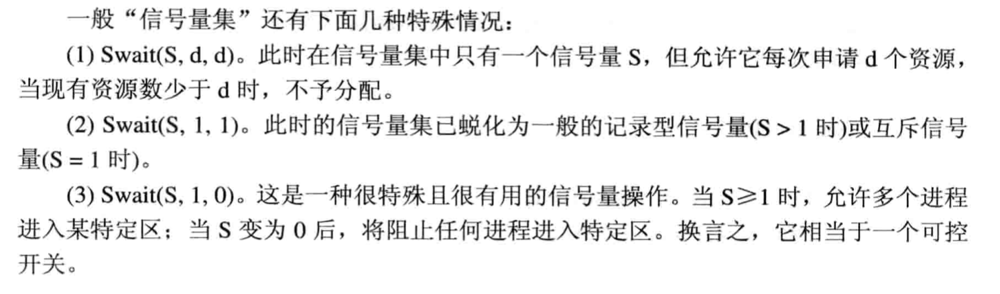

`信号量的应用`

互斥：

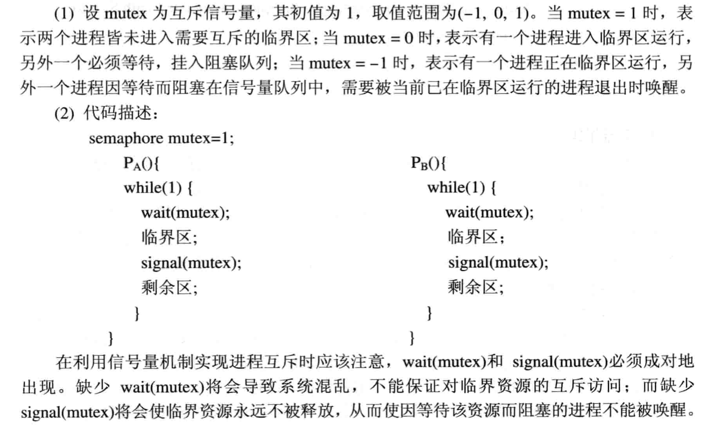

利用信号量实现前驱关系：

即是我们可以通过`信号量`来控制程序的执行顺序：

* 进制p1,p2共享信号量'S',其初值为0，
* 
  * P2若先别执行，那必定阻塞，只有进程1执行完`signal(S)`才可以执行进程P2.

`管程机制`：

这其实是对`互斥`的一种封装

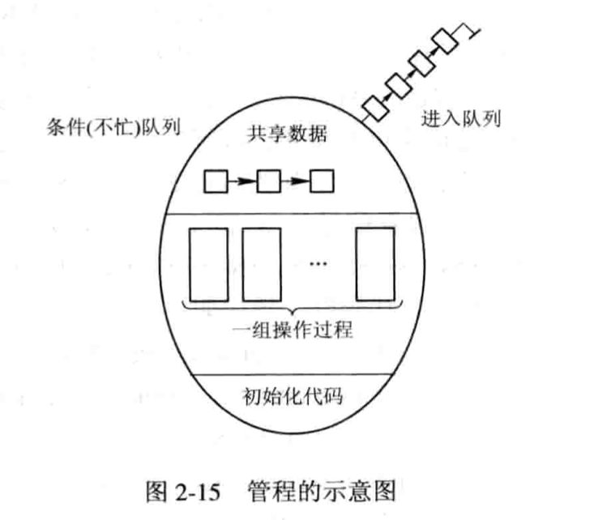

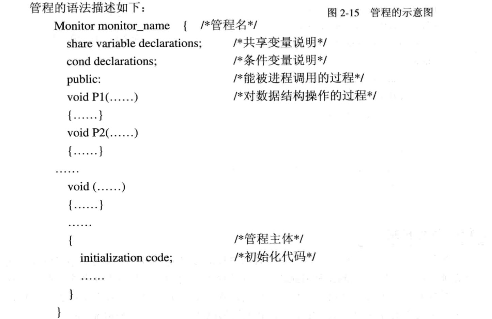

其实管程表征了共享资源的数据结构及其对数据结构的一组操作过程。

`生产者消费者问题`

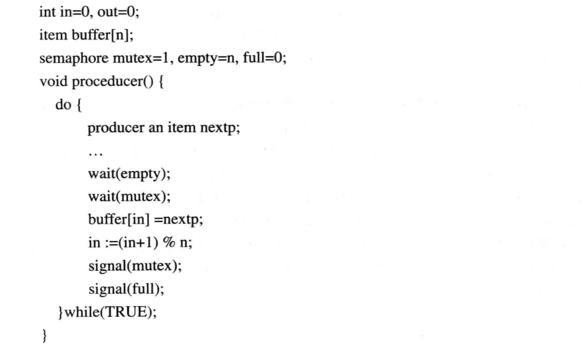

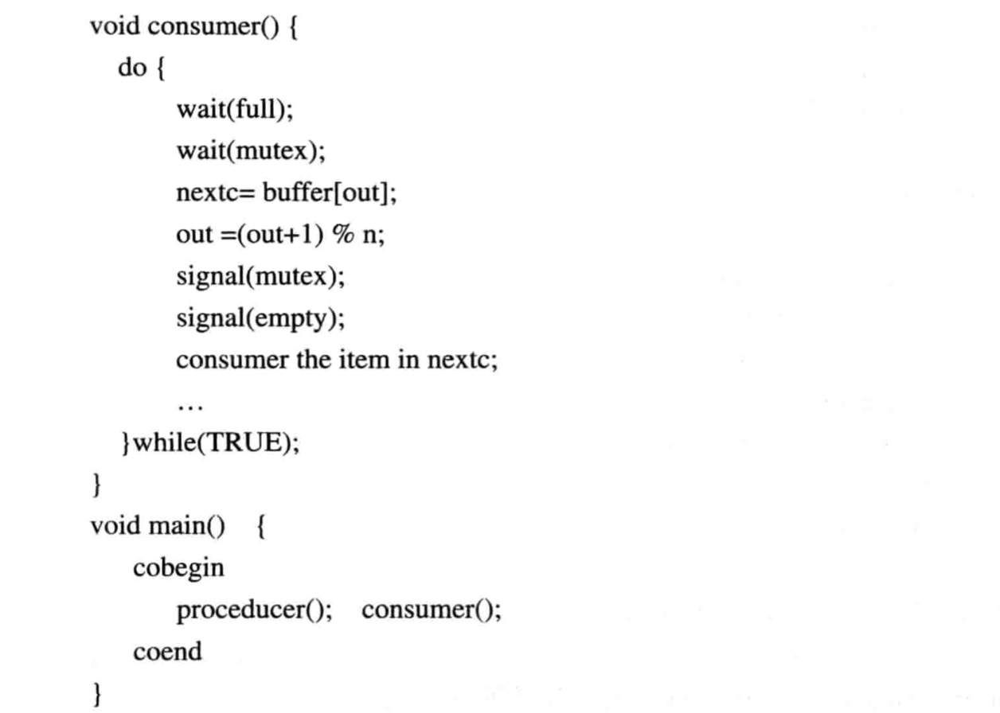

核心思想：

* 一个`mutex`向量实现进程互斥。
* 信号量`empty`和`full`的`wait`和`signal`操作成对出现并且分别处于不同的进程里面。
  * 这就导致一个进程被阻塞后必须由另一个进程来唤醒它，这也就确保了不会产生竞争影响。

利用其它思想也可以解决，但是感觉还是`管程`的方式，比较直接，而且简单明了。

`哲学家进餐问题`

感觉跟上面那个一样，就不费时间了。

## 进程通信

高级通信机制归类：

`共享存储器系统`：

相互通信的进程共享某些数据结构或共享存储区。

1. 基于共享数据结构之间的通信方式。
   1. 要求诸进程公用某些数据结构，借以实现进程之间的信息交换。
   2. 仅仅适用于传递相对较少的数据，通信效率低下，属于低级通信。
2. 基于共享存储区的通信方式，内存划分出一大块的共享存储区，进行对其读写交换信息，属于高级通信。

`管道pipe操作系统`

管道是指用于连接一个读进程和写进程以实现它们之间通信的一个共享文件(pipe文件)。

管道机制必须提供以下三方面的协调能力：

1. 互斥
2. 同步
3. 确定对方是否存在，只有确定了对方存在时才可以进行通信。

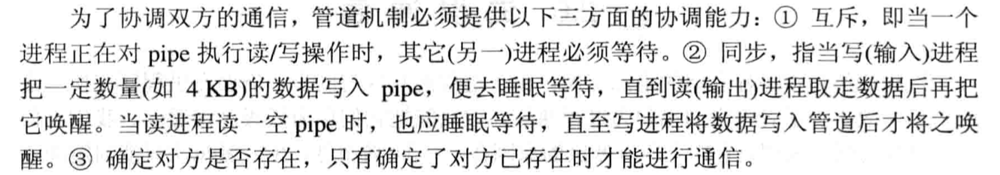

`消息传递系统`

进程不必借助任何共享存储区或者数据结构，而是以格式化的消息为单位。

将通信的数据封装在消息里面，并利用操作系统提供的一组通信命令，在进程间进行消息传递，实现进程间的数据交换。

* 通信过程对用户透明化。

其分为：

1. 直接通信方式，指发送进程利用OS所提供的发送原语，直接把消息发送给目标进程。
2. 间接通信：发送和接受进程，都通过共享中间实体的方式进行消息的发送和接受，完成进程间通信。

**套接字Socket**

一个套接字就是一个通信标识类型的数据结构，包含了通信的目的地址，通信使用的端口号，通信网络的传输层协议，进程所在的网络地址，以及针对客户或者服务程序提供的不同系统调用或者API函数。

套接字分为2类：

1. 基于文件型，此时通信进程都运行在同一台机器环境中，套接字是基于本地文件系统支持的，通信双方通过读写这个特殊文件实现通信。
2. 基于网络型的。

`远程过程调用和远程方法调用`

RPC通信协议，用于通过网络连接的系统。

​	改协议允许运行于一太主机系统上的进程调用另外一台主机系统上的进程，而对程序员表现为常规的过程调用，无需额外的为此编程。负责远程调用进程有两个，一个是本地客户进程，另一个是远程服务进程，这两个通常被称为`网络守护进程`。一般情况下都处于阻塞状态等待消息。

`消息传递通信的实现方式`

1. 直接通信方式

   1. > 利用OS提供的发送命令（原语），直接把消息发送给目标进程。

   2. 直接通信原语

      1. `send(receiver,message);`发送一个消息给接受进程。
      2. `receive(sender,message);`接受Sender发来的信息。

      其不足在于一旦改变进程名字，则可能检查所有其它进程的定义，有关该进程旧名称的所有引用都必须查找到，以便将其修改为新名称，显然这样的方式不利于实现进程定义的模块化。

   3. 非对称寻址方式，在某些情况下，接受进程可能需要与多个发送进程通信，无法事先指定发送进程，此时，在接受进程的原语中，不需要命名发送进程，只填写表示源进程的参数，即完成通信后的返回值。

      1. 此时的原语：
         1. `send(P,message)`发送一个消息给P
         2. `receive(id,message)`接受来自任何进程的消息，id变量可设置为进行通信的发送方进程ID或者名字。

2. 信箱通信

`直接消息传递系统实例`

