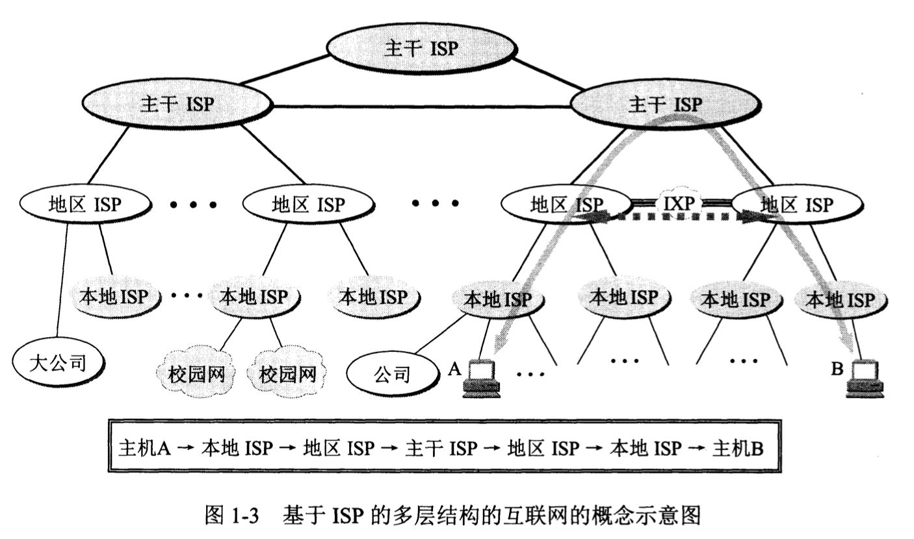
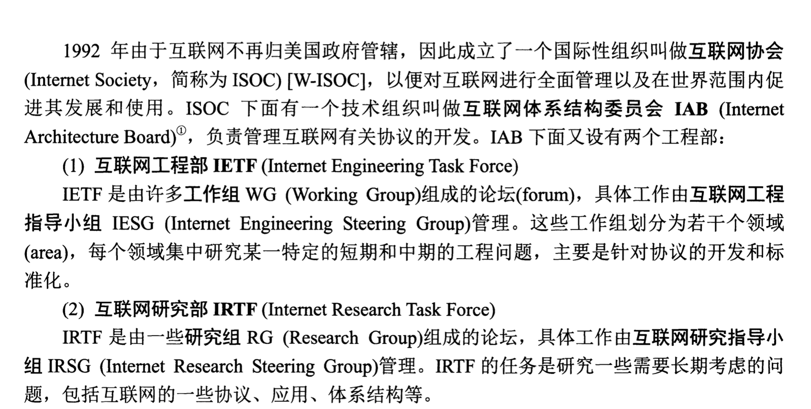
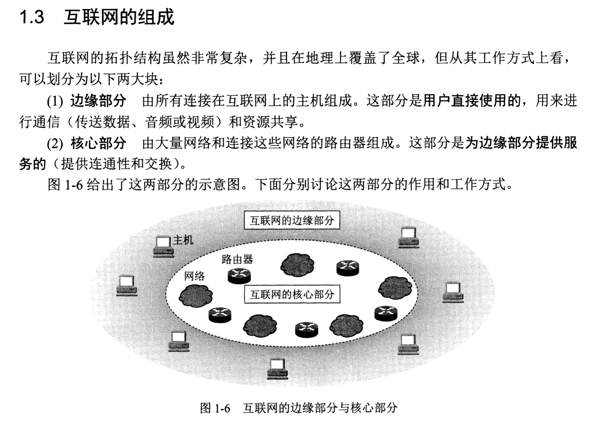
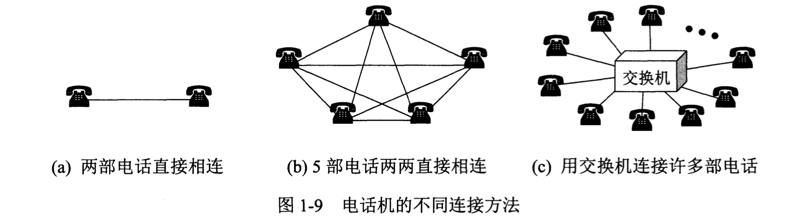
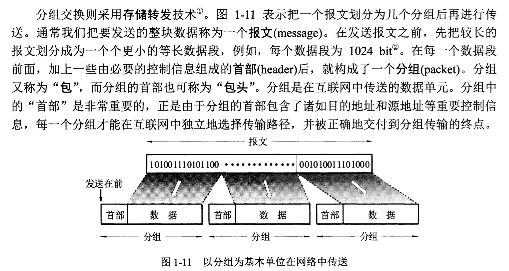

# 第一章-概述

## 名词

* ISP : 互联网服务提供商 Internet Service Provider
* IXP : 互联网交换点  Internet eXchange Point
* 

## 互联网标准化工作

## 互联网的组成

### 连接方式

* 客户-服务器连接：这个就很普通了。
* 对等连接（P2P），其实简单来说就是不区分那个是服务端那个是客户端，两台主机都运行了对等连接软件，他们就可以进行平等的对等连接。（就比如自己之前写的p2p聊天程序）

## 互联网的核心

> 核心部分起到关键作用的就是路由器，它是实现分组交换的关键构件，任务是转发收到的分组。

### 电路交换

> 用电话比拟计算机网络的连接方式

过程：建立连接 -> 通话  - > 释放连接。

特点：在通话的全部时间内，通话的两个用户始终占用端到端的通信资源。

但是这种效率低下，因为他会一直占用线路，即使他什么都没做。

### 分组交换

采用存储转发技术。

主机：用户进行信息处理。

路由器：用来转发分组，各个路由器之间必须经常交换彼此之见的路由信息，以便创建和动态维护路由器中的转发表，使得转发表能够在整个网络拓扑发生变化时及时更新，同时这些短分组是暂存到路由器的内存里面的，保证了较高的交换速率。

链路：单个的网络连接。

结点：核心部分的路由器。