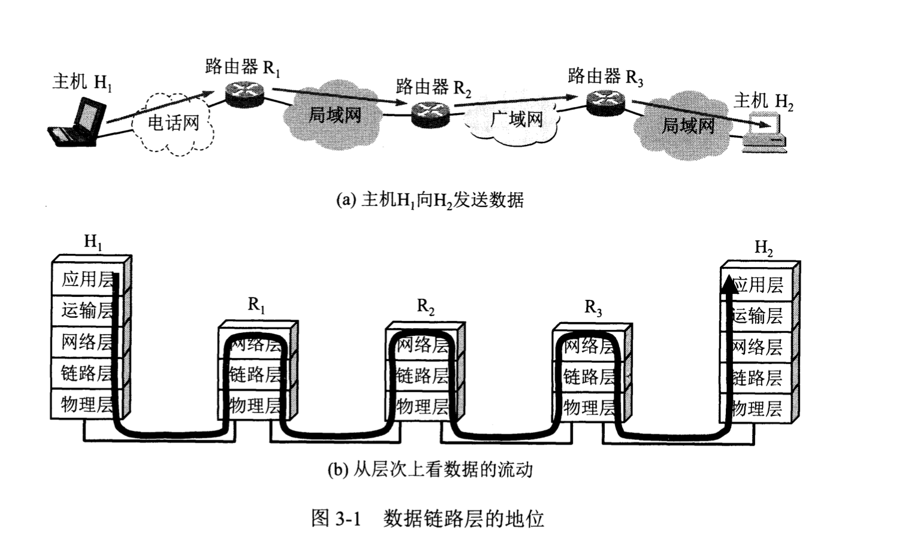
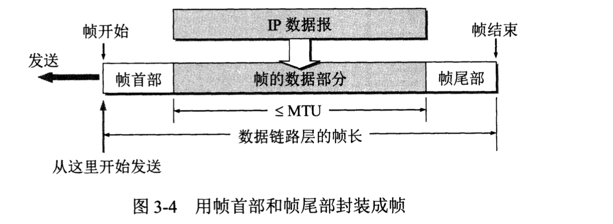
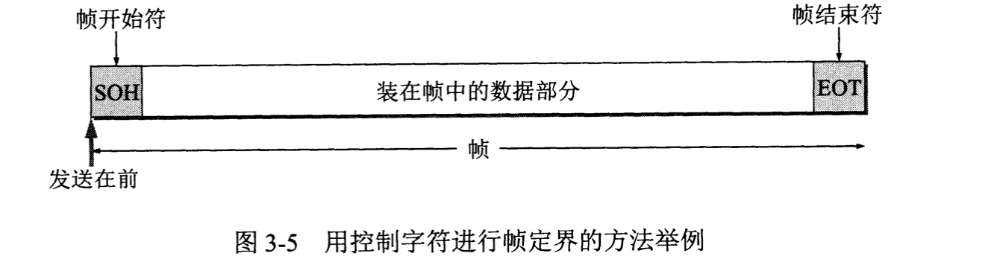
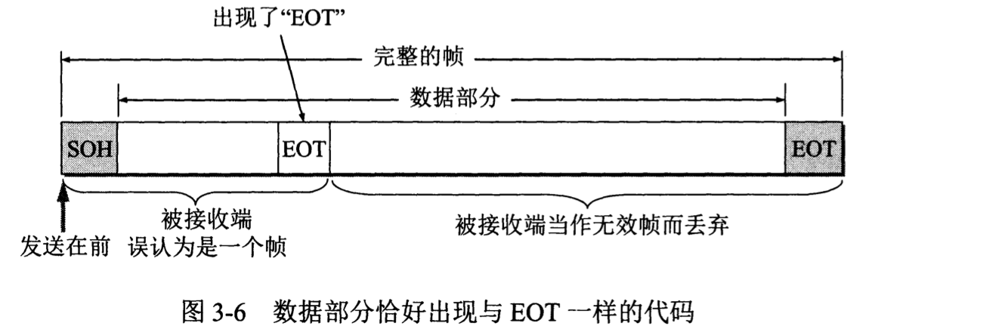
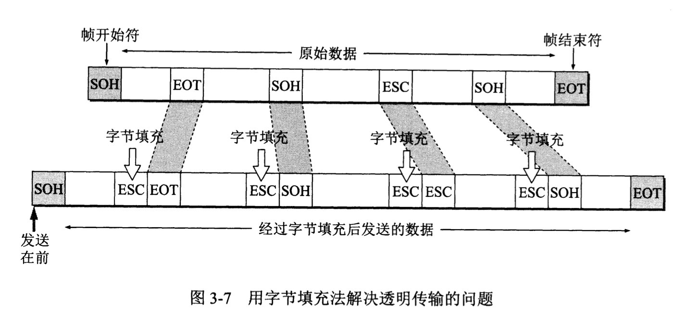
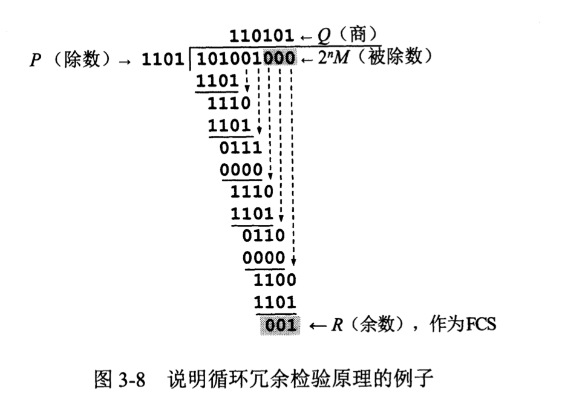
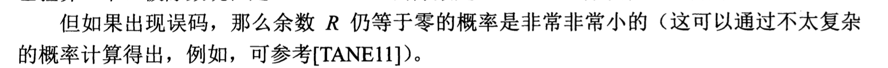

# 数据链路层

> 数据链路层属于计算机网络的底层。

数据链路层的相关信道：

* 点对点信道：这种信道使用点对点的通信方式。
* 广播信道：一对多的广播通信方式，因此信道多的情况下，需要使用共享信道协议，

从整个互联网来看，局域网是属于数据链路层的，因为网络层其实讨论的是怎么从一个网络传输到另一个网络的问题。

路局在网络中的流动：

## 点对点信道的数据链路层

数据链路：物理线路+必要的通信协议+必要软件，其中实现协议的最常用的方法是使用`网络适配器（包括硬件和软件）`,一般的网络适配器都包括数据链路层和物理层两个功能。

帧：数据链路层的协议数据单元。

数据链路层的作用：把网络层交下来的数据发送到链路上，把收到的帧里面的数据取出交给网络层。

点对点通信的主要步骤：

* 节点A的数据链路层把网络层交下来的IP数据报，添加首部和尾部封装成帧。
* 节点A把封装好的帧发送给节点B的数据链路层
* B确定数据链路层过来的帧没有错误之后，从中提取IP数据交给网络层，否则进行丢弃。

数据链路层协议的三个基本问题`封装成帧`，`透明传输`,`差错检测`。

数据链路层相关协议的三个基本问题：

* 封装成帧：
  * 这个其实就是在一段数据前后分别天剑首部和尾部，这样就构成了一个帧，那么接收端就可以根据首部和尾部的标识，从比特流里面识别出帧的开始和结束，所以首部和尾部的作用就是`帧定界`，同时首部和尾部还包含很多的控制信息。
  * 值得注意的是每一种链路层协议都规定了所能传送的帧的`数据部分长度上限-最大传送单元MTU(Maximum Transfer Unit)`。
  * 
  * 如果数据是由可打印的ASCII码组成的文本文件时,`帧定界符`可以是特殊字符，ASCII码是七位编码，128种不同的ascii码，其中可打印的95个，不可打印的控制字符33个，我们就可以使用控制字符`SOH(Start Of Header)`放在一个帧的最前面，另一个`EOT(End Of Transmission)`放在最后面表示开始和结束。
  * `帧界定符`的一个很重要的作用就是判断数据包是否完整，知道哪些数据包无效哪些是可以接收的。
* 透明传输：
  * 如上用专门的控制字符表示开始和结束的时候，我们发送的数据段就不可以存在这些字符，当然对于ASCII文本信息，自然是不可能包含这些不可打印的字符的，但是如果不是ASCIi文本信息怎么办？此时如果使用如上的控制字符，当数据段包含这些字符的时候就会引发错误这就不是一种透明传输。
  * `透明`:某一个实际存在的事务看起来却好像不存在一样，这其实表示数据可以无差错通过数据链路层，所以数据链路层就好像`透明`一样。
  * 为了实现透明传输：我们把数据中可能出现的控制字符前面插入转义字符`ESC`,但是在数据链路层发送数据到网络层 之前，需要删除这个插入的转义字符，改方法称为`字节填充`。
* 差错检测：
  * `比特差错`:比特流传输过程中，可能产生差错，1变0，0变1.
  * 误码率EBR（Bit Error Rate）:传输错误的比特占所传输比特总数的比率。
  * `循环冗余检验CRC(Cyclic Redundancy Check)`:假设我们现在发送数据`M=101001(k=6)` , CRC运算就是添加供差错检查用的n位`冗余码`。
  * `冗余码计算方法`：用二进制的模2运算进行2的n次方乘以M的运算，相当于M后面加了n个0，得到的（k+n）位的数除以收发双方事先商定的长度（n+1）的除数P，得出的商是Q，余数是R.
    * 假设`P=1101`那么mod2除法运算之后商`Q=110101`余数就是`R=001`这个余数就作为冗余码拼接在M的后面发送出去。
    * 这种为了进行检错添加的冗余码常称为`帧检验序列FCS(Frame Check Sequence)`,那么上面的那个结果就是`101001001`（k+n位）。
  * `接收端以帧位单位进行CRC检验`：把收到的每一帧都除以同样的除数P（mod 2计算），检查得到的余数R，如果传输没有差错，那么余数一定是0。
  * `CRC检查总结`：
    * 余数为0，表示正确
    * 余数不等于0，出现错误，但是无法确定是哪一位或者那几位出现了错误，丢弃改数据包。
    * 那么如果仅仅使用`CRC `进行检测，那么只能保证`凡是接受端数据链路层接受的帧均无差错`，因为有错误的都被丢弃了，但是这并不算是`可靠传输服务`，`可靠传输服务应该保证发送段的发送都被接收端正确的接收`。
  * 

