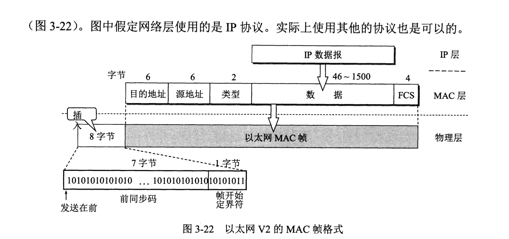

# 数据链路层

> 数据链路层属于计算机网络的底层。

数据链路层的相关信道：

* 点对点信道：这种信道使用点对点的通信方式。
* 广播信道：一对多的广播通信方式，因此信道多的情况下，需要使用共享信道协议，

从整个互联网来看，局域网是属于数据链路层的，因为网络层其实讨论的是怎么从一个网络传输到另一个网络的问题。

路局在网络中的流动：

## 点对点信道的数据链路层

数据链路：物理线路+必要的通信协议+必要软件，其中实现协议的最常用的方法是使用`网络适配器（包括硬件和软件）`,一般的网络适配器都包括数据链路层和物理层两个功能。

帧：数据链路层的协议数据单元。

数据链路层的作用：把网络层交下来的数据发送到链路上，把收到的帧里面的数据取出交给网络层。

点对点通信的主要步骤：

* 节点A的数据链路层把网络层交下来的IP数据报，添加首部和尾部封装成帧。
* 节点A把封装好的帧发送给节点B的数据链路层
* B确定数据链路层过来的帧没有错误之后，从中提取IP数据交给网络层，否则进行丢弃。

数据链路层协议的三个基本问题`封装成帧`，`透明传输`,`差错检测`。

数据链路层相关协议的三个基本问题：

* 封装成帧：
  * 这个其实就是在一段数据前后分别天剑首部和尾部，这样就构成了一个帧，那么接收端就可以根据首部和尾部的标识，从比特流里面识别出帧的开始和结束，所以首部和尾部的作用就是`帧定界`，同时首部和尾部还包含很多的控制信息。
  * 值得注意的是每一种链路层协议都规定了所能传送的帧的`数据部分长度上限-最大传送单元MTU(Maximum Transfer Unit)`。
  * 
  * 如果数据是由可打印的ASCII码组成的文本文件时,`帧定界符`可以是特殊字符，ASCII码是七位编码，128种不同的ascii码，其中可打印的95个，不可打印的控制字符33个，我们就可以使用控制字符`SOH(Start Of Header)`放在一个帧的最前面，另一个`EOT(End Of Transmission)`放在最后面表示开始和结束。
  * `帧界定符`的一个很重要的作用就是判断数据包是否完整，知道哪些数据包无效哪些是可以接收的。
  
* 透明传输：
  * 如上用专门的控制字符表示开始和结束的时候，我们发送的数据段就不可以存在这些字符，当然对于ASCII文本信息，自然是不可能包含这些不可打印的字符的，但是如果不是ASCIi文本信息怎么办？此时如果使用如上的控制字符，当数据段包含这些字符的时候就会引发错误这就不是一种透明传输。
  * `透明`:某一个实际存在的事务看起来却好像不存在一样，这其实表示数据可以无差错通过数据链路层，所以数据链路层就好像`透明`一样。
  * 为了实现透明传输：我们把数据中可能出现的控制字符前面插入转义字符`ESC`,但是在数据链路层发送数据到网络层 之前，需要删除这个插入的转义字符，改方法称为`字节填充`。
  
* 差错检测：
  * `比特差错`:比特流传输过程中，可能产生差错，1变0，0变1.
  * 误码率EBR（Bit Error Rate）:传输错误的比特占所传输比特总数的比率。
  * `循环冗余检验CRC(Cyclic Redundancy Check)`:假设我们现在发送数据`M=101001(k=6)` , CRC运算就是添加供差错检查用的n位`冗余码`。
  * `冗余码计算方法`：用二进制的模2运算进行2的n次方乘以M的运算，相当于M后面加了n个0，得到的（k+n）位的数除以收发双方事先商定的长度（n+1）的除数P，得出的商是Q，余数是R.
    * 假设`P=1101`那么mod2除法运算之后商`Q=110101`余数就是`R=001`这个余数就作为冗余码拼接在M的后面发送出去。
    * 这种为了进行检错添加的冗余码常称为`帧检验序列FCS(Frame Check Sequence)`,那么上面的那个结果就是`101001001`（k+n位）。
  * `接收端以帧位单位进行CRC检验`：把收到的每一帧都除以同样的除数P（mod 2计算），检查得到的余数R，如果传输没有差错，那么余数一定是0。
  * `CRC检查总结`：
    * 余数为0，表示正确
    * 余数不等于0，出现错误，但是无法确定是哪一位或者那几位出现了错误，丢弃改数据包。
    * 那么如果仅仅使用`CRC `进行检测，那么只能保证`凡是接受端数据链路层接受的帧均无差错`，因为有错误的都被丢弃了，但是这并不算是`可靠传输服务`，`可靠传输服务应该保证发送段的发送都被接收端正确的接收`。
  
  只是通过`CRC`校验的haul是无法保证`可靠传输的`，`可靠传输`就是客户端发什么接收端都要接受什么。
  
  `传输差错`：
  
  * 基本的比特差错，就如上。
  * 复杂错误。
    * 帧丢失
    * 帧重复
    * 帧失序
  
  
  
  
  
## 点对点协议PPP

  > PPP协议就是用户计算机和ISP进行通信所使用的数据链路层协议，TCP/IP协议簇里面可靠传输由运输层TCP协议负责。那么PPP协议不需要纠错，设置序号，流量控制等，同时只支持点对点的链路通信，只支持全双工链路。

  协议需求：

  * 简单
    * 就一个CRC校验
  * 封装成帧
    * PPP协议规定特殊字符为`帧定界符`。
  * 透明性
    * 必须有效解决，数据帧中的数据段出现`帧界定符`的情况
  * 多种网络层协议
    * 可以再同一条物理链路上同时支持多种网络层协议。
      * 就比如点对点连接的是局域网或者路由器的话，PPP协议必须同时支持所连接的局域网或者路由器上运行的各种网咯层协议。
  * 差错检测。
  * 检测连接状态
    * 可以及时检测链路是否处于正常的工作状态。
  * 最大传输单元`MUT`
    * MTU是数据链路层的帧可以载荷的`数据部分`的最大长度。
  * 数据压缩商
    * 提供一种方法来协商使用的数据压缩算法，但是PPP协议并不要求将数据压缩算法标准化。

`PPP协议组成`

1. 将IP数据报装到串行链路的方法，PPP只出异步链路和同步链路。
2. 一个用来建立配置和测试数据链路的`链路控制协议LCP`
3. 一套网络控制协议`NCP`.

`PPP协议帧格式`

1. 各个字段的意义
   1. 
   2. `帧界定符`:`0x7E`
   3. 地址字段A
   4. 控制字段C
   5. 第四个字段是两字节的协议字段
      1. 0x0021  --->   IP数据报
      2. 0xC)21  ----> `链路控制协议LCP`数据
      3. 0x8021 -----> 网络层控制数据
      4. 尾部第一个字段 CRC 的帧检验序列FCS
2. 字节填充
   1. 
3. 0比特填充
   1. 

`PPP协议的工作状态`

`ppp`链路初始化：

1. 用户拨号接入ISP
2. 个人PC发送`LCP`分组（配置请求帧，PPP帧，其协议字段置为LCP对应的代码，信息字段抱哈特定的配置请求），建立`LCP`连接
   1. 上述过程中会进入`鉴别`状态，改状态下只允许传送LPC协议的分组，鉴别协议的分组，以及检测链路质量 的分组。
   2. 如果上述过程中使用了`口令鉴别协议PAP`或者`口令握手鉴别协议CHAP`鉴别成功后才可以进入`网络层协议`。
3. 网络层配置：（网络控制协议）NCP根据不同的协议互相交换网络层特定的网络控制分组，因为路由器支持多种网络层协议。
   1. IP协议：对`PPP`链路的每一端配置IP协议模块时就要使用NCP中支持IP的协议（IPCP，IP控制协议）
4. 链路进入`链路打开状态`

比较值得注意的是PPP链路的起始和终止状态都是`链路静止状态`。

同时在第2步骤的时候，链路的另一端会回应以下响应 的一种：

1. `配置确认帧`：所有选项都接受。
2. `配置否认帧`：所有选项都理解但不可以接受。
3. `配置拒绝帧`：选项有的无法识别或不能接受，需要协商。

LCP配置选项：

1. 链路上最大帧长
2. 所使用的鉴别协议的规约（如果有的话）
3. 不使用PPP帧的地址和控制字段。

`PPP协议结束`

链路的一端发送`终止请求LCP`分组，收到`终止确认LCP`分组后，进入`链路终止`状态。调制解调器的载波停止之后，回到`链路静止`状态。

1. NCP释放网络连接
2. LCP释放数据链路层连接。
3. 物理层释放连接

## 使用广播信道的数据链路层

局域网的优点：

1. 广播功能：站点方便访问全网，局域网里面的主机可共享连接在局域网上共享各种硬件和软件资源。
2. 便于系统的扩展和逐渐演变，各设备可灵活调整和改变。
3. 提高了系统的可靠性，可用性，生存性。

`使用集线器的星形拓扑`

`20BASE-T双绞线以太网的出现，是局域网发展史上的一个非常重要的里程碑。`

集线器的特点：

* 使用集线器的以太网在逻辑上仍然是一个总线网，各站共享逻辑上的总线，使用的还是`CSMA/CD`协议。

* 集线器工作在物理层，其每个接口仅仅简单地转发比特，不进行碰撞检测。
* 一般都具有少量的容错能力和网络管理能力。

`以太网的信道利用率`

> 因为碰撞的存在，信道的利用率不可能是百分之百的。

计算方式：

帧发送需要的时间：

一个帧占用信道的时间：

发送时间 + 端到端的时延

结论：

> 提高信道利用率，必须减小时延和发送时间之间的比值。

a趋近于0的时候，说明一旦发生碰撞就可以立马检测出来。

那么：

* 以太网的连线长度受到限制
* 以太网帧不能过短（T0会过小）

假设以太网各站发送数据都不会发生碰撞，而且可以有效的利用网络资源：

`以太网的MAC层`

`名字指出我们要寻找那个资源，地址指出那个资源在何处，路由告诉我们如何到达该处。`

MAC地址固化在适配器的ROM的地址中，是每一个站的标识符。

适配器可以根据MAC帧中的目的地址进行过滤。

帧：

* 单帧：一对一：收到的帧的MAC地址与本站的硬件地址相同。
* 广播帧：一队全体，发给本局域网所有的站点的帧`全1地址`。
* 多播帧：一对多，发给本局域网一部分的站点。

**安全部分**

混杂方式工作的适配器，可以把所有在以太网传输的帧都悄悄接受下来，而不管这些帧是发送给那个站点的，**这样做其实是`窃听`其他站点的通信但是并不中断其他站点的通信，黑客经常用这种方式非法获取网上用户的口令。**

> 嗅探器就是使用了设置为混杂方式的网络适配器。

`MAC帧的格式`

* DIX Ethernet V2标准（以太网V2标准）
* IEEE的 802.3标准。（下面是这个，它用到的多）

* 2字节的类型字段，标志上一层使用的是什么协议。
* 帧校验序列FCS，采用CRC校验。

没有标识帧长度，MAC子层如何确定确定取出多少字节的数据交付给上一层的协议呢？

**曼彻斯特编码：编码之后的每一个码元中间一定有一次电压转换，当发送方发送完毕一个以太网帧之后，就会停止发送码元，那么接收端就可以检测到电压不再发生变化，就可以确定结束位置。**

前面插入的8字节作用：一个站点开始接受MAC帧的时候，由于适配器时钟尚未与到达的比特流达成同步，因此MAC帧最前面的若干位就无法接受。但是在使用`SONET/SDH`进行同步传输的时候，不需要前同步码，因为在同步传输的时候，收发双方的位同步总是一直保持着。

因为以太网传送帧的时候，各帧之间还必须有间隙，所以就不需要帧结束界定符。

`重点`

**IEEE802.3规定凡是出现下列情况就是无效帧**

* 帧的长度不是整数个字节
* 用收到的帧检验序列FCS查出有错。
* 收到的帧的MAC客户数据字段长度不在46~1500字节之间。

## 扩展的以太网

扩展距离用光纤，光纤调制解调器的作用：电信号和光信号之间的转换。

扩展以太网，值得注意的是集线器之间的距离可以很远，这无疑使得不同系之间的主机距离得以被扩展。

缺点：

* 每个系的以太网本来是一个独立的`碰撞域`,每个时刻在每个碰撞域里面只有一个站可以发送数据，那么主干集线器存在以后，三个碰撞域变成了一个，以太网总的吞吐量下降。
* 不同系使用的以太网技术不同（如数据率不同），那么就不可以连接起来。

`以太网交换机`

工作在数据链路层，其实质是一个多接口的网桥，这使得它具有并行性，可以使得多对主机同时通信，相互通信的主机都是`独占传输媒体，无碰撞的传输数据`。

同时交换机可以暂存数据，集线器就不可以。

`以太网交换机的自学习功能`

交换表里面的数据都存在`有效时间`，过期 的项目会被自动删除，用这样的方法保证交换表中的数据都符合当前网络的实际情况。

自学习的兜圈子问题，解决方法`生成树协议STP`：不改变网络的实际拓扑结构，但在逻辑上则切断某些链路，使得从以太主句到所有其他主机的路径是无环路的树状结构，从而消除了兜圈子的现象。

`从总线以太网到星型以太网`

以太网交换机不使用共享总线，没有碰撞问题，没有争用期，不使用`CSMA/CD`协议，而是以全双工的形式工作。

`虚拟局域网VLAN`

802.3ac标准定义了以太网帧格式的扩展，以便支持虚拟局域网，虚拟局域网协议允许在以太网的帧格式里面插入一个4字节的标识符，称为`VLAN标记`（用来指明发送该帧的计算机输入哪一个虚拟局域网，插入VLAN标志的帧称为`802.1Q帧`）。

`VLA标识符VID`：唯一的标志了这个以太网帧属于哪一个VLAN。

`高速以太网`

感觉没吉尔用，也不会考，了解一下，不记笔记了，数据链路层完结撒花，感觉不难，就是知识点多，(灬ꈍ ꈍ灬)

