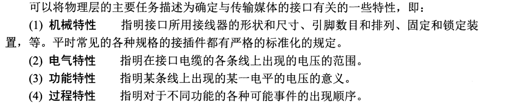
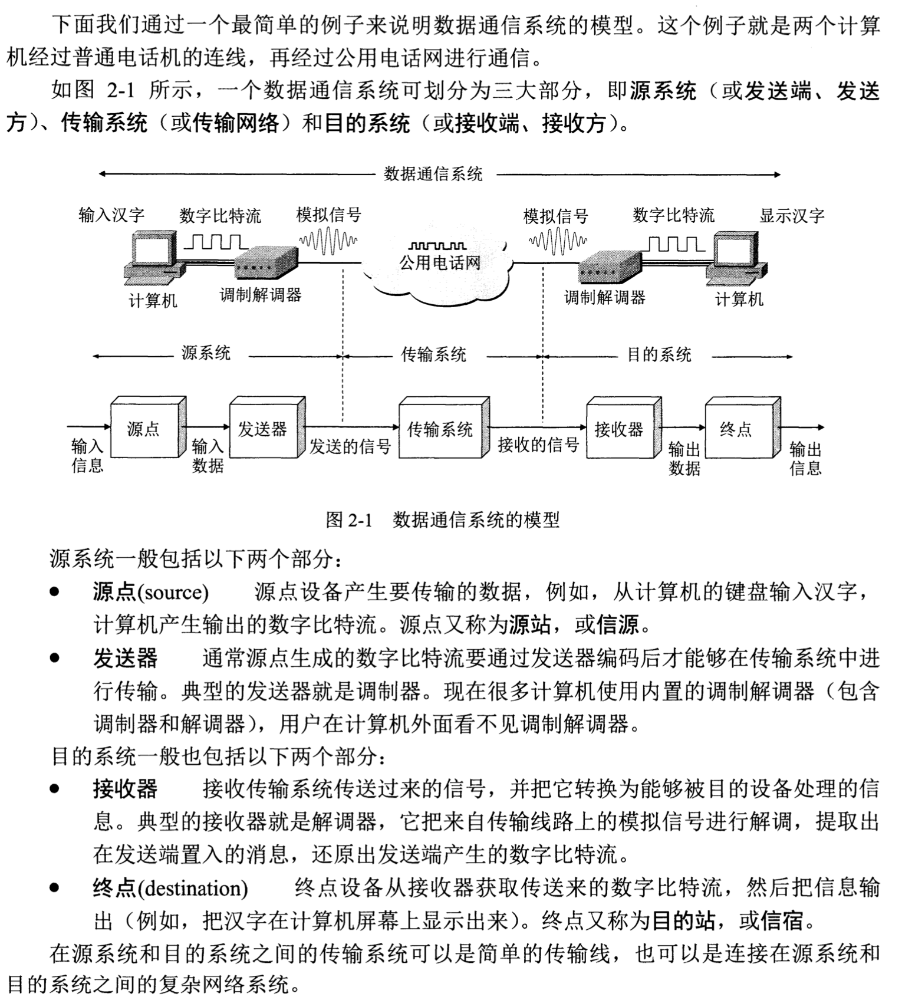
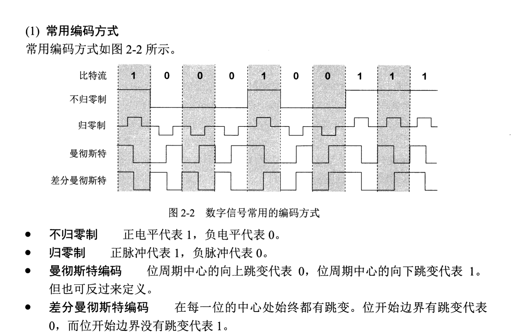
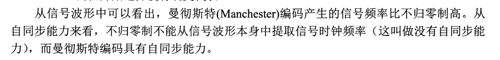
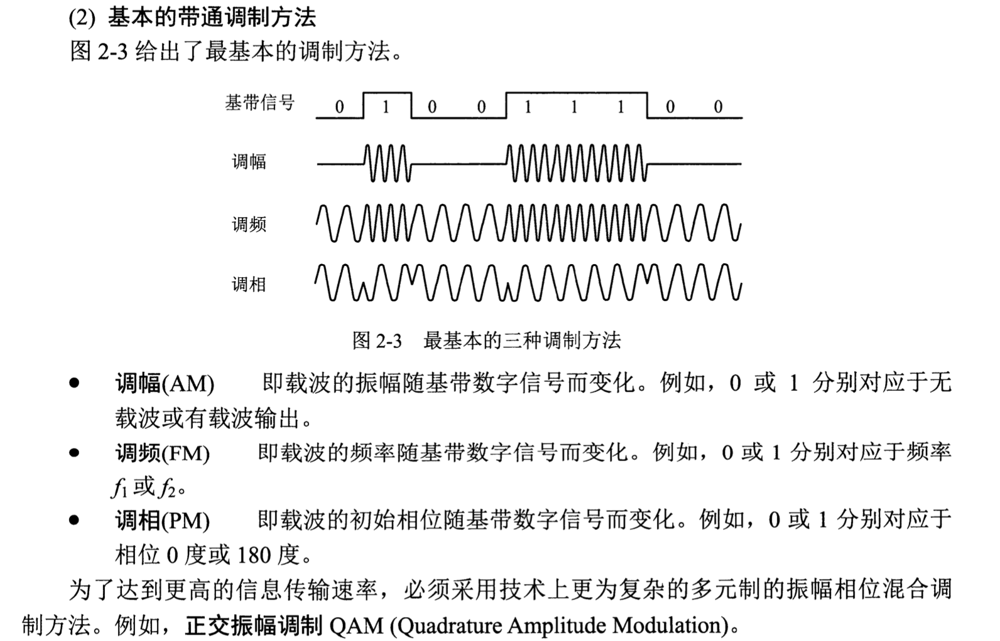
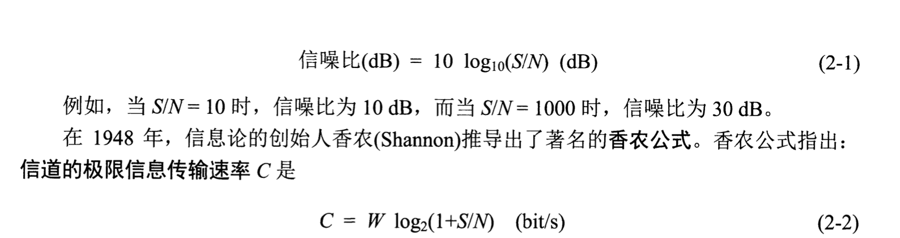
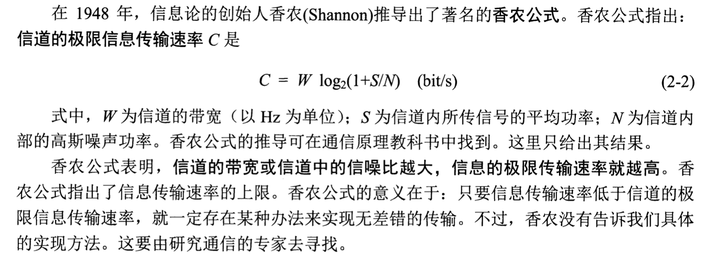
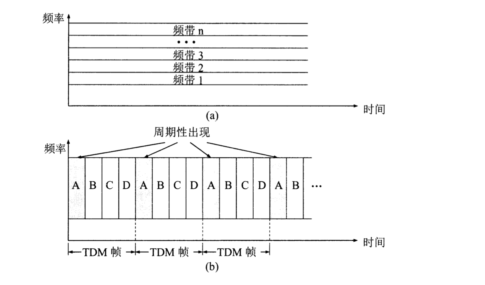
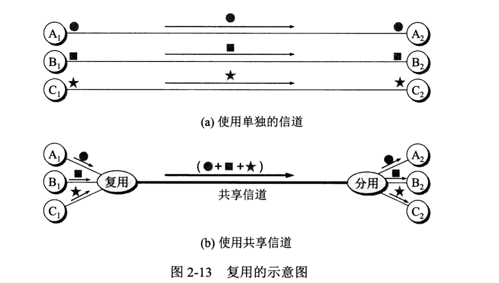
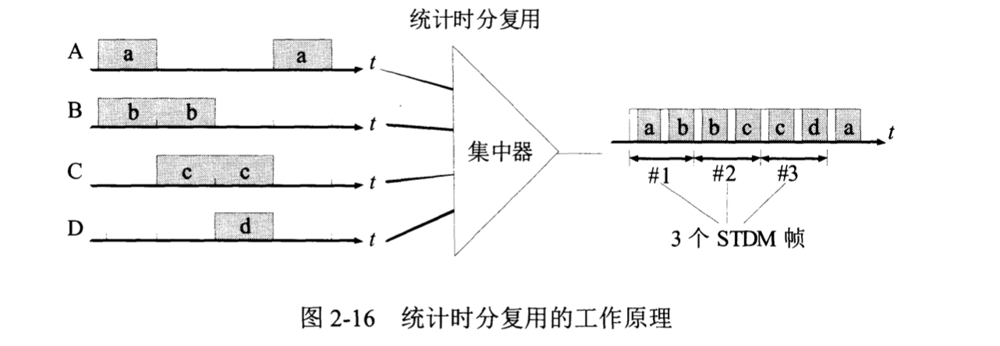

# 物理层

## 基本概念

数据在通信线路里面一般都是串行传输，因此物理层还需要完成传输方式的转换。

## 数据通信的基础知识

数据通信模型：

就是一些概念。

信号：

* 模拟信号（连续信号）：代表消息的参数的取值是连续的。
* 数字信号（离散信号）：代表消息的参数的取值是离散的（上图的数字比特流）。
* 码元：就是基本波形。（不懂可以查一下）

信道的基本概念：

* 单向通信（单工通信），只有一个方向没有反方向的交互。
* 半双工通信：双方都可发送信息，但是不可以同时发送接收。
* 全双工通信：双方可以同时发送接收信息。

调制：

* 编码：把数字信号转换为另一种形式的数字信号，这个只是对基带信号的波形进行了变换，使得它可以与信道相适应。
* 带通调制：使用载波把基带信号的频率范围搬移到较高的频段，并转换为模拟信号，变换之后的信号叫做带通信号。

编码方式：

基本的带通调制方法：

* 调幅：就是利用有无波动区别0，1
* 调频：利用频率的不同区分0，1
* 调相，利用初始相位的不同区分0，1

重点：

**在任何信道里面，码元传输的速率是有上限的，传输速率超过上限，就会出现严重的码间串扰问题，使得接收端对码元的识别成为不可能。**

信道越宽，能通过的信号高频分量越多，就可以用更高速率传送码元而不出现码间串扰。

* 这个简单理解就是码元长度变宽，然后单个码元里面的传输又高又密，那么由于和下一个不一样的码元之间差别巨大，从而可能更好的避免码间干扰。

信躁比：信号的平均功率和噪声的平均功率之比。S/N,用分贝（dB）作为度量单位。

## 物理层下面的传输媒体

略，可以看书。

## 信道复用技术

* 频分复用：就是在信道里面传输不同频率的波段，分配给不同的用户实现信道共享。图a
* 时分复用：就是在信道传输过程中，不同的时间段对应不同的用户，实现信道共享。图b

如何实现信道共享？复用器和分解器

* 统计时分复用：简单来说就是利用一个集中器来是使得我们信道的高效分配。

> Emmm,我封笔先，感觉这些东西不如期末的时候好好复习考试一下就够了，直接跳到网络层。

