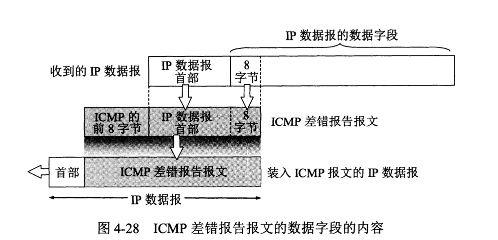
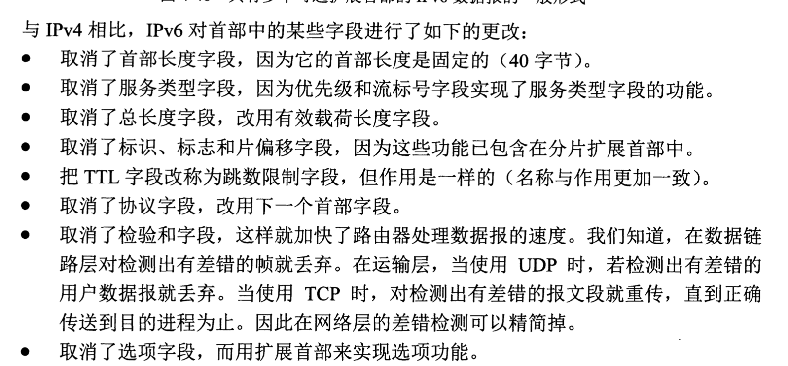

# 网络层

互联网的设计思路：**网络层向上只提供简单灵活的，无连接的，尽最大努力交付的数据报服务**。

* 网络层不提供服务质量的承诺，数据报传输可能出错，丢失等等。
* 如果需要可靠通信的话，我们就可以在运输层里面进行实现。

上面设计思路的优点在于：

* 极大的降低了网络中路由器的造价，运行方式灵活，可以适用多种应用。

虚电路表示只是逻辑上的连接，分组都沿着这条逻辑连接按照存储转发的方式传送，而不是真正建立了一条物理连接。

## 网际协议IP

与IP协议配套使用的三个协议

1. 地址解析协议ARP
2. 网际控制报文协议ICMP
3. 网际管理协议IGMP

`虚拟互联网络`

> 没有一种单一的网络能够适应所有用户的需求。

网络有很多种，而且层出不穷，连接网络需要中间设备：

1. 物理层使用的中间设备：`转发器`
2. 数据链路层使用的中间设备：`网桥`或者`桥接器`。
3. 网络层使用的中间设备`路由器`
4. 网络层以上使用的中间设备叫做`网关`，网关连接两个不兼容的系统需要在高层进行协议转换。

物理网络的异构性本来是客观存在的，但是我们利用`IP协议`就可以使得这些性能各异的网络在网络层看起来好像是一个统一的网络。

分组传送问题：

H1发送数据报给H2

1. H1检查自己的路由表，如果查到说明H2在本网络，所以直接交付。
2. 如果不是，那么就发送给某个路由器进行间接交付。

上图还有一个结论:`互联网可以由多个异构网络互连组成`。

`分类的IP地址`

IP地址由`互联网名字和数字分配机构ICANN`进行分配。

IP地址的编址的发展：

1. 分类的IP地址。
2. 子网的划分
3. 构成超网。

下面说下分类的IP地址。

IP地址识别：

1. 第一个字段是网络号，用来标识所连接到的网络，这个是唯一的。
2. 第二个字段是主机号，标识该主机，一个主机号在它的网络号指明的网络范围内必须是唯一的。

A类地址里面，本机软件环回测试地址的网络号127

A类地址主机号：全0表示主机所在的网络地址，例如`5.0.0.0`，全表示该网络的所有主机。

B类网络的`128.0.0.0`是不指派的，其最小的可指派网络地址是`128.1.0.0`。

C类网络最小网络地址`192.0.1.0`。

在互联网里面，一个网络是指具有相同网络号`net-id`的集合，因此，用转发器或者网桥连接起来的若干个局域网仍然为一个网络。

互联网平等的对待每一个IP地址。

两个路由器直接相连的时候，在连线的两端可以不分配IP地址，如果分配了，那么就构成了一段特殊的网络，因为它有IP，但是经常是不分配IP地址，叫做`无编号网络或者无名网络`。

`IP地址与硬件地址`

IP地址放在IP数据报的首部，硬件地址放在MAC帧的首部。在网络层和网络层以上使用IP地址，数据链路层及其以下用硬件地址。

注意IP数据报放入数据链路层的MAC帧之后，数据链路层看不到数据包IP的IP地址。

从上图可以看出虚拟互联网和实际链路之间的关系。

`地址解析协议ARP`

地址解析协议ARP解决这个问题的方法就是在主机ARP高速缓存里面放一个IP地址到硬件地址的映射表，并且这个映射表还经常动态的更新。

每个主机都设有一个`ARP高数缓存`，里面有本局域网上各主机和路由器的IP地址到硬件地址的映射表。

ARP步骤：

1. 主机A的ARP进程在本局域网广播发送一个ARP请求分组。
2. 本局域网所有主机运行的ARP进程都收到此ARP请求分组。
3. 主机B的IP地址与ARP请求分组中要查询的IP地址一致，就收下这个分组，然后向A发送响应分组，同时在响应分组里面写入自己的硬件地址。
4. 主机A收到响应分组之后，就在其ARP高速缓存里面写入主机BIP地址到硬件地址的映射。

值得注意的是：主机A发送的ARP分组里面已经包含了自己的IP地址到MAC地址的映射。
`IP数据报的格式`

我们知道数据链路层有一个数据字段的最大长度，称为最大传送单元MTU，所以IP数据报封装成数据链路层帧的时候总长度不可以超过这个，过长 的数据报要进行`分片处理`。

IP协议规定：`互联网中所有的主机和路由器，都必须能够接受长度不超过576字节的数据报。`所以当主机发送超过576字节的数据报的时候应该确认一下目的主机是否接受数据报的长度，否则要进行分片处理。

分片操作（此时数据报首部的“总长度”字段是指分片后每一个分片的首部长度和该分片的数据长度的总和。）：

1. 标识，相同标识字段的值使得分片后的数据报片可以组装回原来的数据报。
2. 标志（3位）
   1. 最低位MF = 1表示还有分片 = 0表示是分片的最后一个。
   2. 中间位 DF 表示不能分片 DF = 0时才可以分片。
   3. 最前位尚无作用。
3. 13位，某片相当于原分组中的相对位置。

举个栗子：

生存时间（TTL）：表明数据报在网络里面的寿命，当其为0 的时候，数据报会被直接丢弃。但是路由发展使得时间大大缩短，现在就改用`跳数限制`（路由器每次转发数据报之前就把TTL减一）。

`首部检验和`

1. 先把数据报首部划分成许多16位字的序列，并把检验和字段置0.
2. 反码算术运算把所有的16位字相加，得到的和的反码写入检验和字段。
3. 接收方：
   1. 将首部的所有16位字再使用反码算术运算相加一次。
   2. 得到的和取反码，就得出接收方检验和 的计算结果。
   3. 结果为0则保留数据报。

IP层转发分组流程：

分组转发方式分类：

1. 基于目的主机所在的网络，经常用这个。
2. 特定主机路由，其意思可以指定到某台主机的特定路由。
3. 默认路由

在IP的分组转发过程中IP数据报头部是不保存中间路由的IP地址的，在经历中间路由的时候，我们在路由表中获得下一条的地址，这个地址会交给数据链路层的`网络接口软件`，它负责把路由的IP地址转换为MAC地址。

## 划分子网和构造超网

IP地址里面增加了`子网号字段`用来帮助划分子网，这个字段使得二级IP变成三级IP

基本步骤：

1. 思想：单位所属的大量物理网络划分为若干个子网，这是单位内部的事情，本单位外的网络看不见这个网络是多少个子网组成的，因为这个单位对外表现为一个网络。
2. IP地址形式

3. 数据报传送流程

划分子网只是把IP地址的主机号这部分进行了再次划分。不改变原来IP地址的网络号。

`子网掩码`

从IP数据报的首部无法看出目的主机所连接的网络是否进行了子网的划分。那么就使用了子网掩码：

三级子网掩码由24个1和8个0组成。

**我们把三级IP地址和三级子网掩码进行相与操作（AND），我们就可以得到子网地址，以上面为例子，得到的结果就是145.13.3.0**

默认子网掩码：

互联网规定必须存在子网掩码，同时路由器的路由表里面也同样必须有子网掩码，如果没有子网的话，就用默认子网掩码

子网掩码是一个网络或者一个子网的重要属性。

> 划分子网增加了灵活性，但却减少了能够连接在网络上 的主机总数。

同样的IP地址和不同的子网掩码可以得出相同的网络地址，但是不同掩码的效果是不一样的，他们可能主机位数不同，因而导致每个子网里面的最大主机数量是不一样的。

子网划分后的路由表包括：

1. 目的网络地址
2. 子网掩码
3. 下一跳地址

`无分类编址CIDR（构造超网）`

无分类域间路由选择`CIDR`

特点：

1. 其把32位的IP地址划分为前后两个部分，前缀部分用来指明网络，后部分用来指明主机。因此其把三级网络地址转换为无分类的两级地址。
   1. CIDR法：在IP地址后面加上`/`和网络前缀的位数。
2. CIDR把网络前缀相同的连续IP地址组成一个`CIDR地址块`。
   1. CIDR使用32位的地址掩码。斜线记法里面的数字就是地址掩码里面1的个数。
3. 路由表中利用CIDR地址来查找目的网络，这种地址的聚合常常称为`路由聚合`也称为`构成超网`。

CDIR地址分配举例：

`最长前缀匹配`

CIDR技术使得路由表包括`网络前缀`和`下一跳地址`，但是在查找路由表的时候可能会导致得到不止一个匹配结果。但是我们`从匹配结果中选择具有最长网络前缀的路由，叫做最长前缀匹配`。

`使用二叉线索查找路由表`

## 网际控制报文协议ICMP

> 为了高效的转发IP数据报和提高交付成功的机会，在网际层使用了网际控制报文协议ICMP。

ICMP报文分类：ICMP差错报告报文，ICMP查询报文。

ICMP报文的代码字段是为了进一步区分某种类型的几种不同情况。检验和字段用来检验整个ICMP报文。

* 终点不可达
  * 当路由器或者主机不能交付数据报时就向源点发送终点不可达报文。
* 时间超过
  * 当路由器收到生存时间为0的数据报的时候，除了丢弃该数据报以外，还要向源点发送时间超过报文。当终点在预先规定的时间内不能收到一个数据报的全部数据报片时，就把已收到的数据报片都丢弃，并向源点发送时间超过报文。
* 参数问题
  * 当路由器或目的主机收到的数据报的首部中有的字段的值不正确的时候，就丢弃该数据报，并向源点发送时间超过报文。
* 改变路由（重定向）
  * 路由器把改变路由报文发送给主机，让主机知道下次应将数据报发送给另外的路由器。
  * 主机刚开始工作的时候一般都在路由表中设置一个默认路由器的IP地址，刚开始的数据报直接发往默认路由，但是默认路由知道最佳路径，所以会发送这样ICMP报，让主机在其路由表里面增加一项新的路由。

ICMP数据报的数据字段：`收到的需要进行差错报告的IP数据报的首部和数据字段的前8个字节提取出来作为ICMP报文的数据字段。`

整个ICMP报文作为IP数据报的数据字段发送给源点。

不发送ICMP差错报告报文的几种情况：

1. 对ICMP差错报告报文，不在发送ICMP差错报告报文。
2. 对第一个分片的数据报片的所有后续数据报片，都不发送ICMP差错报告报文。
3. 对具有多播地址的数据报，都不发送ICMP差错报告报文。
4. 对具有特殊地址的数据报，不发送ICMP差错报告报文。

`ICMP询问报文`

1. 回送请求和回答
   1. ICMP回送请求报文是由主机或者路由器向一个特定的目的主机发出的询问。收到此报文的主机必须给源主机或者路由器发送ICMP回送回答报文，用来测试目的站是否可达以及了解其有关状态。
2. 时间戳请求和回答
   1. 请求某台主机或者路由器会发当前的日期和时间。

`ICMP应用举例`

* `ping`

## 互联网的路由选择协议

`分层次的路由选择协议`

* 内部网关协议IGP：在一个自治系统内部使用的路由选择协议，这与在互联网中其他自治系统使用什么路由选择协议无关。如`RIP`和`OSPF`协议。
* 外部网关协议EGP：源主机和目的主机可能并不存在于一个自治系统里面，当数据报传到一个自治系统的边界时，就需要一种协议将路由路由选择信息传递到另一个自治系统中。这样的协议就是EGP。

自治系统（AS）之间的路由选择也叫做域间路由选择，在自治系统内部的路由选择叫做域内路由选择。

`内部网关协议RIP`

RIP是一种分布式的基于距离向量的路由选择协议，是互联网的标准协议。

该协议要求网络中的每一个路由器都要维护从它自己到其他每一个目的网络的距离记录。

距离：直连网络为1，非直连网络为所经过的路由器个数 + 1

RIP允许一条路径最多只能包含15个路由器，因此距离等于16即相当于不可达（最后一个路由器ttl-1之后为0就会丢包）。因而其适用于小型网络。

RIP协议特点：

1. 仅和相邻路由器交换信息。
2. 路由交换信息是当前本路由器知道的全部信息，即自己现在的路由表。
3. 按固定的时间间隔交换信息。

`内部网关协议OSPF`

开放最短路径优先OSPF，其依赖于最短路径算法SPF，OSPF2已经成为互联网标准协议。

OSPF最主要的特征就是使用分布式的`链路状态协议`，特点如下：

1. 其会想本自治系统中的所有路由器发送信息，使用的是洪泛法。
2. 发送的信息就是与本路由器相邻的所有路由器的链路状态。
3. 只有当链路状态发生变化的时候，路由器才向所有路由器用洪泛法发送此信息。但是RIP的话是定期交换路由表信息。

各个路由器之间频繁的交换链路状态信息，因此所有的路由器最终都可以建立一个链路状态数据库，其实就是`全网的拓扑结构图`。这个拓扑结构在全网范围内是一致的。

但是OSFP为了可以用于大规模网络，其将一个自治系统再划分为若干个更小的范围，叫做区域。

这无疑减小了网络的通信量，在一个区域内的路由器只知道本区域的完整拓扑，这就使得区域间通信需要依赖于OSPF的层次结构区域划分。

* 上层的区域叫做主干区域，标识符`0.0.0.0`。从其他区域来的信息都由区域边界路由器进行概括。
* 在主干区域的路由器叫做`主干路由器`。
* 主干区域内负责本自治系统外的其他自治系统交换路由信息，叫做`自治系统边界路由器`。

**OSPF不使用UDP而是直接用IP数据报传送。**

格式：

其他特点：

1. OSPF允许管理员给每条路指派不同的代价。
2. 如果一个目的网络用多条代价相同的路径，那么可以将通信量分配给这几条链路，这叫做多路径间的`负载平衡`。
3. 具备鉴别功能，因而保证了仅在可信赖的路由器之间交换链路状态信息。
4. 支持可变长度子网划分和无分类编址`CDIR`
5. 每个链路状态都带上一个32位的序号，序号越大就越新。

`OSPF`的五种分组类型

1. 类型1，问候分组，用来发现和维持临站 的可达性。
2. 类型2，数据库描述分组，向临站给出自己的链路状态数据库中的所有链路状态项目的摘要信息。
3. 链路状态请求分组，向对方请求发送某些链路状态项目的详细信息。
4. 类型4，链路状态更新分组，用洪泛法对全网更新链路状态。
5. 类型5，链路装填确认分组，对链路更新分组的确认。

OSPF每10秒要交换一次问候分组，用来确定哪些邻站是可达的。

其他四种分组都是用来进行链路状态数据库 的同步。`完全邻接的`路由器表示他们完全同步，即是链路状态数据库完全相同。

如何得到链路状态数据库？

* OSPF让每一个路由器用数据库描述分组和相邻路由器交换本数据库中已有的链路状态摘要信息（指出哪些路由器的链路状态信息已经写入了数据库）。
* 与相邻路由器交换`链路状态描述分组`之后，路由器使用链路状态请求分组向对方请求自己所缺少的某些链路状态项目的详细信息。

`外部网关协议BGP`

BGP使用的环境不同：

1. 互联网太大，使得自治系统AS之间路由选择非常困难。
2. 自治系统AS之间的路由选择必须考虑有关策略。

BGP只能力求寻找一条能够到达目的网络且比较好的路由，而不是要寻找一条最佳路由，其采用了`路径向量路由选择协议`。

BGP发言人：每个AS系统的管理员至少要选择一个路由器作为该自治系统的`BGP发言人`。

一个BGP发言人要和其他AS系统的BGP发言人交换路由信息。

1. 首先建立TCP连接，端口号为179.
2. 在此链接上交换BGP报文以建立BGP会话，利用BGP会话来交换路由信息。

从AS1上的一个BGP发言人构造出的自治系统连通图，它是树形结构，不存在回路

BGP支持无分类域间路由选择CDIR，其路由表包括：

1. 目的网络的前缀
2. 下一跳路由器
3. 到达该目的网络所要经过的自治系统序列。

一个BGP发言人收到其他BGP发言人来的通知，它检查一下本自治系统是否在此通知的路径中。如果在这条路径中，就不能采用这条路径（防止产生回路）。

报文格式：

其有四种不同的报文：

1. OPEN，用来与相邻的另一个BGP发言人建立关系,使得通信初始化。
2. UPDATE报文，用来通告某一路由信息，以列出要撤出的多条路由。
3. KEEPALIVE报文，周期性的证实邻站的连通性。
4. NOTIFICATION报文，用来发送检测到的差错。

`路由器的构成`

路由器的转发分组是网络层的主要工作。

* 路由选择处理机的主要任务是根据所选的路由协议构造出路由表，同时定期的，或者经常的和相邻路由器交换路由信息而不断更新和维护路由表。
* 交换结构作用是根据转发表对分组进行处理，将某个输入端口进入的分组从一个合适的输出端口转发出去，其本身就是一种网络。

> 在讨论路由选择的原理的时候，往往不用区分转发表和路由表的区别，而可以笼统的都使用路由表这一名词。

总结：

物理层进行比特接受，数据链路层按照协议接受传送分组的帧，把帧的首部和尾部剥离之后发，分组传入网络层，此时网络层有两种情况：

1. 如果是路由器之间的路由信息的分组，则送给选择处理机。
2. 如果是数据分组，则按照分组首部中的目的地址查找转发表，根据得出的结果，分组经过交换结构到达合适的输出端口。

输出端口中，当交换结构传送过来的分组的速率超过输出链路的发送速率的时候，来不及发送的分组就必须存在网络层的处理模块缓冲区中（队列）。

`交换结构`

交换结构把一个分组从输入端口转移到某个合适的输出端口。常用方法如下：

1. 现代路由器在通过存储器进行交换时，目的地址的查找和分组在存储器中的缓存都是在输入端口中进行的。
2. 通过总线进行交换，数据报从输入端口通过共享的总线直接传送到合适的输出端口，而不需要路由选择处理机的干预。
   1. 现代的技术已经可以将总线的宽度提高到每秒吉比特的速率。
3. 通过纵横交换结构进行交换。被称为互联网络，它有2N条总线，可以使得N个输入端口和N个输出端口相互连接，这取决于相应的交叉节点是使得水平总线和垂直总线接通还是断开。

## IPv6

`IPv6的基本首部`

此时的协议数据单元PUD称为`分组`。

其主要变化：

1. 更大的地址空间
2. 扩展的地址层次结构。
3. 灵活的首部格式
4. 改进的选项，IPv6允许数据报包含有选项的控制信息。
5. 允许协议继续扩充。
6. 支持即插即用，IPv6不需要使用DHCP。
7. 支持资源的预分配。
8. IPv6首部改为8字节对齐。

IPv6的组成：

* 基本首部
* 有效载荷，其允许有0个或者多个扩展首部，再后面是数据部分。

* 版本，指明协议的版本，IPv6是6
* 通信量类，去本不同IPv6数据报的类别或优先级。
* 流标号，20位，IPv6 中所属同一个流的数据报拥有相同的流标号。
* 有效载荷长度，数据报除了首部意外的字节数，最大值64kb

`IPv6的地址`

IPv6的目的地址可以是以下三种基本类型：

1. 单播，传统的点对点通信
2. 多播，一对多
3. 任播，IPv6多加的一种类型，终点是一组计算机，但是数据报只交付其中的一个，通常是距离最近的哪一个。

IPv6概念记忆点：

* 结点就是路由器。

* 采用冒号十六进制记法：68E6:8C64:FFFF:FFFF:0:1180:960A:FFFF

* 任一地址中只能使用一次的零压缩。

* 冒号十六进制记法可以使用点分十进制记法的后缀。

  * 冒号分割的每个值是两个字节的量，但是每个点分十进制部分的值则指明一个字节的值。同时也可以使用零压缩。

  

`从IPv4向IPv6`过渡

1. 双栈技术
   1. 完全过渡到IPv6之前使得一部分主机装有双协议栈：一个IPv4一个IPv6。
   2. 它使用DNS域名系统来查询一个主机采用的是IPv4还是IPv6.

> 可以看到中间的网络还是使用的IPv4这样就成功实现了过渡。
>
> 但是，在E->F的过程中`IPv6首部的某些字段是无法恢复的，比如流标号X在恢复出的IPv6数据报中只能变为空缺。`（毕竟IPv4里面没有这个字段）

2. 隧道技术

特点就是整个IPv6数据包变成了IPv4数据报的数据部分。

`ICMPv6`

IPv6和IPv4一样，也不保证数据报的可靠交付。但是IPv6比较复杂，地址解析协议ARP和网际组管理协议IGMP都被整合到ICMPv6中。

其报文分类如下：

### IP多播

能够运行多播协议的路由器称为多播路由器。

多播主干网（MBONE）可以把分组传播给地点分散但是属于一个组的许多台主机。同时，`多播数据报`的目的地址写入的是多播组的标识符。该标识符其实就是IP地址中的D类地址，D类前四位是1110。

多播数据报和普通数据报的区别就在于其使用D类IP地址作为目的地址，并且首部中的协议字段值是2，表明使用网际组管理协议IGMP。

同时多播地址只能用于目的地址，但是不能用于源地址。同时对多播数据报不产生ICMP差错报文。

`在局域网上进行硬件多播`

由于多播IP地址和以太网硬件地址的映射关系不是唯一的，因此受到多播数据报的主机，还要在IP层利用软件进行过滤，把不是本主机要接受的数据报丢弃。

`网际组管理协议IGMP和多播路由选择协议`

IGMP协议是让在连接在本地局域网上的多播路由器知道本局域网上是否有主机参加或者退出了某个多播组。

多播路由选择协议

多播转发必须动态的适应多播组成员的变化。多播路由器在转发多播数据报的时候，不能仅仅根据多播数据报中的目的地址，而是还要考虑这多播数据报是从什么地方来要到什么地方去。多播数据报可以由没有加入多播组的主机发出，也可以通过没有组成员接入的网络。

